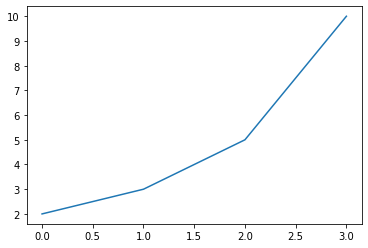
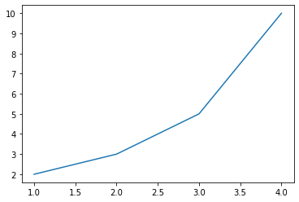
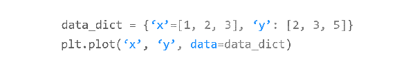
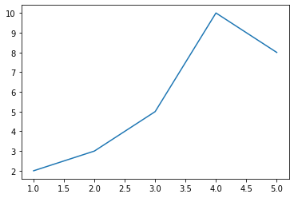

# 02. Matplotlib 숫자 입력하기
## 기본 사용

예제  
```python
import matplotlib.pyplot as plt

plt.plot([2, 3, 5, 10])
plt.show()
```
**plot([2, 3, 5, 10])** 와 같이 하나의 리스트 형태로 값들을 입력하면 y 값으로 인식한다.

**plot((2, 3, 5, 10))** 또는 **plot(np.array([2, 3, 5, 10]))** 와 같이 파이썬 튜플 또는 Numpy 어레이의 형태로도 데이터를 입력할 수 있다.

**x** 값은 기본적으로 **[0, 1, 2, 3]** 이 되어서, **점 (0, 2), (1, 3), (2, 5), (3, 10)** 를 잇는 아래와 같은 꺾은선 그래프가 나타난다.



## x, y값 입력하기

예제  
```python
import matplotlib.pyplot as plt

plt.plot([1, 2, 3, 4], [2, 3, 5, 10])
plt.show()
```
**plot()** 함수에 두 개의 리스트를 입력하면 순서대로 x, y 값들로 인식해서

**점 (1, 2), (2, 3), (3, 5), (4, 10)** 를 잇는 꺾은선 그래프가 나타난다.


## 레이블이 있는 데이터 사용하기

예제  
```python
import matplotlib.pyplot as plt

data_dict = {'data_x': [1, 2, 3, 4, 5], 'data_y': [2, 3, 5, 10, 8]}

plt.plot('data_x', 'data_y', data=data_dict)
plt.show()
```
파이썬 딕셔너리와 같이 레이블이 있는 데이터를 그래프로 나타낼 수 있다.

예제에서와 같이, 먼저 **plot()** 함수에 데이터의 레이블 (딕셔너리의 키)을 입력해주고, **data** 파라미터에 딕셔너리를 지정해준다.
