# 04. Matplotlib 범례 표시하기
## 기본 사용
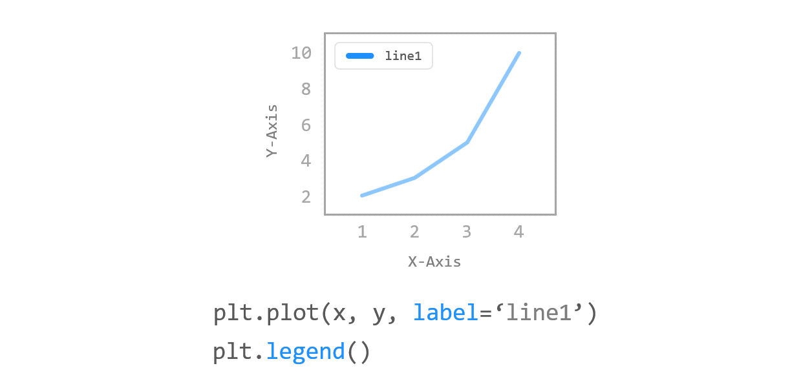
예제  
```python
import matplotlib.pyplot as plt

plt.plot([1, 2, 3, 4], [2, 3, 5, 10], label='Price ($)')
plt.xlabel('X-Axis')
plt.ylabel('Y-Axis')
plt.legend()

plt.show()
```
그래프 영역에 범례를 나타내기 위해서는 우선 **plot()** 함수에 **label** 문자열을 지정하고, **matplotlib.pyplot** 모듈의 **legend()** 함수를 호출한다.

아래와 같이 그래프의 적절한 위치에 데이터를 설명하는 범례가 나타난다.
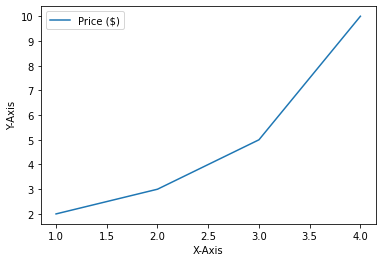

## 위치 지정하기
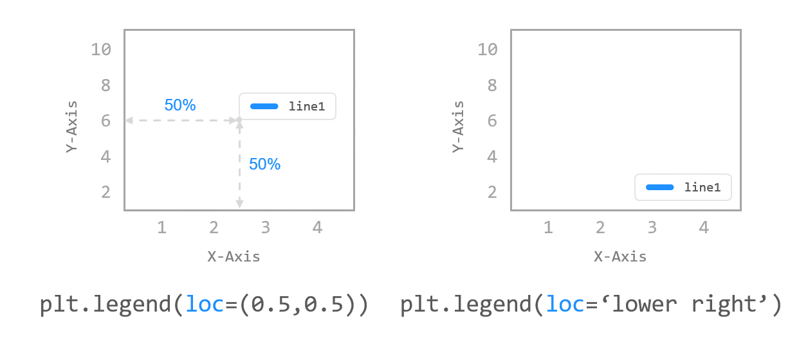
예제1  
```python
import matplotlib.pyplot as plt

plt.plot([1, 2, 3, 4], [2, 3, 5, 10], label='Price ($)')
plt.xlabel('X-Axis')
plt.ylabel('Y-Axis')
# plt.legend(loc=(0.0, 0.0))
# plt.legend(loc=(0.5, 0.5))
plt.legend(loc=(1.0, 1.0))

plt.show()
```
**xlabel(), ylabel()** 함수의 **labelpad** 파라미터는 축 레이블의 **여백 (Padding)** 을 지정한다.

**legend()** 함수의 **loc** 파라미터를 이용해서 범례가 표시될 위치를 설정할 수 있다.

**loc** 파라미터를 *숫자 쌍 튜플로 지정*하면, 해당하는 위치에 범례가 표시된다.

**loc=(0.0, 0.0)** 은 데이터 영역의 왼쪽 아래, **loc=(1.0, 1.0)** 은 데이터 영역의 오른쪽 위 위치이다.
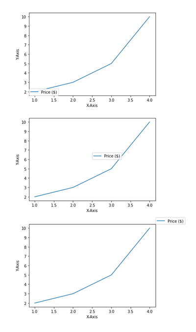

예제2  
```python
import matplotlib.pyplot as plt

plt.plot([1, 2, 3, 4], [2, 3, 5, 10], label='Price ($)')
plt.xlabel('X-Axis')
plt.ylabel('Y-Axis')
plt.legend(loc='lower right')

plt.show()
```
**loc** 파라미터는 예제에서와 같이 문자열로 지정할 수도 있고, 숫자 코드를 사용할 수도 있다.

**loc=’lower right’** 와 같이 지정하면 아래와 같이 오른쪽 아래에 범례가 표시된다.
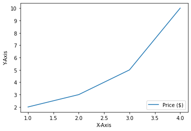

## 열 개수 지정하기
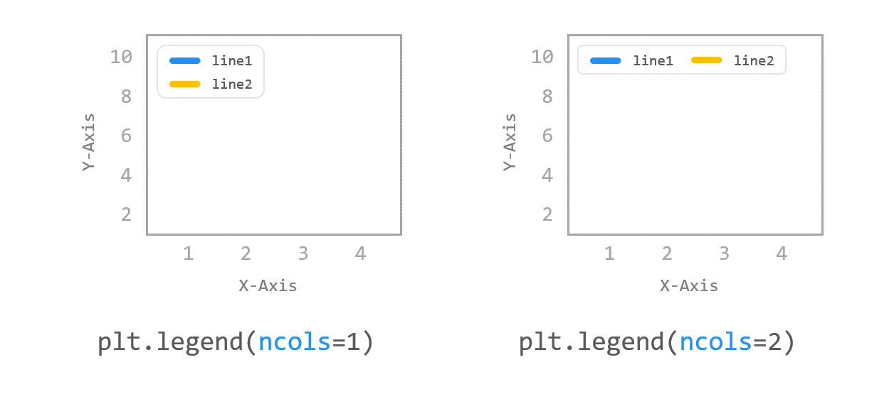
예제  
```python
import matplotlib.pyplot as plt

plt.plot([1, 2, 3, 4], [2, 3, 5, 10], label='Price ($)')
plt.plot([1, 2, 3, 4], [3, 5, 9, 7], label='Demand (#)')
plt.xlabel('X-Axis')
plt.ylabel('Y-Axis')
# plt.legend(loc='best')          # ncol = 1
plt.legend(loc='best', ncol=2)    # ncol = 2

plt.show()
```
**legend()** 함수의 **ncol** 파라미터는 범례에 표시될 텍스트의 열의 개수를 지정한다.

기본적으로 아래 첫번째 그림과 같이 범례 텍스트는 1개의 열로 표시되며,

ncol=2로 지정하면 아래 두번째 그림과 같이 표시된다.  


ncol=1 일 때   
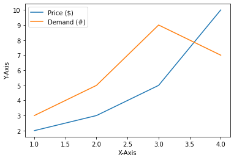  

ncol=2 일 때  
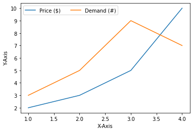  

## 폰트 크기 지정하기
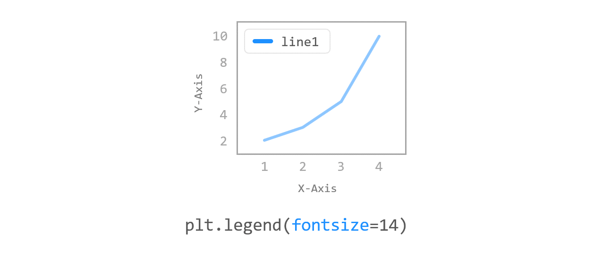
예제  
```python
import matplotlib.pyplot as plt

plt.plot([1, 2, 3, 4], [2, 3, 5, 10], label='Price ($)')
plt.plot([1, 2, 3, 4], [3, 5, 9, 7], label='Demand (#)')
plt.xlabel('X-Axis')
plt.ylabel('Y-Axis')
# plt.legend(loc='best')
plt.legend(loc='best', ncol=2, fontsize=14)

plt.show()
```
**legend()** 함수의 **fontsize** 파라미터는 범례에 표시될 폰트의 크기를 지정한다.

폰트 크기를 14로 지정했다.
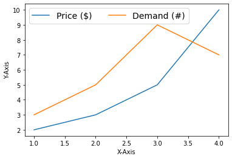

## 범례 테두리 꾸미기
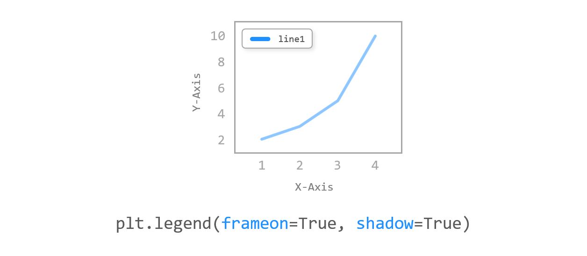
예제  
```python
import matplotlib.pyplot as plt

plt.plot([1, 2, 3, 4], [2, 3, 5, 10], label='Price ($)')
plt.plot([1, 2, 3, 4], [3, 5, 9, 7], label='Demand (#)')
plt.xlabel('X-Axis')
plt.ylabel('Y-Axis')
# plt.legend(loc='best')
plt.legend(loc='best', ncol=2, fontsize=14, frameon=True, shadow=True)

plt.show()
```
**frameon** 파라미터는 범례 텍스트 상자의 테두리를 표시할지 여부를 지정한다.

**frameon=False** 로 지정하면 테두리가 표시되지 않는다.

**shadow** 파라미터를 사용해서 텍스트 상자에 그림자를 표시할 수 있다.

이 외에도 **legend()** 함수에는 **facecolor, edgecolor, borderpad, labelspacing** 과 같은 다양한 파라미터가 있다.