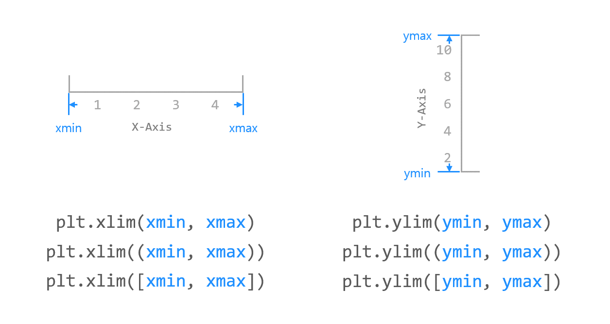
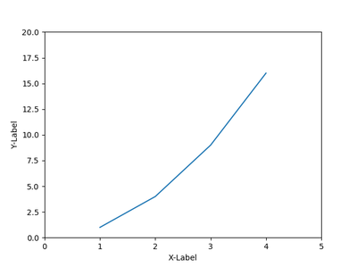
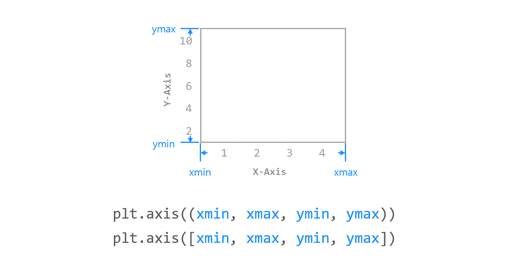
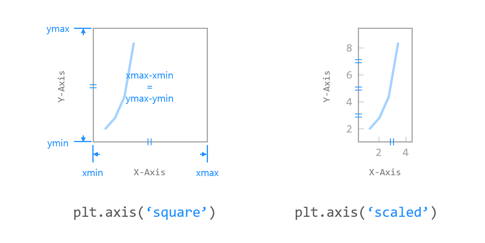
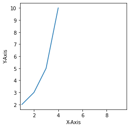
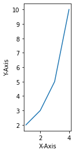

# 05. Matplotlib 축 범위 지정하기
## 기본 사용 - xlim(), ylim()

예제  
```python
import matplotlib.pyplot as plt

plt.plot([1, 2, 3, 4], [2, 3, 5, 10])
plt.xlabel('X-Axis')
plt.ylabel('Y-Axis')
plt.xlim([0, 5])      # X축의 범위: [xmin, xmax]
plt.ylim([0, 20])     # Y축의 범위: [ymin, ymax]

plt.show()
```
**xlim()** 함수에 xmin, xmax 값을 각각 입력하거나 리스트 또는 튜플의 형태로 입력한다.

**ylim()** 함수에 ymin, ymax 값을 각각 입력하거나 리스트 또는 튜플의 형태로 입력한다.

입력값이 없으면 데이터에 맞게 자동으로 범위를 지정한다.


</br>

## 기본 사용 - axis()

예제  
```python
import matplotlib.pyplot as plt

plt.plot([1, 2, 3, 4], [2, 3, 5, 10])
plt.xlabel('X-Axis')
plt.ylabel('Y-Axis')
plt.axis([0, 5, 0, 20])  # X, Y축의 범위: [xmin, xmax, ymin, ymax]

plt.show()
```
**axis()** 함수에 [xmin, xmax, ymin, ymax]의 형태로 X, Y축의 범위를 지정할 수 있다.

**axis()** 함수에 입력한 리스트 (또는 튜플)는 반드시 네 개의 값 (xmin, xmax, ymin, ymax)이 있어야 한다.

입력값이 없으면 데이터에 맞게 자동으로 범위를 지정한다.


</br>

## 옵션 지정하기

예제  
```python
import matplotlib.pyplot as plt

plt.plot([1, 2, 3, 4], [2, 3, 5, 10])
plt.xlabel('X-axis')
plt.ylabel('Y-axis')
# plt.axis('square')
plt.axis('scaled')

plt.show()
```
**axis()** 함수는 아래와 같이 축에 관한 다양한 옵션을 제공한다.
```
'on' | 'off' | 'equal' | 'scaled' | 'tight' | 'auto' | 'normal' | 'image' | 'square'
```
아래 그림은 'square'로 지정했을 때의 그래프이다.  
축의 길이가 동일하게 표시된다.  
  

아래 그림은 'scaled'로 지정했을 때의 그래프이다.
X, Y 축이 같은 길이 스케일로 나타나게 된다.  


</br>

## 축 범위 얻기

예제  
```python
import matplotlib.pyplot as plt

plt.plot([1, 2, 3, 4], [2, 3, 5, 10])
plt.xlabel('X-axis')
plt.ylabel('Y-axis')

x_range, y_range = plt.xlim(), plt.ylim()
print(x_range, y_range)

axis_range = plt.axis('scaled')
print(axis_range)

plt.show()
```
**xlim(), ylim()** 함수는 그래프 영역에 표시되는 X축, Y축 범위를 각각 반환한다.  
**axis()** 함수는 그래프 영역에 표시되는 X축, Y축의 범위를 반환한다.
```python
(0.85, 4.15) (1.6, 10.4)
(0.85, 4.15, 1.6, 10.4)
```