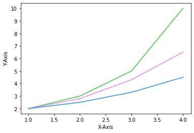

# 08. Matplotlib 색상 지정하기
## 포맷 문자열 사용하기

예제  
```python
import matplotlib.pyplot as plt

plt.plot([1, 2, 3, 4], [2.0, 3.0, 5.0, 10.0], 'r')
plt.plot([1, 2, 3, 4], [2.0, 2.8, 4.3, 6.5], 'g')
plt.plot([1, 2, 3, 4], [2.0, 2.5, 3.3, 4.5], 'b')
plt.xlabel('X-Axis')
plt.ylabel('Y-Axis')

plt.show()
```
**plot()** 함수의 **포맷 문자열 (Format string)** 을 사용해서 실선의 색상을 지정했다.


## color키워드 인자 사용하기

예제  
```python
import matplotlib.pyplot as plt

plt.plot([1, 2, 3, 4], [2.0, 3.0, 5.0, 10.0], color='limegreen')
plt.plot([1, 2, 3, 4], [2.0, 2.8, 4.3, 6.5], color='violet')
plt.plot([1, 2, 3, 4], [2.0, 2.5, 3.3, 4.5], color='dodgerblue')
plt.xlabel('X-Axis')
plt.ylabel('Y-Axis')

plt.show()
```
**color** 키워드 인자를 사용해서 더 다양한 색상의 이름을 지정할 수 있다.

**plot()** 함수에 **color=’limegreen’** 과 같이 입력하면, limegreen에 해당하는 색깔이 표시된다.


## Hex code 사용하기

예제  
```python
import matplotlib.pyplot as plt

plt.plot([1, 2, 3, 4], [2, 3, 5, 10], color='#e35f62',
         marker='o', linestyle='--')
plt.xlabel('X-Axis')
plt.ylabel('Y-Axis')

plt.show()
```
**16진수 코드 (Hex code)** 로 더욱 다양한 색상을 지정할 수 있다.

marker는 마커 스타일, linestyle는 선의 스타일을 지정한다.


## Matplotlib 색상들
### Cycler 색상
색상을 지정하지 않으면 기본적으로 아래의 10개의 색상이 반복적으로 표시된다.


### 기본 색상
아래의 색상은 간단한 문자열을 사용해서 색상을 지정하도록 한다.


### Tableau 색상
Matplotlib은 Tableau의 색상들을 지원하며, 이는 Cycler의 색상과 같다.


### CSS 색상
아래와 같이 색상의 이름을 사용해서 색상을 지정할 수 있다.
