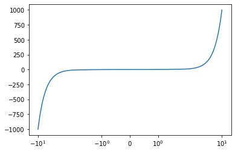
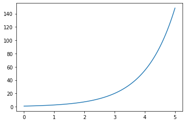
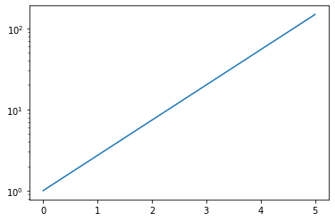

# 10. Matplotlib 축 스케일 지정하기
## X축 스케일 지정하기

예제  
```python 
import matplotlib.pyplot as plt
import numpy as np

x = np.linspace(-10, 10, 100)
y = x ** 3

plt.plot(x, y)
plt.xscale('symlog')

plt.show()
```
**xscale()** 함수를 사용해서 X축의 스케일을 **‘symlog’** 로 지정했다.

**‘symlog’** 는 **Symmetrical Log Scale** 이다.

축의 원점을 기준으로 양, 음의 방향이 대칭적인 로그 스케일로 표시된다.



## Y축 스케일 지정하기

예제  
```python
import matplotlib.pyplot as plt
import numpy as np

x = np.linspace(0, 5, 100)
y = np.exp(x)

plt.plot(x, y)
# plt.yscale('linear')
plt.yscale('log')

plt.show()
```
**yscale()** 함수를 사용해서 Y축의 스케일을 지정했다.

로그 스케일은 지수함수 (Exponential function)와 같이 기하급수적으로 변화하는 데이터를 표현하기에 적합하다.

아래의 그래프는 **Y축을 선형 스케일 (Linear scale)** 로 나타낸 결과이고,


아래의 그래프는 **Y축을 로그 스케일 (Log scale)** 로 나타낸 결과다.
  