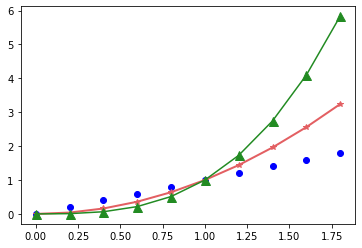

# 11. Matplotlib 여러 곡선 그리기
## 기본 사용

예제  
```python
import matplotlib.pyplot as plt
import numpy as np

x = np.arange(0, 2, 0.2)

plt.plot(x, x, 'r--', x, x**2, 'bo', x, x**3, 'g-.')
plt.show()
```
NumPy 어레이 **[ 0. 0.2 0.4 0.6 0.8 1. 1.2 1.4 1.6 1.8]** 를 만들었다.

**plot()** 함수에 x 값, y 값, 스타일을 순서대로 세 번씩 입력하면, 세 개의 곡선 (y=x, y=x^2, y=x^3)이 동시에 그려진다.

**‘r–‘** 은 빨간색 (Red)의 대쉬 (Dashed) 스타일 선,

**‘bo’** 는 파란색 (Blue)의 원형 (Circle) 마커,

**‘g-.’** 은 녹색 (Green)의 대쉬-닷 (Dash-dot) 스타일 선을 의미한다.


## 스타일 지정하기

예제  
```python
import matplotlib.pyplot as plt
import numpy as np

x = np.arange(0, 2, 0.2)

plt.plot(x, x, 'bo')
plt.plot(x, x**2, color='#e35f62', marker='*', linewidth=2)
plt.plot(x, x**3, color='forestgreen', marker='^', markersize=9)
plt.show()
```
**plot()** 함수를 여러 번 호출함으로써 각각의 곡선을 그래프에 표시하고 스타일을 설정할 수 있다.

첫 번째 곡선의 스타일은 ‘bo’,  
두 번째 곡선은 color=’#e35f62’, marker=’*’, linewidth=2로,
세 번째 곡선은 color=’forestgreen’, marker=’^’, markersize=9로 각각 설정했다.

