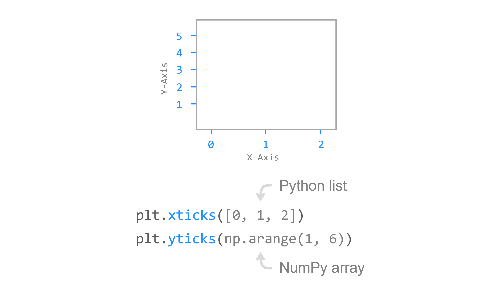
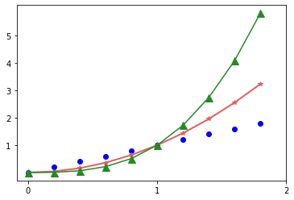
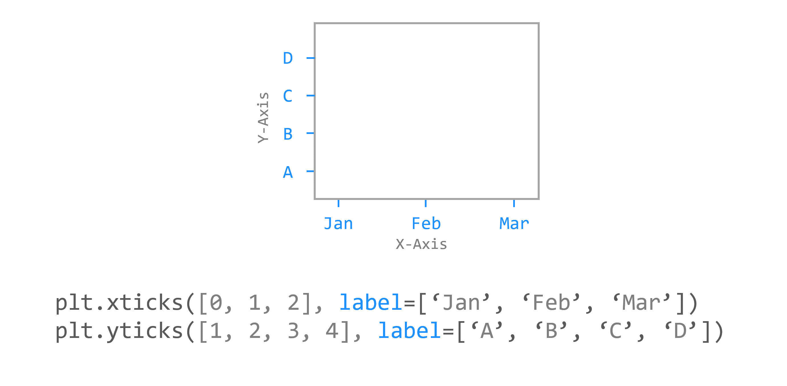
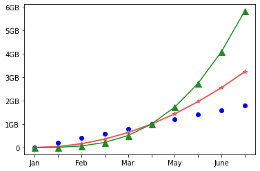
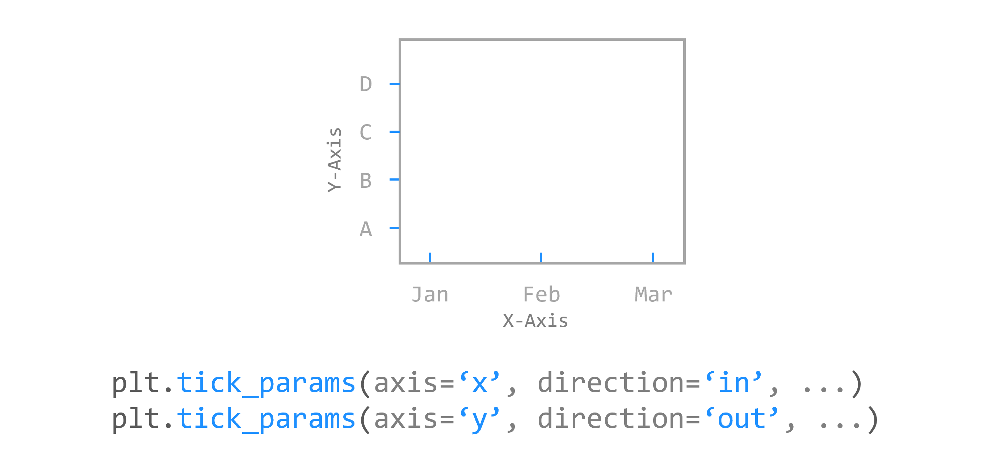
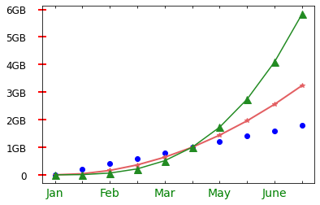

# 13. Matplotlib 눈금 표시하기
## 기본 사용

예제  
```python
import numpy as np

x = np.arange(0, 2, 0.2)

plt.plot(x, x, 'bo')
plt.plot(x, x**2, color='#e35f62', marker='*', linewidth=2)
plt.plot(x, x**3, color='forestgreen', marker='^', markersize=9)
plt.xticks([0, 1, 2])
plt.yticks(np.arange(1, 6))

plt.show()
```
**xticks(), yticks()** 함수는 각각 X축, Y축에 눈금을 표시한다.

**xticks(), yticks()** 함수에 파이썬 리스트 또는 NumPy 어레이를 입력하면 눈금과 숫자 레이블이 표시된다.

예제에서는 X축의 [0, 1, 2]의 위치, Y축의 [1, 2, 3, 4, 5]의 위치에 눈금을 표시했다.



</br>

## 눈금 레이블 지정하기

예제  
```python
import matplotlib.pyplot as plt
import numpy as np

x = np.arange(0, 2, 0.2)

plt.plot(x, x, 'bo')
plt.plot(x, x**2, color='#e35f62', marker='*', linewidth=2)
plt.plot(x, x**3, color='springgreen', marker='^', markersize=9)
plt.xticks(np.arange(0, 2, 0.2), labels=['Jan', '', 'Feb', '', 'Mar', '', 'May', '', 'June', '', 'July'])
plt.yticks(np.arange(0, 7), ('0', '1GB', '2GB', '3GB', '4GB', '5GB', '6GB'))

plt.show()
```
**labels** 파라미터를 사용하면 눈금 레이블을 문자열의 형태로 지정할 수 있다.

입력해준 눈금의 개수와 같은 개수의 레이블을 지정해준다.



</br>

## 눈금 스타일 설정하기

예제  
```python
import matplotlib.pyplot as plt
import numpy as np

x = np.arange(0, 2, 0.2)

plt.plot(x, x, 'bo')
plt.plot(x, x**2, color='#e35f62', marker='*', linewidth=2)
plt.plot(x, x**3, color='springgreen', marker='^', markersize=9)
plt.xticks(np.arange(0, 2, 0.2), labels=['Jan', '', 'Feb', '', 'Mar', '', 'May', '', 'June', '', 'July'])
plt.yticks(np.arange(0, 7), ('0', '1GB', '2GB', '3GB', '4GB', '5GB', '6GB'))

plt.tick_params(axis='x', direction='in', length=3, pad=6, labelsize=14, labelcolor='green', top=True)
plt.tick_params(axis='y', direction='inout', length=10, pad=15, labelsize=12, width=2, color='r')

plt.show()
```
**tick_params()** 함수를 사용하면 눈금의 스타일을 다양하게 설정할 수 있다.

**axis** 는 설정이 적용될 축을 지정한다. {‘x’, ‘y’, ‘both’} 중 선택할 수 있다.

**direction** 을 ‘in’, ‘out’으로 설정하면 눈금이 안/밖으로 표시된다. {‘in’, ‘out’, ‘inout’} 중 선택할 수 있다.

**length** 는 눈금의 길이를 지정한다.

**pad** 는 눈금과 레이블과의 거리를 지정한다.

**labelsize** 는 레이블의 크기를 지정한다.

**labelcolor** 는 레이블의 색상을 지정한다.

**top/bottom/left/right** 를 **True/False** 로 지정하면 눈금이 표시될 위치를 선택할 수 있다.

**width** 는 눈금의 너비를 지정한다.

**color** 는 눈금의 색상을 지정한다.

