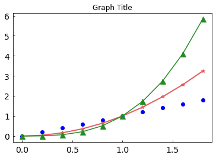
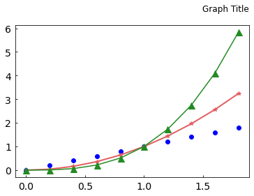
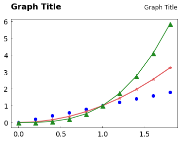

# 14. Matplotlib 타이틀 설정하기
## 기본 사용

예제  
```python
import matplotlib.pyplot as plt
import numpy as np

x = np.arange(0, 2, 0.2)

plt.plot(x, x, 'bo')
plt.plot(x, x**2, color='#e35f62', marker='*', linewidth=2)
plt.plot(x, x**3, color='forestgreen', marker='^', markersize=9)

plt.tick_params(axis='both', direction='in', length=3, pad=6, labelsize=14)
plt.title('Graph Title')

plt.show()
```
**title()** 함수를 이용해서 그래프의 타이틀을 ‘Graph Title’로 설정했다.



## 위치와 오프셋 지정하기

예제  
```python
import matplotlib.pyplot as plt
import numpy as np

x = np.arange(0, 2, 0.2)

plt.plot(x, x, 'bo')
plt.plot(x, x**2, color='#e35f62', marker='*', linewidth=2)
plt.plot(x, x**3, color='forestgreen', marker='^', markersize=9)

plt.tick_params(axis='both', direction='in', length=3, pad=6, labelsize=14)
plt.title('Graph Title', loc='right', pad=20)

plt.show()
```

**plt.title()** 함수의 **loc** 파라미터를 **‘right’** 로 설정하면, 타이틀이 그래프의 오른쪽 위에 나타나게 된다.

{‘left’, ‘center’, ‘right’} 중 선택할 수 있으며 디폴트는 **‘center’** 이다.

**pad** 파라미터는 **타이틀과 그래프와의 간격** 을 포인트 단위로 설정한다.



## 폰트 지정하기

예제  
```python
import matplotlib.pyplot as plt
import numpy as np

x = np.arange(0, 2, 0.2)

plt.plot(x, x, 'bo')
plt.plot(x, x**2, color='#e35f62', marker='*', linewidth=2)
plt.plot(x, x**3, color='forestgreen', marker='^', markersize=9)

plt.tick_params(axis='both', direction='in', length=3, pad=6, labelsize=14)
plt.title('Graph Title', loc='right', pad=20)

title_font = {
    'fontsize': 16,
    'fontweight': 'bold'
}
plt.title('Graph Title', fontdict=title_font, loc='left', pad=20)

plt.show()
```
**fontdict** 파라미터에 딕셔너리 형태로 폰트 스타일을 설정할 수 있다.

**‘fontsize’** 를 16으로, **‘fontweight’** 를 ‘bold’로 설정했다.

**‘fontsize’** 는 포인트 단위의 숫자를 입력하거나 ‘smaller’, ‘x-large’ 등의 상대적인 설정을 할 수 있다.

**‘fontweight’** 에는 {‘normal’, ‘bold’, ‘heavy’, ‘light’, ‘ultrabold’, ‘ultralight’}와 같이 설정할 수 있다.



## 타이틀 얻기

예제  
```python
import matplotlib.pyplot as plt
import numpy as np

x = np.arange(0, 2, 0.2)

plt.plot(x, x, 'bo')
plt.plot(x, x**2, color='#e35f62', marker='*', linewidth=2)
plt.plot(x, x**3, color='forestgreen', marker='^', markersize=9)

plt.tick_params(axis='both', direction='in', length=3, pad=6, labelsize=14)
title_right = plt.title('Graph Title', loc='right', pad=20)

title_font = {
    'fontsize': 16,
    'fontweight': 'bold'
}
title_left = plt.title('Graph Title', fontdict=title_font, loc='left', pad=20)

print(title_left.get_position())
print(title_left.get_text())

print(title_right.get_position())
print(title_right.get_text())

plt.show()
```
**plt.title()** 함수는 타이틀을 나타내는 Matplotlib text 객체를 반환한다.

**get_position()** 과 **get_text()** 메서드를 사용해서 텍스트 위치와 문자열을 얻을 수 있다.
```python
(0.0, 1.0)
Graph Title
(1.0, 1.0)
Graph Title
```