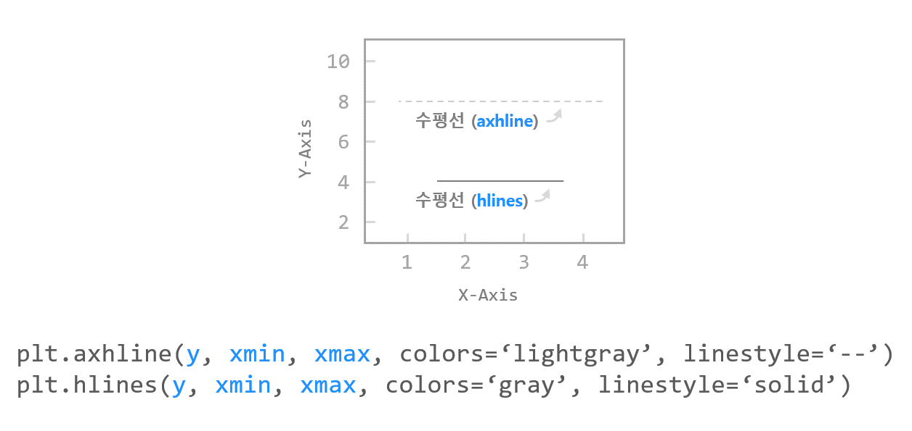
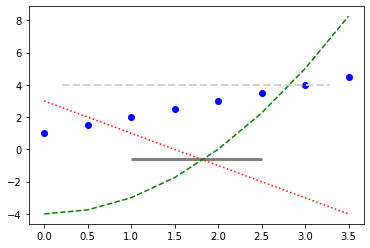
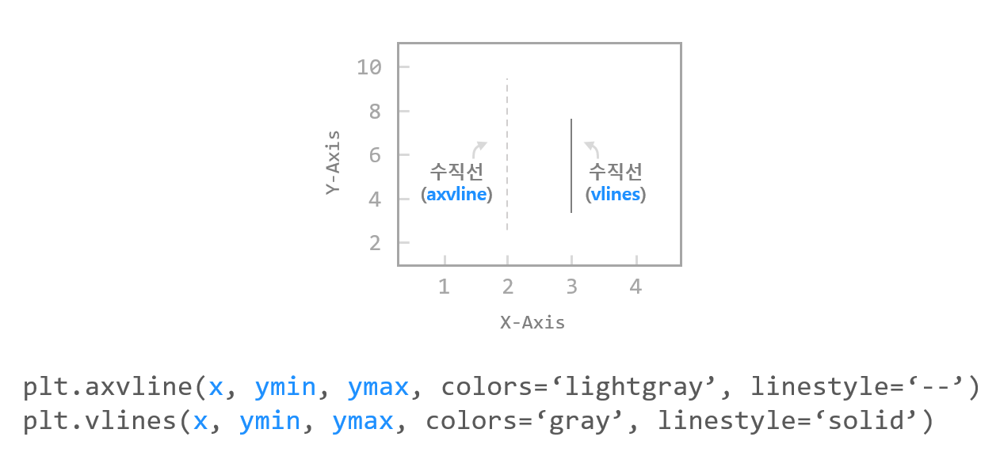
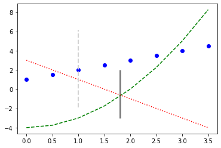

# 15. Matplotlib 수평선/수직선 표시하기
## 수평선 그리기 - axhline(), hlines()

예제  
```python
import matplotlib.pyplot as plt

x = np.arange(0, 4, 0.5)

plt.plot(x, x + 1, 'bo')
plt.plot(x, x**2 - 4, 'g--')
plt.plot(x, -2*x + 3, 'r:')

plt.axhline(4.0, 0.1, 0.9, color='lightgray', linestyle='--', linewidth=2)
plt.hlines(-0.62, 1.0, 2.5, color='gray', linestyle='solid', linewidth=3)

plt.show()
```
**axhline()** 함수의 첫번째 인자는 y 값으로서 수평선의 위치가 된다.

두, 세번째 인자는 xmin, xmax 값으로서 **0에서 1 사이의 값** 을 입력한다. 0은 왼쪽 끝, 1은 오른쪽 끝을 의미한다.

**hlines()** 함수에 y, xmin, xmax를 순서대로 입력하면, 점 (xmin, y)에서 점 (xmax, y)를 따라 수평선을 표시한다.



## 수직선 그리기 axvline(), vlines()

예제  
```python
import matplotlib.pyplot as plt

x = np.arange(0, 4, 0.5)

plt.plot(x, x + 1, 'bo')
plt.plot(x, x**2 - 4, 'g--')
plt.plot(x, -2*x + 3, 'r:')

plt.axvline(1.0, 0.2, 0.8, color='lightgray', linestyle='--', linewidth=2)
plt.vlines(1.8, -3.0, 2.0, color='gray', linestyle='solid', linewidth=3)

plt.show()
```
**axvline()** 함수의 첫번째 인자는 x 값으로서 수직선의 위치가 된다.

두, 세번째 인자는 ymin, ymax 값으로서 **0에서 1 사이의 값** 을 입력한다. 0은 아래쪽 끝, 1은 위쪽 끝을 의미한다.

**vlines()** 함수에 x, ymin, ymax를 순서대로 입력하면, 점 (x, ymin)에서 점 (x, ymax)를 따라 수평선을 표시한다.

