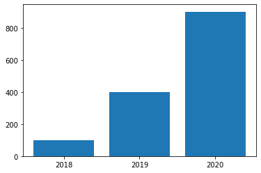
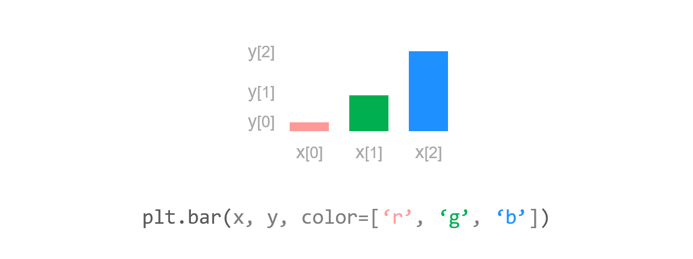
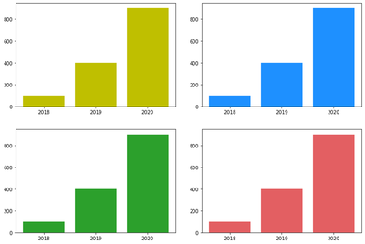
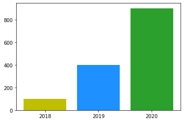
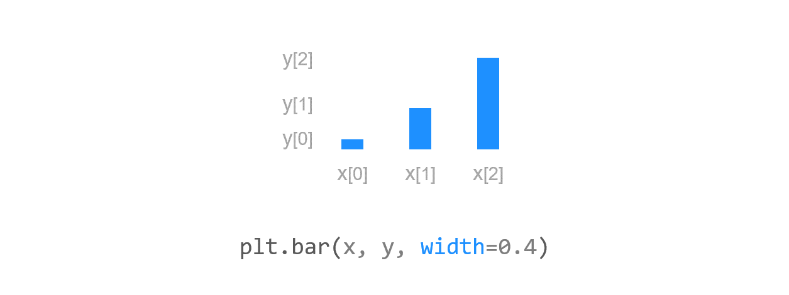
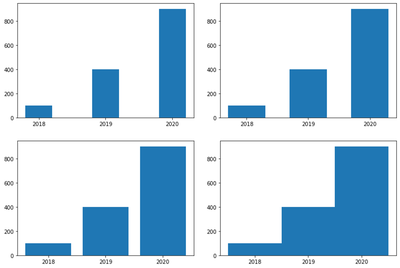
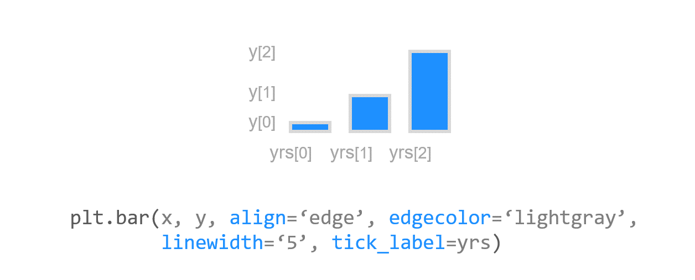
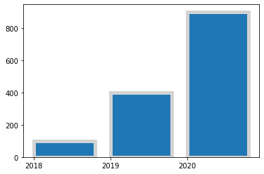

# 16. Matplotlib 막대 그래프 그리기
## 기본 사용

예제  
```python
import matplotlib.pyplot as plt
import numpy as np

x = np.arange(3)
years = ['2018', '2019', '2020']
values = [100, 400, 900]

plt.bar(x, values)
plt.xticks(x, years)

plt.show()
```
이 예제는 연도별로 변화하는 값을 갖는 데이터를 막대 그래프로 나타낸다.

NumPy의 **np.arange()** 함수는 주어진 범위와 간격에 따라 균일한 값을 갖는 어레이를 반환한다.

**years**는 X축에 표시될 연도이고, **values**는 막대 그래프의 y 값 이다.

먼저 **plt.bar()** 함수에 x 값 [0, 1, 2]와 y 값 [100, 400, 900]를 입력해주고,

**xticks()** 에 **x**와 **years**를 입력해주면, X축의 눈금 레이블에 ‘2018’, ‘2019’, ‘2020’이 순서대로 표시된다.


## 색상 지정하기

예제1  
```python
import matplotlib.pyplot as plt
import numpy as np

x = np.arange(3)
years = ['2018', '2019', '2020']
values = [100, 400, 900]

plt.bar(x, values, color='y')
# plt.bar(x, values, color='dodgerblue')
# plt.bar(x, values, color='C2')
# plt.bar(x, values, color='#e35f62')
plt.xticks(x, years)

plt.show()
```
**plt.bar()** 함수의 **color** 파라미터를 사용해서 막대의 색상을 지정할 수 있다.

예제에서는 네 가지의 색상을 사용했다.

Matplotlib의 다양한 색상에 대해서는 [Matplotlib 색상 지정하기](https://github.com/trustyourse1f/TIL/blob/master/Data_Visualization/Matplotlib/Matplotlib%20Tutorial%20-%20%ED%8C%8C%EC%9D%B4%EC%8D%AC%EC%9C%BC%EB%A1%9C%20%EB%8D%B0%EC%9D%B4%ED%84%B0%20%EC%8B%9C%EA%B0%81%ED%99%94%20%ED%95%98%EA%B8%B0/08.%20Matplotlib%20%EC%83%89%EC%83%81%20%EC%A7%80%EC%A0%95%ED%95%98%EA%B8%B0.md) 페이지를 참고.



예제2
```python
import matplotlib.pyplot as plt
import numpy as np

x = np.arange(3)
years = ['2018', '2019', '2020']
values = [100, 400, 900]
colors = ['y', 'dodgerblue', 'C2']

plt.bar(x, values, color=colors)
plt.xticks(x, years)

plt.show()
```
**plt.bar()** 함수의 **color** 파라미터에 색상의 이름을 리스트의 형태로 입력하면, 막대의 색상을 각각 다르게 지정할 수 있다.


## 막대 폭 지정하기

예제  
```python
import matplotlib.pyplot as plt
import numpy as np

x = np.arange(3)
years = ['2018', '2019', '2020']
values = [100, 400, 900]

plt.bar(x, values, width=0.4)
# plt.bar(x, values, width=0.6)
# plt.bar(x, values, width=0.8)
# plt.bar(x, values, width=1.0)
plt.xticks(x, years)

plt.show()
```
**plt.bar()** 함수의 **width** 파라미터는 막대의 폭을 지정한다.

예제에서는 막대의 폭을 0.4/0.6/0.8/1.0으로 지정했고, 디폴트는 0.8이다.



## 스타일 꾸미기

예제  
```python
import matplotlib.pyplot as plt
import numpy as np

x = np.arange(3)
years = ['2018', '2019', '2020']
values = [100, 400, 900]

plt.bar(x, values, align='edge', edgecolor='lightgray',
        linewidth=5, tick_label=years)

plt.show()
```
**align**은 눈금과 막대의 위치를 조절한다. 디폴트 값은 ‘center’이며, ‘edge’로 설정하면 막대의 왼쪽 끝에 눈금이 표시된다.

**edgecolor**는 막대 테두리 색, **linewidth**는 테두리의 두께를 지정한다.

**tick_label**을 리스트 또는 어레이 형태로 지정하면, 틱에 문자열을 순서대로 나타낼 수 있다.

