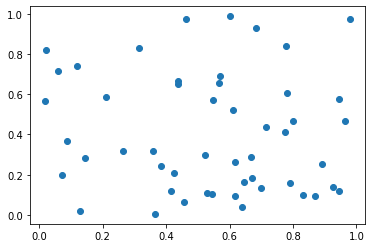
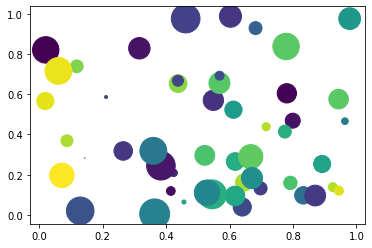
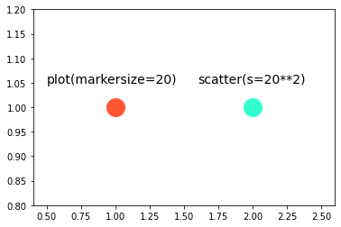
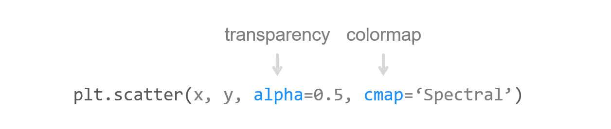
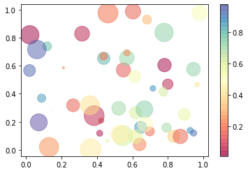

# 18. Matplotlib 산점도 그리기
## 기본 사용

예제  
```python
import matplotlib.pyplot as plt
import numpy as np

np.random.seed(0)

n = 50
x = np.random.rand(n)
y = np.random.rand(n)

plt.scatter(x, y)
plt.show()
```
NumPy의 random 모듈에 포함된 **rand() 함수**를 사용해서 [0, 1) 범위의 난수를 각각 50개씩 생성했다.

x, y 데이터를 순서대로 **scatter()** 함수에 입력하면 x, y 값에 해당하는 위치에 기본 마커가 표시된다.



## 색상과 크기 지정하기

예제1  
```python
import matplotlib.pyplot as plt
import numpy as np

np.random.seed(0)

n = 50
x = np.random.rand(n)
y = np.random.rand(n)
area = (30 * np.random.rand(n))**2
colors = np.random.rand(n)

plt.scatter(x, y, s=area, c=colors)
plt.show()
```
**scatter()** 함수의 s, c 파라미터는 각각 마커의 크기와 색상을 지정한다.

마커의 크기는 size**2 의 형태로 지정한다.

예를 들어 **plot()** 함수에 **markersize=20**으로 지정하는 것과

scatter() 함수에 s=20**2으로 지정하는 것은 같은 크기의 마커를 표시하도록 한다.

마커의 색상은 데이터의 길이와 같은 크기의 숫자 시퀀스 또는 rgb, 그리고 Hex code 색상을 입력해서 지정한다.

마커에 임의의 크기와 색상을 지정했다.



예제2  
plot() 함수의 markersize 지정과 scatter() 함수의 s (size) 지정에 대해서는 아래의 예제를 참고  
```python
import matplotlib.pyplot as plt

plt.plot([1], [1], 'o', markersize=20, c='#FF5733')
plt.scatter([2], [1], s=20**2, c='#33FFCE')

plt.text(0.5, 1.05, 'plot(markersize=20)', fontdict={'size': 14})
plt.text(1.6, 1.05, 'scatter(s=20**2)', fontdict={'size': 14})
plt.axis([0.4, 2.6, 0.8, 1.2])
plt.show()
```
**plot() 함수**의 **markersize**를 20으로, **scatter()** 함수의 **s**를 20**2으로 지정했다.

아래 그림과 같이 동일한 크기의 마커를 표시한다.


## 투명도와 컬러맵 설정하기

예제  
```python
import matplotlib.pyplot as plt
import numpy as np

np.random.seed(0)

n = 50
x = np.random.rand(n)
y = np.random.rand(n)
area = (30 * np.random.rand(n))**2
colors = np.random.rand(n)

plt.scatter(x, y, s=area, c=colors, alpha=0.5, cmap='Spectral')
plt.colorbar()
plt.show()
```
**alpha** 파라미터는 마커의 투명도를 지정합니다. 0에서 1 사이의 값을 입력한다.

**cmap** 파라미터에 컬러맵에 해당하는 문자열을 지정할 수 있다.

