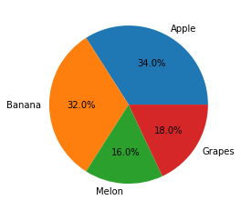
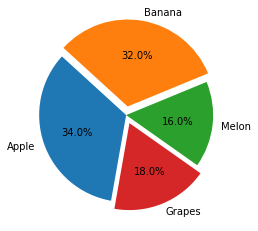
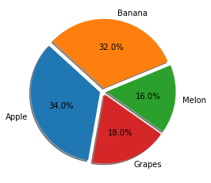
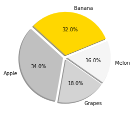
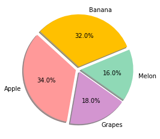
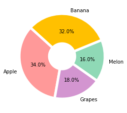

# Matplotlib 파이 차트 그리기
## 기본 사용
예제  
```python
import matplotlib.pyplot as plt

ratio = [34, 32, 16, 18]
labels = ['Apple', 'Banana', 'Melon', 'Grapes']

plt.pie(ratio, labels=labels, autopct='%.1f%%')
plt.show()
```
우선 각 영역의 비율과 이름을 **ratio**와 **labels**로 지정해주고,

**pie()** 함수에 순서대로 입력한다.

**autopct**는 부채꼴 안에 표시될 숫자의 형식을 지정한다. 소수점 한자리까지 표시하도록 설정했다.



</br>

## 시작 각도와 방향 설정하기
예제  
```python
import matplotlib.pyplot as plt

ratio = [34, 32, 16, 18]
labels = ['Apple', 'Banana', 'Melon', 'Grapes']

plt.pie(ratio, labels=labels, autopct='%.1f%%', startangle=260, counterclock=False)
plt.show()
```
**startangle**는 부채꼴이 그려지는 시작 각도를 설정한다.

디폴트는 0도 (양의 방향 x축)로 설정되어 있다.

**counterclock=False**로 설정하면 시계 방향 순서로 부채꼴 영역이 표시된다.


</br>

## 중심에서 벗어나는 정도 설정하기
예제  
```python
import matplotlib.pyplot as plt

ratio = [34, 32, 16, 18]
labels = ['Apple', 'Banana', 'Melon', 'Grapes']
explode = [0, 0.10, 0, 0.10]

plt.pie(ratio, labels=labels, autopct='%.1f%%', startangle=260, counterclock=False, explode=explode)
plt.show()
```
**explode**는 부채꼴이 파이 차트의 중심에서 벗어나는 정도를 설정한다.

‘Banana’와 ‘Grapes’ 영역에 대해서 반지름의 10% 만큼 벗어나도록 설정했다.



</br>

## 그림자 나타내기
예제  
```python
import matplotlib.pyplot as plt

ratio = [34, 32, 16, 18]
labels = ['Apple', 'Banana', 'Melon', 'Grapes']
explode = [0.05, 0.05, 0.05, 0.05]

plt.pie(ratio, labels=labels, autopct='%.1f%%', startangle=260, counterclock=False, explode=explode, shadow=True)
plt.show()
```
**shadow**를 True로 설정하면, 파이 차트에 그림자가 표시된다.



</br>

## 색상 지정하기
예제1  
```python
import matplotlib.pyplot as plt

ratio = [34, 32, 16, 18]
labels = ['Apple', 'Banana', 'Melon', 'Grapes']
explode = [0.05, 0.05, 0.05, 0.05]
colors = ['silver', 'gold', 'whitesmoke', 'lightgray']

plt.pie(ratio, labels=labels, autopct='%.1f%%', startangle=260, counterclock=False, explode=explode, shadow=True, colors=colors)
plt.show()
```
**colors**를 사용하면 각 영역의 색상을 자유롭게 지정할 수 있다.

‘silver’, ‘gold’, ‘lightgray’, ‘whitesmoke’ 등 색상의 이름을 사용해서 각 영역의 색상을 지정했다.



</br>

예제2  
```python
import matplotlib.pyplot as plt

ratio = [34, 32, 16, 18]
labels = ['Apple', 'Banana', 'Melon', 'Grapes']
explode = [0.05, 0.05, 0.05, 0.05]
colors = ['#ff9999', '#ffc000', '#8fd9b6', '#d395d0']

plt.pie(ratio, labels=labels, autopct='%.1f%%', startangle=260, counterclock=False, explode=explode, shadow=True, colors=colors)
plt.show()
```
Hex code를 이용해서 더욱 다양한 색상을 지정할 수 있다.

각 영역의 색상을 ‘#ff9999’, ‘#ffc000’, ‘#8fd9b6’, ‘#d395d0’ 코드로 지정하면 아래와 같이 표시된다.



</br>

## 부채꼴 스타일 지정하기
예제  
```python
import matplotlib.pyplot as plt

ratio = [34, 32, 16, 18]
labels = ['Apple', 'Banana', 'Melon', 'Grapes']
colors = ['#ff9999', '#ffc000', '#8fd9b6', '#d395d0']
wedgeprops={'width': 0.7, 'edgecolor': 'w', 'linewidth': 5}

plt.pie(ratio, labels=labels, autopct='%.1f%%', startangle=260, counterclock=False, colors=colors, wedgeprops=wedgeprops)
plt.show()
```
**wedgeprops**는 부채꼴 영역의 스타일을 설정한다.

wedgeprops 딕셔너리의 ‘width’, ‘edgecolor’, ‘linewidth’ 키를 이용해서 각각 부채꼴 영역의 너비 (반지름에 대한 비율), 테두리의 색상, 테두리 선의 너비를 설정했다.

