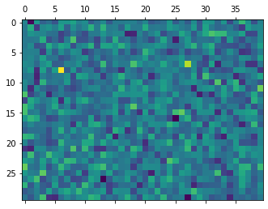
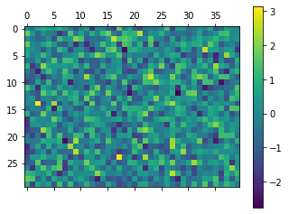
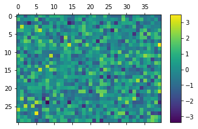
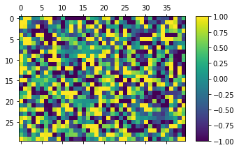
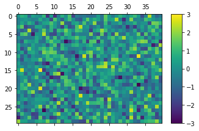
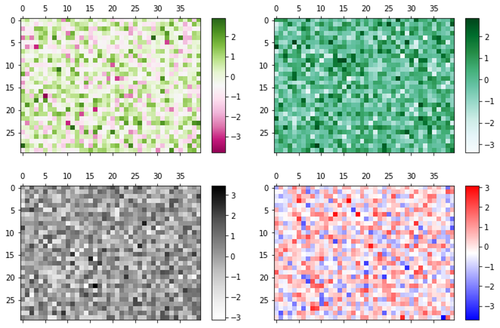

# Matplotlib 히트맵 그리기
## 기본 사용

예제  
```python
import matplotlib.pyplot as plt
import numpy as np

arr = np.random.standard_normal((30, 40))

plt.matshow(arr)

plt.show()
```
np.random.standard_normal() 로 만들어진 2차원 어레이 arr는 표준정규분포를 갖는 (30, 40) 형태의 2차원 어레이 이다.

**matshow()** 함수에 어레이의 형태로 값들을 직접 입력하면 아래와 같은 그래프가 표시된다.



## 컬러바 나타내기

예제1  
```python
import matplotlib.pyplot as plt
import numpy as np

arr = np.random.standard_normal((30, 40))

plt.matshow(arr)
plt.colorbar()

plt.show()
```
히트맵에 컬러바를 함께 나타내기 위해서 **colorbar()** 함수를 사용한다.


예제2  
```python
plt.colorbar(shrink=0.8, aspect=10)
```
**colorbar()** 함수의 **shrink** 파라미터는 컬러바의 크기를 결정한다.

**shrink** 파라미터의 디폴트 값은 1.0이며, 예제에서는 0.8로 지정했다.

**colorbar()** 함수의 **aspect** 파라미터는 컬러바의 종횡비 (Aspect ratio)를 결정한다.

**aspect** 파라미터의 디폴트 값은 20이며, 예제에서는 10으로 지정했다.



## 색상 범위 지정하기

예제  
```python
import matplotlib.pyplot as plt
import numpy as np

arr = np.random.standard_normal((30, 40))

plt.matshow(arr)
plt.colorbar(shrink=0.8, aspect=10)
# plt.clim(-1.0, 1.0)
plt.clim(-3.0, 3.0)

plt.show()
```
히트맵에 표시될 색상의 범위를 지정하기 위해서 **clim()** 함수를 사용한다.

아래 그림은 색상의 범위를 -1.0 ~ 1.0 으로 지정한 히트맵이다.

arr의 값 중 -1.0 보다 작거나 1.0 보다 큰 값에 대해서는 각각 -1.0, 1.0과 같은 색으로 나타난다.



<br>
아래 그림은 색상의 범위를 -3.0 ~ 3.0 으로 지정한 히트맵이다.

arr의 값 중 -3.0 보다 작거나 3.0 보다 큰 값에 대해서는 각각 -3.0, 3.0과 같은 색으로 나타난다.



## 컬러맵 지정하기

예제  
```python
import matplotlib.pyplot as plt
import numpy as np

arr = np.random.standard_normal((30, 40))
# cmap = plt.get_cmap('PiYG')
# cmap = plt.get_cmap('BuGn')
# cmap = plt.get_cmap('Greys')
cmap = plt.get_cmap('bwr')

plt.matshow(arr, cmap=cmap)
plt.colorbar()
plt.show()
```
**cmap** 키워드 인자를 통해 표시할 컬러맵의 종류를 지정할 수 있다.

**matplotlib.pyplot** 모듈의 **get_cmap()** 함수를 이용해서 Matplotlib 컬러맵을 가져와서 **matshow()** 에 입력해준다.

다양한 컬러맵을 적용한 히트맵은 아래와 같다.

