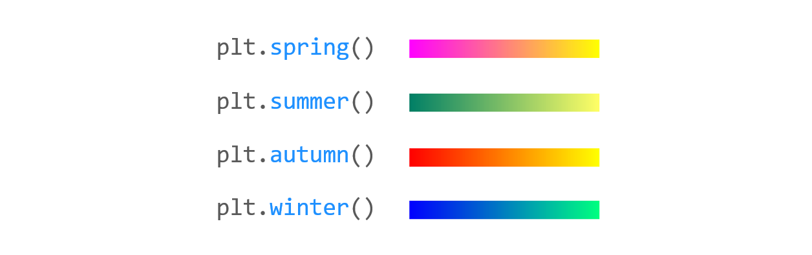

# 25. Matplotlib 컬러맵 설정하기
## 기본 사용

예제  
```python
import matplotlib.pyplot as plt
import numpy as np

np.random.seed(0)
arr = np.random.standard_normal((8, 100))

plt.subplot(2, 2, 1)
# plt.scatter(arr[0], arr[1], c=arr[1], cmap='spring')
plt.scatter(arr[0], arr[1], c=arr[1])
plt.spring()
plt.title('spring')

plt.subplot(2, 2, 2)
plt.scatter(arr[2], arr[3], c=arr[3])
plt.summer()
plt.title('summer')

plt.subplot(2, 2, 3)
plt.scatter(arr[4], arr[5], c=arr[5])
plt.autumn()
plt.title('autumn')

plt.subplot(2, 2, 4)
plt.scatter(arr[6], arr[7], c=arr[7])
plt.winter()
plt.title('winter')

plt.tight_layout()
plt.show()
```
**subplot()** 함수를 이용해서 네 영역에 각각의 그래프를 나타내고,

**spring(), summer(), autumn(), winter()** 함수를 이용해서 컬러맵을 다르게 설정했다.


</br>

## 컬러바 나타내기

예제  
```python
import matplotlib.pyplot as plt
import numpy as np

np.random.seed(0)
arr = np.random.standard_normal((8, 100))

plt.subplot(2, 2, 1)
plt.scatter(arr[0], arr[1], c=arr[1])
plt.viridis()
plt.title('viridis')
plt.colorbar()

plt.subplot(2, 2, 2)
plt.scatter(arr[2], arr[3], c=arr[3])
plt.plasma()
plt.title('plasma')
plt.colorbar()

plt.subplot(2, 2, 3)
plt.scatter(arr[4], arr[5], c=arr[5])
plt.jet()
plt.title('jet')
plt.colorbar()

plt.subplot(2, 2, 4)
plt.scatter(arr[6], arr[7], c=arr[7])
plt.nipy_spectral()
plt.title('nipy_spectral')
plt.colorbar()

plt.tight_layout()
plt.show()
```
**colorbar()** 함수를 사용하면 그래프 영역에 컬러바를 포함할 수 있다.

</br>

## 컬러맵 종류

예제  
```python
import matplotlib.pyplot as plt
from matplotlib import cm

cmaps = plt.colormaps()
for cm in cmaps:
    print(cm)
```
pyplot 모듈의 **colormaps()** 함수를 사용해서 Matplotlib에서 사용할 수 있는 모든 컬러맵의 이름을 얻을 수 있다.

예를 들어, **winter**와 **winter_r**은 순서가 앞뒤로 뒤집어진 컬러맵이다.

</br>

## 컬러맵 예시
아래 그림은 각 컬러맵의 예시를 나타낸다.

