# 27. Matplotlib 수학적 표현 사용하기
## 그리스 문자 (Greek Letter)
Matplotlib에서 문자열에 수학적 표현을 사용하기 위해서 아래와 같이 세 가지 표현이 필요하다.


- ‘r’은 파이썬 문자열을 raw string으로 표현하도록 한다.
- Matplotlib의 수학적 표현은 두 개의 달러 기호 ($) 사이에 위치해야 한다.
- Tex 마크업 언어 (참고)를 사용해서 각각의 수학적 표현과 기호를 사용한다.

예제  
```python
import matplotlib.pyplot as plt

plt.plot([1, 2, 3, 4], [1, 4, 9, 16])
plt.xlabel('X-Label')
plt.ylabel('Y-Label')
plt.text(1, 15, r'$\alpha > \beta$', fontdict={'size': 16})

plt.show()
```
**text()** 함수를 사용해서 그래프의 x=1, y=15 위치에 그리스 문자를 포함하는 문자열을 삽입했다.

아래 그림과 같이 그래프에 𝛼와 𝛽가 표시된다.

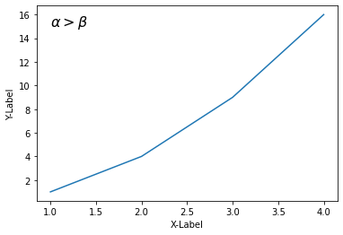

그리스 문자를 위한 TeX 기호는 아래의 표를 참고  

**소문자**
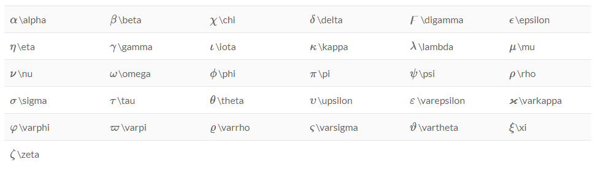

**대문자**
  

## 위 첨자(Superscripts), 아래첨자(Subscrips)
위 첨자와 아래 첨자를 위해서는 아래와 같이 각각 ‘^’와 ‘_’ 기호를 사용한다.  
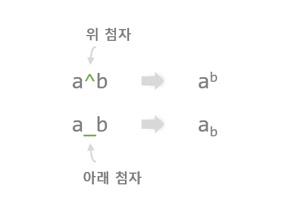
예제  
```python
import matplotlib.pyplot as plt

plt.plot([1, 2, 3, 4], [1, 4, 9, 16])
plt.xlabel('X-Label')
plt.ylabel('Y-Label')
plt.text(1, 15, r'$\alpha^2 > \beta_5$', fontdict={'size': 16})

plt.show()
```
‘^’와 ‘_’를 사용해서 그래프에 위 첨자와 아래 첨자를 포함하는 수식 표현을 삽입했다.

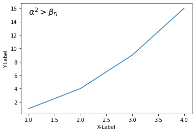

## 분수(Fractions)
분수 표현을 사용하기 위해서는 아래와 같이 \frac{ }{ } 표현을 사용한다.  

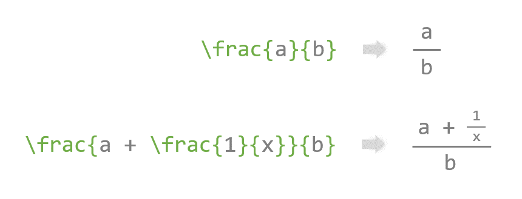

예제  
```python
import matplotlib.pyplot as plt

plt.plot([1, 2, 3, 4], [1, 4, 9, 16])
plt.xlabel('X-Label')
plt.ylabel('Y-Label')
plt.text(1, 15, r'$\frac{1}{2} + \frac{3}{4} = \frac{5}{4}$', fontdict={'size': 16})

plt.show()
```
아래와 같이 그래프에 분수 표현 수식이 삽입되었다.  
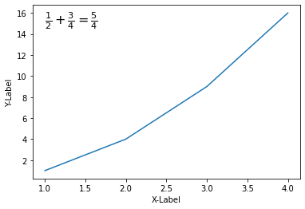

## 거듭제곱 근호 (Radical Signs)
거듭제곱 근호를 표현하기 위해서는 \sqrt{ } 또는 \sqrt[ ]{ }를 사용한다.

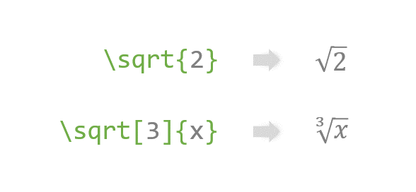

예제  
```python
import matplotlib.pyplot as plt

plt.plot([1, 2, 3, 4], [1, 4, 9, 16])
plt.xlabel('X-Label')
plt.ylabel('Y-Label')
plt.text(1, 15, r'$\sqrt{2} + \sqrt[3]{x} = y$', fontdict={'size': 16})

plt.show()
```
아래와 같이 그래프에 근호를 포함한 수식이 삽입되었다.  

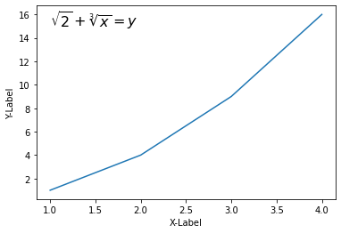

## 액센트 (Accents)
액센트는 강세, 억양을 나타내거나 수학적 표현을 위해 문자의 위에 표시되는 기호이다.

Matplotlib에서 액센트를 사용하기 위해서는 아래와 같이 \acute, \bar 등의 TeX 기호를 함께 사용한다.

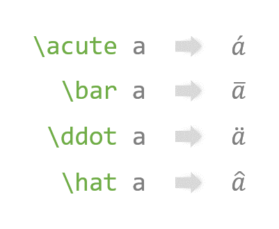

예제  
```python
import matplotlib.pyplot as plt

plt.plot([1, 2, 3, 4], [1, 4, 9, 16])
plt.xlabel('X-Label')
plt.ylabel('Y-Label')
plt.text(1, 15, r'$\acute a, \bar a, \tilde a$', fontdict={'size': 16})
plt.text(1, 13, r'$\vec a \cdot \vec a = |\vec a|^2$', fontdict={'size': 16})
plt.text(1, 11, r'$\overline{abc}$', fontdict={'size': 16})

plt.show()
```
다양한 액센트 기호를 포함하는 문자열을 그래프에 나타냈다.

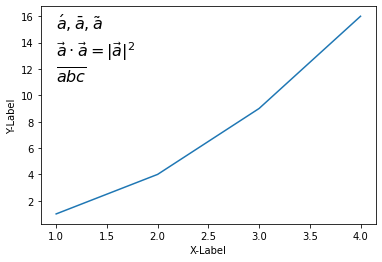

## 표준 함수 (Standard Functions)와 대형 기호 (Big Symbols)
아래 그림과 같이 Matplotlib에서 삼각함수 (sin, cos, tan 등), 극한 (lim), 최대 (max), 최소 (min) 등의 표현과 다양한 대형 연산자 기호를 사용할 수 있다.  


예제  
```python
import matplotlib.pyplot as plt

plt.plot([1, 2, 3, 4], [1, 4, 9, 16])
plt.xlabel('X-Label')
plt.ylabel('Y-Label')
plt.text(1, 15, r'$\sin (x) \ \cos (x) \ \tan (x)$', fontdict={'size': 16})
plt.text(1, 12, r'$\lim_{x\rightarrow 2} (x^2 - x + 2)$', fontdict={'size': 16})
plt.text(1, 8, r'$\sum_{n=0}^{10}{(n^2 + n)}$', fontdict={'size': 16})
plt.show()
```
그래프에 여러가지 삼각함수와 극한 기호, 그리고 합 기호 (Summation symbol)를 표시했다.

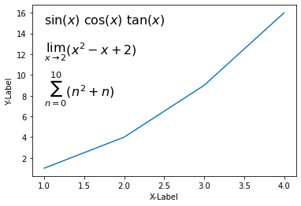

더 다양한 표준 함수의 기호는 아래의 표를 참고  
  

대형 기호는 아래의 표를 참고
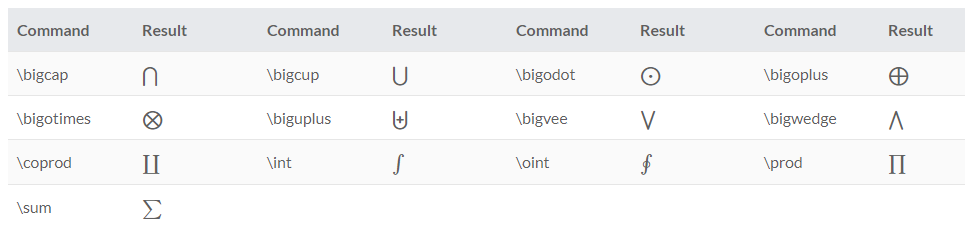