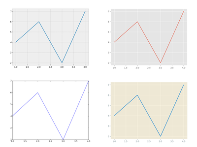
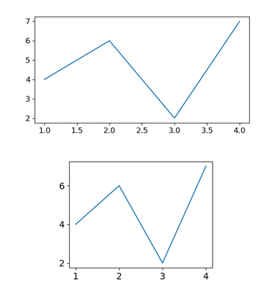
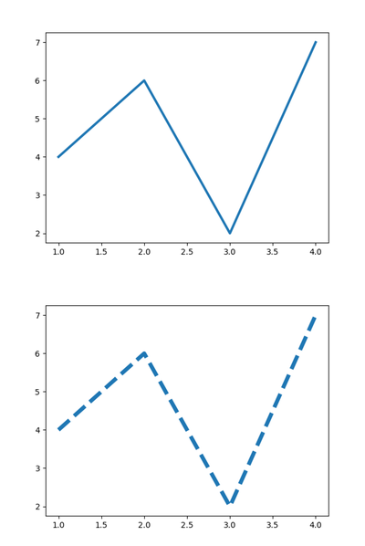
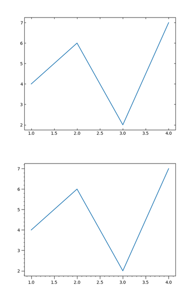

# 28. Matplotlib 그래프 스타일 설정하기
## 기본 사용

예제  
```python
import matplotlib.pyplot as plt

plt.style.use('bmh')
# plt.style.use('ggplot')
# plt.style.use('classic')
# plt.style.use('Solarize_Light2')
# plt.style.use('default')

plt.plot([1, 2, 3, 4], [4, 6, 2, 7])
plt.show()
```
**matplotlib.style** 모듈은 미리 만들어놓은 Matplotlib 그래프 스타일을 포함하고 있다.

**matplotlib.style.use()** 를 사용해서 다양한 스타일을 지정할 수 있다.

예제에서는 ‘bmh’, ‘ggplot’, ‘classic’, ‘Solarize_Light2’ 네 가지의 스타일을 지정했다.

다시 기본 스타일로 돌아가기 위해서는 plt.style.use(‘default’)를 호출하면 된다.



<br>
사용할 수 있는 Matplotlib 스타일을 확인하기 위해서는 아래의 코드를 실행.

```python
import matplotlib.pyplot as plt

print(plt.style.available)
```

</br>

## rcParams 사용하기

예제1  
```python
import matplotlib.pyplot as plt

plt.style.use('default')
plt.rcParams['figure.figsize'] = (6, 3)
plt.rcParams['font.size'] = 12
# plt.rcParams['figure.figsize'] = (4, 3)
# plt.rcParams['font.size'] = 14

plt.plot([1, 2, 3, 4], [4, 6, 2, 7])
plt.show()
```
미리 지정해놓은 스타일을 사용하지 않고, 각각의 스타일 관련 파라미터 (**rcParams**)를 지정할 수 있다.

**‘figure.figsize’** 를 사용해서 그래프 이미지의 크기를 (6, 3)과 (4, 3)으로,

**‘font.size’**를 사용해서 폰트의 크기를 12와 14로 각각 지정했다.

아래의 두 그래프를 얻을 수 있다.



</br>

예제2  
```python
import matplotlib.pyplot as plt

plt.style.use('default')
plt.rcParams['lines.linewidth'] = 3
plt.rcParams['lines.linestyle'] = '-'
# plt.rcParams['lines.linewidth'] = 5
# plt.rcParams['lines.linestyle'] = '--'

plt.plot([1, 2, 3, 4], [4, 6, 2, 7])
plt.show()
```
이번에는 **‘lines.linewidth’** 를 사용해서 선의 두께를 3과 5로,

**‘lines.linestyle’** 를 사용해서 선의 스타일을 ‘-‘과 ‘- -‘로 지정했다.  



</br>

예제3  
```python
import matplotlib.pyplot as plt

plt.style.use('default')
plt.rcParams['xtick.top'] = True
plt.rcParams['ytick.right'] = True
plt.rcParams['xtick.direction'] = 'in'
plt.rcParams['ytick.direction'] = 'in'
# plt.rcParams['xtick.major.size'] = 7
# plt.rcParams['ytick.major.size'] = 7
# plt.rcParams['xtick.minor.visible'] = True
# plt.rcParams['ytick.minor.visible'] = True

plt.plot([1, 2, 3, 4], [4, 6, 2, 7])
plt.show()
```
축 눈금과 관련된 **rcParams**을 설정했다.

**‘xtick.top’, ‘ytick.right’** 을 True로 설정하면 데이터 영역의 위, 오른쪽에 눈금이 표시된다.

**‘xtick.direction’, ytick.direction’** 은 눈금이 표시될 방향이며, {‘in’, ‘out’, ‘inout’} 중 선택할 수 있다.

**‘xtick.major.size’, ytick.major.size’** 는 주 눈금의 크기 (길이)를 지정한다.

**‘xtick.minor.visible’, ytick.minor.visible’** 을 True로 설정하면 보조 눈금이 함께 표시된다.

