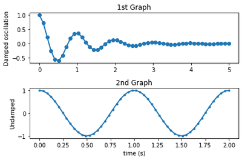
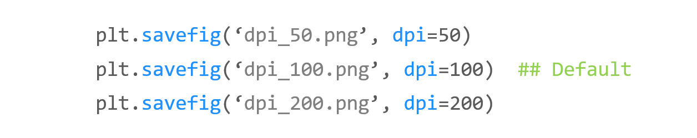
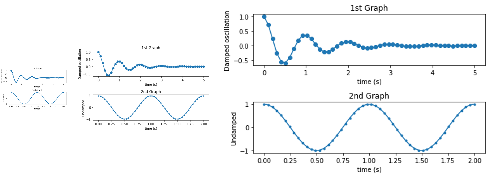
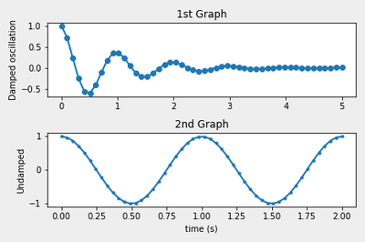
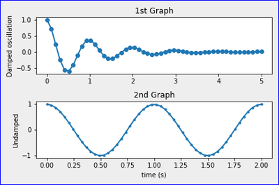
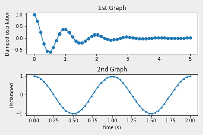
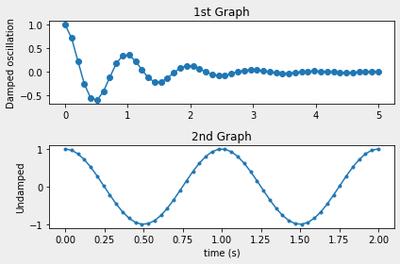
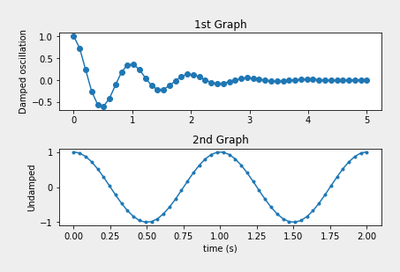
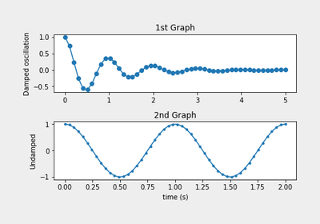

# 29. Matplotlib 이미지 저장하기
## 기본 사용

예제  
```python
import numpy as np
import matplotlib.pyplot as plt

x1 = np.linspace(0.0, 5.0)
x2 = np.linspace(0.0, 2.0)

y1 = np.cos(2 * np.pi * x1) * np.exp(-x1)
y2 = np.cos(2 * np.pi * x2)

plt.subplot(2, 1, 1)                # nrows=2, ncols=1, index=1
plt.plot(x1, y1, 'o-')
plt.title('1st Graph')
plt.ylabel('Damped oscillation')

plt.subplot(2, 1, 2)                # nrows=2, ncols=1, index=2
plt.plot(x2, y2, '.-')
plt.title('2nd Graph')
plt.xlabel('time (s)')
plt.ylabel('Undamped')

plt.tight_layout()
# plt.show()
plt.savefig('savefig_default.png')
```
**plt.savefig()** 함수에 파일 이름을 입력해주면 아래와 같은 이미지 파일이 저장된다.



</br>

## dpi 설정하기

예제  
```python
plt.savefig('savefig_default.png')
plt.savefig('savefig_50dpi.png', dpi=50)
plt.savefig('savefig_200dpi.png', dpi=200)
```
**dpi (Dots per Inch)** 는 이미지의 해상도를 설정한다. 디폴트는 dpi=100이다.

해상도에 따라 아래와 같은 이미지가 저장된다.



</br>

## facecolor 설정하기

예제  
```python
plt.savefig('savefig_facecolor.png', facecolor='#eeeeee')
```
**facecolor**는 이미지의 배경색을 설정한다.

아래와 같은 이미지가 저장된다.



</br>

## edgecolor 설정하기

예제  
```python
import numpy as np
import matplotlib.pyplot as plt

plt.figure(linewidth=2)

x1 = np.linspace(0.0, 5.0)
x2 = np.linspace(0.0, 2.0)

y1 = np.cos(2 * np.pi * x1) * np.exp(-x1)
y2 = np.cos(2 * np.pi * x2)

plt.subplot(2, 1, 1)                # nrows=2, ncols=1, index=1
plt.plot(x1, y1, 'o-')
plt.title('1st Graph')
plt.ylabel('Damped oscillation')

plt.subplot(2, 1, 2)                # nrows=2, ncols=1, index=2
plt.plot(x2, y2, '.-')
plt.title('2nd Graph')
plt.xlabel('time (s)')
plt.ylabel('Undamped')

# plt.show()
plt.savefig('savefig_edgecolor.png', facecolor='#eeeeee', edgecolor='blue')
```
**edgecolor**는 이미지의 테두리선의 색상을 설정한다.

테두리선의 너비가 기본적으로 0이기 때문에 먼저 linewidth=2로 설정해 준 다음 테두리 색을 지정한다.

아래와 같은 이미지가 저장된다.



</br>

## bbox_inches 설정하기

예제  
```python
plt.savefig('savefig_bbox_inches.png', facecolor='#eeeeee')
plt.savefig('savefig_bbox_inches2.png', facecolor='#eeeeee', bbox_inches='tight')
```
**bbox_inches**는 그래프로 저장할 영역을 설정한다.

디폴트로 **None**이지만, ‘tight’로 지정하면 여백을 최소화하고 그래프 영역만 이미지로 저장한다.  

bbox_inches 설정하기 (디폴트)
  

<br>

bbox_inches 설정하기 (tight)  


</br>

## pad_inches 설정하기

예제  
```python
plt.savefig('savefig_pad_inches.png', facecolor='#eeeeee',
            bbox_inches='tight', pad_inches=0.3)
plt.savefig('savefig_pad_inches2.png', facecolor='#eeeeee',
            bbox_inches='tight', pad_inches=0.5)
```
**bbox_inches=’tight’** 로 지정하면 **pad_inches**를 함께 사용해서 **여백 (Padding)** 을 지정할 수 있다.

**pad_inches**의 디폴트 값은 0.1이며, 0.3과 0.5로 지정했을 때의 결과는 아래와 같다.

pad_inches 설정하기 (0.3)


<br>

pad_inches 설정하기 (0.5)
