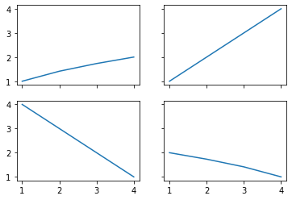
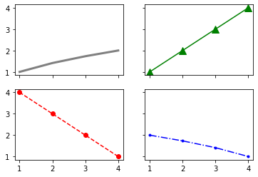
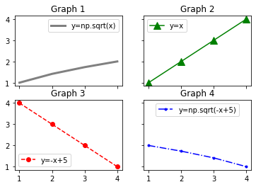

# Matplotlib 객체 지향 인터페이스 2
## 그래프 그리기
예제  
```python
import matplotlib.pyplot as plt
import numpy as np

x = np.arange(1, 5)     # [1, 2, 3, 4]

fig, ax = plt.subplots(2, 2, sharex=True, sharey=True, squeeze=True)
ax[0][0].plot(x, np.sqrt(x))      # left-top
ax[0][1].plot(x, x)               # right-top
ax[1][0].plot(x, -x+5)            # left-bottom
ax[1][1].plot(x, np.sqrt(-x+5))   # right-bottom

plt.show()
```
NumPy를 이용해서 x값들을 만들고, 네 개의 그래프 영역에 각각 다른 y값을 그래프로 나타냈다.

plt.subplots()이 반환하는 ax는 **Matplotlib의 Axes 클래스의 인스턴스**이다.

행과 열을 각각 2, 2로 지정했기 때문에 ax는 2×2의 형태를 갖는 NumPy 어레이가 된다.

위치에 따라 각각 ax[0][0], ax[0][1], ax[1][0], ax[1][1]과 같이 접근해서 사용할 수 있다.  



## 스타일 설정하기
예제  
```python
import matplotlib.pyplot as plt
import numpy as np

x = np.arange(1, 5)     # [1, 2, 3, 4]

fig, ax = plt.subplots(2, 2, sharex=True, sharey=True, squeeze=True)
ax[0][0].plot(x, np.sqrt(x), 'gray', linewidth=3)
ax[0][1].plot(x, x, 'g^-', markersize=10)
ax[1][0].plot(x, -x+5, 'ro--')
ax[1][1].plot(x, np.sqrt(-x+5), 'b.-.')

plt.show()
```
**plot()** 에 각각의 그래프의 스타일을 커스터마이즈하도록 설정할 수 있다.



## 제목과 범례 표시하기
예시  
```python
import matplotlib.pyplot as plt
import numpy as np

x = np.arange(1, 5)     # [1, 2, 3, 4]

fig, ax = plt.subplots(2, 2, sharex=True, sharey=True, squeeze=True)
ax[0][0].plot(x, np.sqrt(x), 'gray', linewidth=3, label='y=np.sqrt(x)')
ax[0][0].set_title('Graph 1')
ax[0][0].legend()
ax[0][1].plot(x, x, 'g^-', markersize=10, label='y=x')
ax[0][1].set_title('Graph 2')
ax[0][1].legend(loc='upper left')
ax[1][0].plot(x, -x+5, 'ro--', label='y=-x+5')
ax[1][0].set_title('Graph 3')
ax[1][0].legend(loc='lower left')
ax[1][1].plot(x, np.sqrt(-x+5), 'b.-.', label='y=np.sqrt(-x+5)')
ax[1][1].set_title('Graph 4')
ax[1][1].legend(loc='upper center')

plt.show()
```
**set_title()** 과 **legend()** 를 이용해서 각각의 그래프에 제목과 범례를 설정할 수 있다.

**set_title()** 은 입력한 문자열을 그래프의 제목으로 나타낸다.

**legend()** 는 **plot()** 에서 label을 이용해서 지정한 문자열을 범례에 나타낸다.

그래프 영역에서 범례가 표시될 위치를 지정할 수 있는데, 지정하지 않으면 최적의 위치에 범례를 표시한다.

범례가 표시될 위치를 설정하기 위한 옵션은 아래와 같다.
```python
'best'
'upper right'
'upper left'
'lower left'
'lower right'
'right'
'center left'
'center right'
'lower center'
'upper center'
'center'
```
