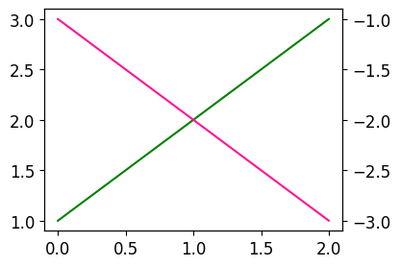

# 33. Matplotlib 이중 Y축 표시하기
## 기본 사용

예제  
```python
import matplotlib.pyplot as plt
import numpy as np

plt.style.use('default')
plt.rcParams['figure.figsize'] = (4, 3)
plt.rcParams['font.size'] = 12

x = np.arange(0, 3)
y1 = x + 1
y2 = -x - 1

fig, ax1 = plt.subplots()
ax1.plot(x, y1, color='green')

ax2 = ax1.twinx()
ax2.plot(x, y2, color='deeppink')

plt.show()
```
**ax1.plot(x, y1, color=’green’)** 은 첫번째 축에 (x, y1) 데이터를 나타낸다.

**ax1.twinx()** 는 ax1과 x축을 공유하는 새로운 Axes 객체를 만든다.

**ax2.plot(x, y2)** 는 새로운 Axes 객체에 (x, y2) 데이터를 나타낸다.



<br>

## 축 레이블 표시하기

예제  
```python
import matplotlib.pyplot as plt
import numpy as np

plt.style.use('default')
plt.rcParams['figure.figsize'] = (4, 3)
plt.rcParams['font.size'] = 12

x = np.arange(0, 3)
y1 = x + 1
y2 = -x - 1

fig, ax1 = plt.subplots()
ax1.set_xlabel('X-Axis')
ax1.set_ylabel('1st Y-Axis')
ax1.plot(x, y1, color='green')

ax2 = ax1.twinx()
ax2.set_ylabel('2nd Y-Axis')
ax2.plot(x, y2, color='deeppink')

plt.show()
```
**set_xlabel(), set_ylabel()** 메서드는 각 축에 대한 레이블을 표시하도록 한다.


<br>

## 범례 표시하기 1

예제  
```python
import matplotlib.pyplot as plt
import numpy as np

plt.style.use('default')
plt.rcParams['figure.figsize'] = (4, 3)
plt.rcParams['font.size'] = 14

x = np.arange(0, 3)
y1 = x + 1
y2 = -x - 1

fig, ax1 = plt.subplots()
ax1.set_xlabel('X-Axis')
ax1.set_ylabel('1st Y-Axis')
ax1.plot(x, y1, color='green', label='1st Data')
ax1.legend(loc='upper right')

ax2 = ax1.twinx()
ax2.set_ylabel('2nd Y-Axis')
ax2.plot(x, y2, color='deeppink', label='2nd Data')
ax2.legend(loc='lower right')

plt.show()
```
각 축의 데이터 곡선에 대한 범례를 나타내기 위해 **legend()** 메서드를 사용한다.


<br>

## 범례 표시하기 2

예제  
```python
import matplotlib.pyplot as plt
import numpy as np

plt.style.use('default')
plt.rcParams['figure.figsize'] = (4, 3)
plt.rcParams['font.size'] = 14

x = np.arange(0, 3)
y1 = x + 1
y2 = -x - 1

fig, ax1 = plt.subplots()
ax1.set_xlabel('X-Axis')
ax1.set_ylabel('1st Y-Axis')
line1 = ax1.plot(x, y1, color='green', label='1st Data')

ax2 = ax1.twinx()
ax2.set_ylabel('2nd Y-Axis')
line2 = ax2.plot(x, y2, color='deeppink', label='2nd Data')

lines = line1 + line2
labels = [l.get_label() for l in lines]
ax1.legend(lines, labels, loc='upper right')
plt.show()
```
두 축에 대한 범례를 하나의 텍스트 상자에 표시하기 위해서는 위의 예제와 같이

두 곡선을 먼저 합친 후 **legend()** 메서드를 사용.

