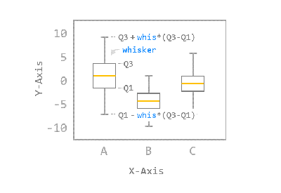
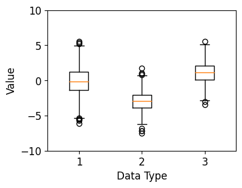
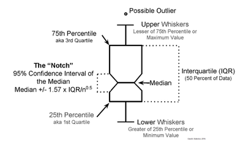
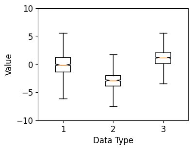
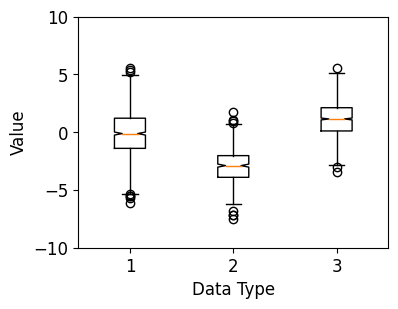
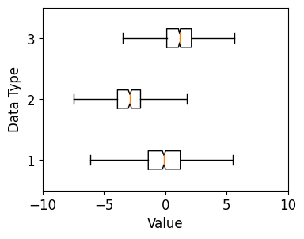

# 35. Matplotlib 박스 플롯 그리기
## 기본 사용
예제  
```python
import matplotlib.pyplot as plt
import numpy as np

# 1. 기본 스타일 설정
plt.style.use('default')
plt.rcParams['figure.figsize'] = (4, 3)
plt.rcParams['font.size'] = 12

# 2. 데이터 준비
np.random.seed(0)
data_a = np.random.normal(0, 2.0, 1000)
data_b = np.random.normal(-3.0, 1.5, 500)
data_c = np.random.normal(1.2, 1.5, 1500)

# 3. 그래프 그리기
fig, ax = plt.subplots()

ax.boxplot([data_a, data_b, data_c])
ax.set_ylim(-10.0, 10.0)
ax.set_xlabel('Data Type')
ax.set_ylabel('Value')

plt.show()
```
**ax.boxplot()** 은 주어진 데이터 어레이로부터 얻어진 요약 수치를 박스 형태로 나타낸다.

np.random 모듈의 **normal()** 함수는 정규 분포로부터 난수를 생성한다.

세 개의 난수 데이터 어레이를 리스트 형태로 입력했다.

가운데 박스 모양으로부터 그려지는 중심선을 **수염 (Whisker)** 이라고 한다.

**boxplot()** 함수는 기본적으로 박스의 위쪽 경계로부터 **Q3 + whis\*(Q3-Q1)** 까지,

박스의 아래쪽 경계로부터 **Q1 - whis\*(Q3-Q1)** 까지 **수염 (Whisker)** 을 나타낸다.



**whis** 파라미터의 디폴트 값은 1.5이며, **수염 외부의 데이터 포인트 (Outlier)는 개별적으로 표시** 된다.



</br>

## 노치 표시하기
예제  
```python
import matplotlib.pyplot as plt
import numpy as np

# 1. 기본 스타일 설정
plt.style.use('default')
plt.rcParams['figure.figsize'] = (4, 3)
plt.rcParams['font.size'] = 12

# 2. 데이터 준비
np.random.seed(0)
data_a = np.random.normal(0, 2.0, 1000)
data_b = np.random.normal(-3.0, 1.5, 500)
data_c = np.random.normal(1.2, 1.5, 1500)

# 3. 그래프 그리기
fig, ax = plt.subplots()

ax.boxplot([data_a, data_b, data_c], notch=True, whis=2.5)
ax.set_ylim(-10.0, 10.0)
ax.set_xlabel('Data Type')
ax.set_ylabel('Value')

plt.show()
```
**ax.boxplot()** 의 **notch** 파라미터를 True로 지정하면 중앙값 (Median)의 95% 신뢰 구간을 노치 형태로 표시한 **Notched Boxplot**을 나타낸다.

아래 그림에서 노치의 범위를 결정하는 **IQR (Inter Quartile Range)** 은 사분위 범위이며, (Q3-Q1)으로 주어집니다.
  
이미지 참고 : [링크](https://sites.google.com/site/davidsstatistics/davids-statistics/notched-box-plots)  

이 예제에서는 whis=2.5로 지정해서, 수염의 길이가 길어지고 수염 범위 밖의 데이터가 표시되지 않았다.



</br>

## 분위수 값, 중앙값 등 얻기
예제  
```python
import matplotlib.pyplot as plt
import numpy as np

# 1. 기본 스타일 설정
plt.style.use('default')
plt.rcParams['figure.figsize'] = (4, 3)
plt.rcParams['font.size'] = 12

# 2. 데이터 준비
np.random.seed(0)
data_a = np.random.normal(0, 2.0, 1000)
data_b = np.random.normal(-3.0, 1.5, 500)
data_c = np.random.normal(1.2, 1.5, 1500)

# 3. 그래프 그리기
fig, ax = plt.subplots()

box = ax.boxplot([data_a, data_b, data_c], notch=True, whis=1.5)
ax.set_ylim(-10.0, 10.0)
ax.set_xlabel('Data Type')
ax.set_ylabel('Value')

whiskers = [item.get_ydata() for item in box['whiskers']]
medians = [item.get_ydata() for item in box['medians']]
fliers = [item.get_ydata() for item in box['fliers']]

print('whiskers:', whiskers)
print('medians:', medians)
print('fliers:', fliers)

plt.show()
```
**ax.boxplot()** 은 박스 플롯의 각 구성 요소에 해당하는 Line2D 인스턴스의 리스트를 딕셔너리의 형태로 반환한다.

예를 들어, 위의 예제에서 **box[‘whiskers’]** 는 Q1, Q3, max, min 값, **box[‘medians’]** 는 중앙값에 대한 정보를 갖는 Line2D 인스턴스의 리스트이다.

**box[‘fliers’]** 는 수염 범위 밖의 데이터 포인트를 반환하는데, (각 데이터셋에 해당하는) 세 개의 어레이를 갖는 리스트가 출력되었다.

**get_ydata()** 메서드를 사용해서 y 값 위치를 얻을 수 있다.  

```pyothon
whiskers: [array([-1.39684012, -5.31123819]), array([1.2139012 , 4.99440078]), array([-3.90406317, -6.23710285]), array([-2.02661826,  0.67684458]), array([ 0.11032143, -2.87951905]), array([2.1221751 , 5.13086077])]
medians: [array([-0.11605607, -0.11605607]), array([-2.89070397, -2.89070397]), array([1.14767116, 1.14767116])]
fliers: [array([-5.54518551, -5.31834448, -5.47935433, -6.09228611, -5.66910901,
      5.39244811,  5.18884918,  5.51871023]), array([-7.16603872, -7.2033042 , -6.80183169, -7.49191929,  1.75646216,
      0.78955236,  0.96440358,  1.02085626]), array([-3.47528489, -3.0480178 ,  5.59364436])]
```


</br>

## 수평 박스 플롯 나타내기
예제  
```python
import matplotlib.pyplot as plt
import numpy as np

# 1. 기본 스타일 설정
plt.style.use('default')
plt.rcParams['figure.figsize'] = (4, 3)
plt.rcParams['font.size'] = 12

# 2. 데이터 준비
np.random.seed(0)
data_a = np.random.normal(0, 2.0, 1000)
data_b = np.random.normal(-3.0, 1.5, 500)
data_c = np.random.normal(1.2, 1.5, 1500)

# 3. 그래프 그리기
fig, ax = plt.subplots()

ax.boxplot([data_a, data_b, data_c], notch=True, whis=2.5, vert=False)
ax.set_xlim(-10.0, 10.0)
ax.set_xlabel('Value')
ax.set_ylabel('Data Type')

plt.show()
```
**ax.boxplot()** 의 **vert** 파라미터를 False로 지정하면 수평 방향의 박스 플롯이 나타난다.

디폴트는 수직 방향의 박스 플롯이다.

