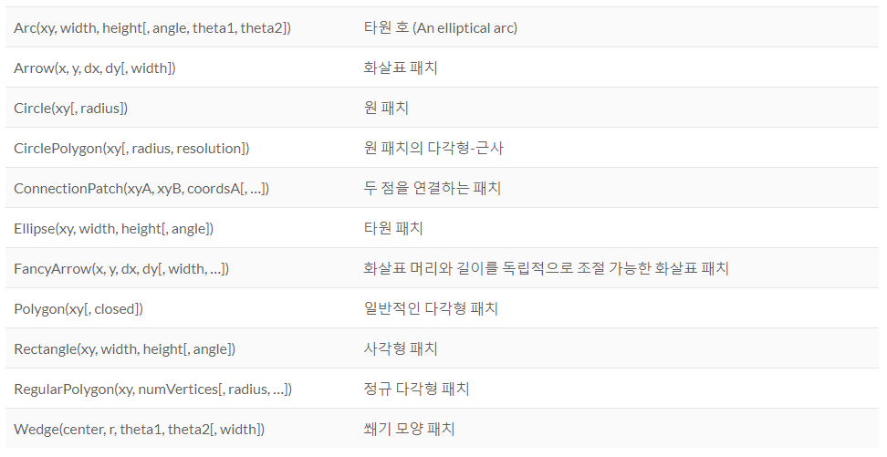
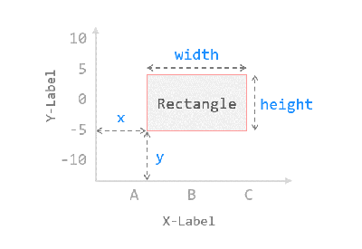
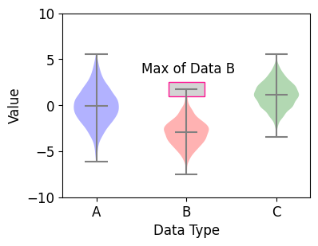
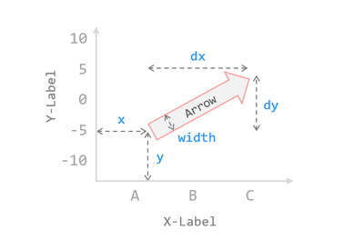
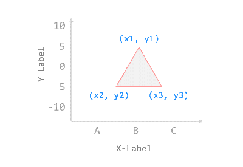
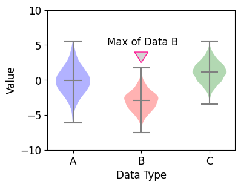

# 37. Matplotlib 다양한 도형 삽입하기
Matplotlib의 그림에 표현되는 모든 성분들은 **Artist** 클래스의 서브클래스이다.

**Patch**는 면 색 (facecolor)과 테두리 색 (edgecolor)을 갖는 **2D 도형을 그래프의 캔버스 영역에 표현하기 위한 Artist 클래스의 서브클래스**이다.

**matplotlib.patches** 모듈에 포함된 주요한 도형 클래스는 아래와 같다.



</br>

## 사각형 그리기 (Rectangle)
앞에서 소개했던 바이올린 플롯의 특정 위치에 사각형 (Rectangle)과 텍스트를 추가.

예제  
```python
import matplotlib.pyplot as plt
import matplotlib.patches as patches
import numpy as np

# 1. 기본 스타일 설정
plt.style.use('default')
plt.rcParams['figure.figsize'] = (4, 3)
plt.rcParams['font.size'] = 12

# 2. 데이터 준비
np.random.seed(0)
data_a = np.random.normal(0, 2.0, 1000)
data_b = np.random.normal(-3.0, 1.5, 500)
data_c = np.random.normal(1.2, 1.5, 1500)

# 3. 그래프 그리기
fig, ax = plt.subplots()

violin = ax.violinplot([data_a, data_b, data_c], showmeans=True)
ax.set_ylim(-10.0, 10.0)
ax.set_xticks(np.arange(1, 4))
ax.set_xticklabels(['A', 'B', 'C'])
ax.set_xlabel('Data Type')
ax.set_ylabel('Distribution')

violin['bodies'][0].set_facecolor('blue')
violin['bodies'][1].set_facecolor('red')
violin['bodies'][2].set_facecolor('green')

violin['cbars'].set_edgecolor('gray')
violin['cmaxes'].set_edgecolor('gray')
violin['cmins'].set_edgecolor('gray')
violin['cmeans'].set_edgecolor('gray')

# 4. 사각형 그리기
ax.add_patch(
   patches.Rectangle(
      (1.8, 1.0),                   # (x, y)
      0.4, 1.5,                     # width, height
      edgecolor = 'deeppink',
      facecolor = 'lightgray',
      fill=True,
   ))

# 5. 텍스트 삽입하기
ax.text(1.5, 3.5, 'Max of Data B')

plt.show()
```
우선 **matplotlib.patches** 모듈을 불러온다.

**ax.add_patch()** 메서드는 입력한 **Patch**를 그래프 영역에 추가한다.

**patches.Rectangle()** 패치는 그래프에 사각형을 표현하기 위해 사용한다.

(x, y) 위치와 width, height를 순서대로 입력하고, edgecolor와 facecolor를 지정한다.

fill=True로 지정하면 도형의 면에 색이 채워진다.



**text()** 메서드로 x=1.5, y=3.5 위치에 ‘Max of Data B’ 텍스트를 삽입했다.



</br>

## 화살표 그리기 (Arrow)
예제  
```python
import matplotlib.pyplot as plt
import matplotlib.patches as patches
import numpy as np

# 1. 기본 스타일 설정
plt.style.use('default')
plt.rcParams['figure.figsize'] = (4, 3)
plt.rcParams['font.size'] = 12

# 2. 데이터 준비
np.random.seed(0)
data_a = np.random.normal(0, 2.0, 1000)
data_b = np.random.normal(-3.0, 1.5, 500)
data_c = np.random.normal(1.2, 1.5, 1500)

# 3. 그래프 그리기
fig, ax = plt.subplots()

violin = ax.violinplot([data_a, data_b, data_c], showmeans=True)
ax.set_ylim(-10.0, 10.0)
ax.set_xticks(np.arange(1, 4))
ax.set_xticklabels(['A', 'B', 'C'])
ax.set_xlabel('Data Type')
ax.set_ylabel('Value')

violin['bodies'][0].set_facecolor('blue')
violin['bodies'][1].set_facecolor('red')
violin['bodies'][2].set_facecolor('green')

violin['cbars'].set_edgecolor('gray')
violin['cmaxes'].set_edgecolor('gray')
violin['cmins'].set_edgecolor('gray')
violin['cmeans'].set_edgecolor('gray')

# 4. 화살표 그리기
ax.add_patch(
     patches.Arrow(
        2.0, 4.0,
        0.0, -1.5,
        width=0.3,
        edgecolor = 'deeppink',
        facecolor = 'lightgray'
     ))

# 5. 텍스트 삽입하기
ax.text(1.5, 5.0, 'Max of Data B')

plt.show()
```
**patches.Arrow()** 패치는 그래프에 화살표 도형을 표현하기 위해 사용한다.

화살표 시작점 위치 x, y와 위치 변화량 dx, dy를 순서대로 입력한다.

width는 화살표 도형의 너비이다.



**text()** 메서드로 x=1.5, y=5.0 위치에 ‘Max of Data B’ 텍스트를 삽입했다.


</br>

## 다각형 그리기 (Polygon)
예제  
```python
import matplotlib.pyplot as plt
import matplotlib.patches as patches
import numpy as np

# 1. 기본 스타일 설정
plt.style.use('default')
plt.rcParams['figure.figsize'] = (4, 3)
plt.rcParams['font.size'] = 12

# 2. 데이터 준비
np.random.seed(0)
data_a = np.random.normal(0, 2.0, 1000)
data_b = np.random.normal(-3.0, 1.5, 500)
data_c = np.random.normal(1.2, 1.5, 1500)

# 3. 그래프 그리기
fig, ax = plt.subplots()

violin = ax.violinplot([data_a, data_b, data_c], showmeans=True)
ax.set_ylim(-10.0, 10.0)
ax.set_xticks(np.arange(1, 4))
ax.set_xticklabels(['A', 'B', 'C'])
ax.set_xlabel('Data Type')
ax.set_ylabel('Value')

violin['bodies'][0].set_facecolor('blue')
violin['bodies'][1].set_facecolor('red')
violin['bodies'][2].set_facecolor('green')

violin['cbars'].set_edgecolor('gray')
violin['cmaxes'].set_edgecolor('gray')
violin['cmins'].set_edgecolor('gray')
violin['cmeans'].set_edgecolor('gray')

# 4. 다각형 그리기
ax.add_patch(
     patches.Polygon(
        ((1.9, 4.0), (2.0, 2.5), (2.1, 4.0)),
        closed=True,
        edgecolor = 'deeppink',
        facecolor = 'lightgray'
     ))

# 5. 텍스트 삽입하기
ax.text(1.5, 5.0, 'Max of Data B')

plt.show()
```
**patches.Polygon()** 패치는 그래프에 **다각형 (Polygon)** 을 표현하기 위해 사용한다.

아래 그림과 같이 각각의 꼭지점 위치 (x, y) 튜플의 어레이를 입력한다.

closed=True로 지정하면 닫힌 다각형의 형태로 그려진다.



**text() 메서드**로 x=1.5, y=5.0 위치에 ‘Max of Data B’ 텍스트를 삽입했다.

