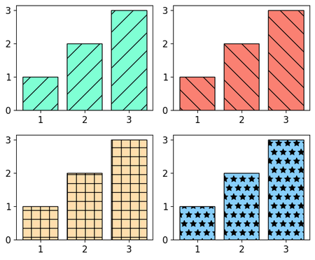
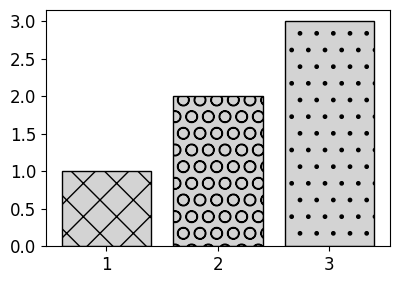
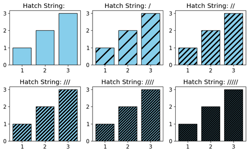

# 38. Matplotlib 다양한 패턴 채우기
## 기본 사용
예제1  
```python
import matplotlib.pyplot as plt

plt.style.use('default')
plt.rcParams['figure.figsize'] = (6, 5)
plt.rcParams['font.size'] = 12

x = [1, 2, 3]
y = [1, 2, 3]

fig, ((ax1, ax2), (ax3, ax4)) = plt.subplots(2, 2)

ax1.bar(x, y, color='aquamarine', edgecolor='black', hatch='/')
ax2.bar(x, y, color='salmon', edgecolor='black', hatch='\\')
ax3.bar(x, y, color='navajowhite', edgecolor='black', hatch='+')
ax4.bar(x, y, color='lightskyblue', edgecolor='black', hatch='*')

plt.tight_layout()
plt.show()
```
**bar()** 함수의 hatch는 막대 그래프의 막대 내부에 표시할 패턴을 지정한다.

예제에서는 네가지의 서로 다른 패턴을 지정했다.

아래의 **hatch 문자열** 중에서 선택해서 사용할 수 있다.
```python
{'/', '\\', '|', '-', '+', 'x', 'o', 'O', '.', '*'}
```


<br>

예제2  
```python
import matplotlib.pyplot as plt

plt.style.use('default')
plt.rcParams['figure.figsize'] = (4, 3)
plt.rcParams['font.size'] = 12

x = [1, 2, 3]
y = [1, 2, 3]

fig, ax = plt.subplots()

bars = ax.bar(x, y, color='lightgray', edgecolor='black')
bars[0].set_hatch('x')
bars[1].set_hatch('O')
bars[2].set_hatch('.')

plt.tight_layout()
plt.show()
```
**bar()** 함수는 막대 그래프의 모든 막대 도형 (BarContainer 클래스)을 반환한다.

**set_hatch()** 메서드는 각 도형에 채워질 패턴을 지정한다.



## 패턴의 밀도 지정하기
예제  
```python
import matplotlib.pyplot as plt
import numpy as np

plt.style.use('default')
plt.rcParams['figure.figsize'] = (8, 5)
plt.rcParams['font.size'] = 12

x = [1,2,3]
y = [1,2,3]

for i in range(6):
    hatch_str = "/" * i

    ax = plt.subplot(2, 3, i + 1)
    ax.set_title("Hatch String: " + hatch_str)
    bars = ax.bar(x,y,facecolor='skyblue', edgecolor='black')

    for bar in bars:
        bar.set_hatch(hatch_str)

plt.tight_layout()
plt.show()
```
**hatch** 문자열의 개수를 한 개 이상 입력함으로써 패턴의 밀도를 지정할 수 있다.

예제에서는 **hatch 문자열** ‘/’에 대해 개수를 0~5개로 조절했다.


## 패턴의 두께 지정하기
예제  
```python
import matplotlib.pyplot as plt
import numpy as np

plt.style.use('default')
plt.rcParams['figure.figsize'] = (8, 5)
plt.rcParams['font.size'] = 12
plt.rcParams['hatch.linewidth'] = 3

x = [1,2,3]
y = [1,2,3]

for i in range(6):
    hatch_str = "/" * i

    ax = plt.subplot(2, 3, i + 1)
    ax.set_title("Hatch String: " + hatch_str)
    bars = ax.bar(x,y,facecolor='skyblue', edgecolor='black')

    for bar in bars:
        bar.set_hatch(hatch_str)

plt.tight_layout()
plt.show()
```
‘hatch.linewidth’ 속성을 사용해서 패턴의 두께를 변경할 수 있다.

패턴에 사용되는 선의 두께의 디폴트는 1이며, 예제에서는 3으로 변경했다.

