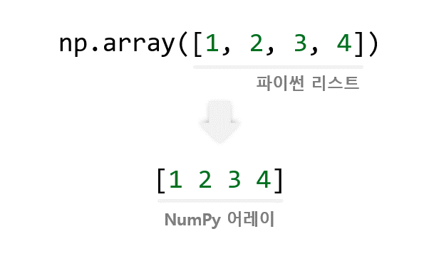
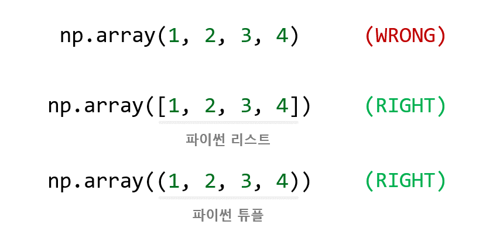
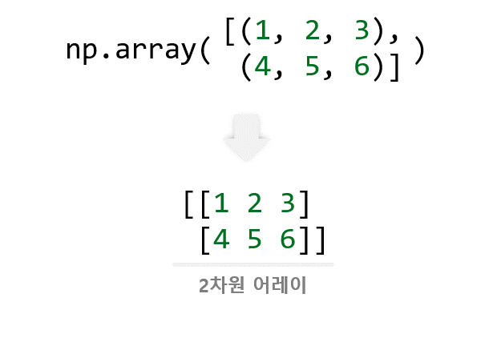
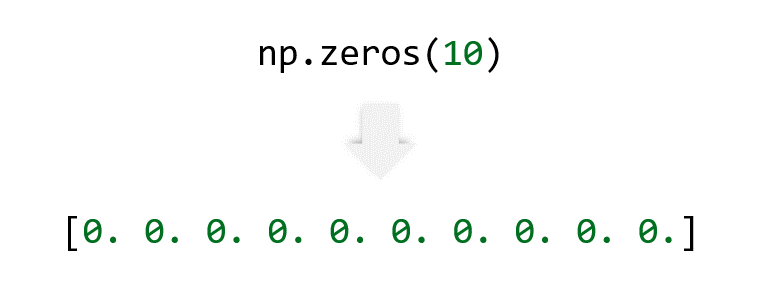
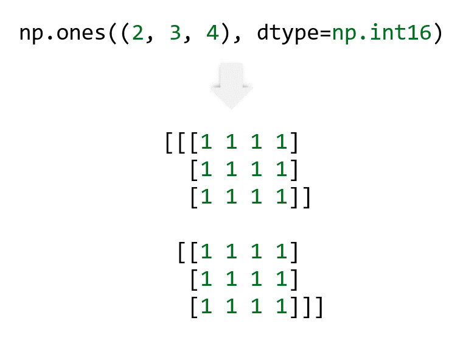
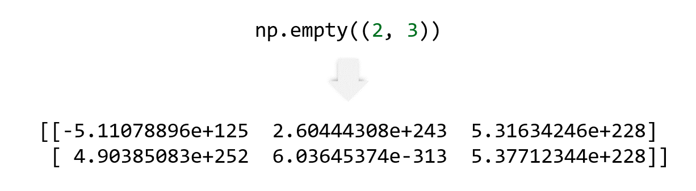
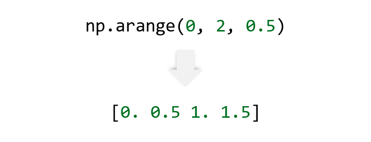

<!-- TOC -->

- [NumPy 어레이 만들기](#numpy-%EC%96%B4%EB%A0%88%EC%9D%B4-%EB%A7%8C%EB%93%A4%EA%B8%B0)
    - [np.array 사용하기](#nparray-%EC%82%AC%EC%9A%A9%ED%95%98%EA%B8%B0)
        - [예제](#%EC%98%88%EC%A0%9C)
        - [예제](#%EC%98%88%EC%A0%9C)
    - [차원 어레이 만들기](#%EC%B0%A8%EC%9B%90-%EC%96%B4%EB%A0%88%EC%9D%B4-%EB%A7%8C%EB%93%A4%EA%B8%B0)
        - [예제](#%EC%98%88%EC%A0%9C)
    - [타입 지정하기 dtype](#%ED%83%80%EC%9E%85-%EC%A7%80%EC%A0%95%ED%95%98%EA%B8%B0-dtype)
        - [예제](#%EC%98%88%EC%A0%9C)
    - [np.zeros, np.ones, np.empty 사용하기](#npzeros-npones-npempty-%EC%82%AC%EC%9A%A9%ED%95%98%EA%B8%B0)
        - [예제](#%EC%98%88%EC%A0%9C)
    - [np.arange 사용하기](#nparange-%EC%82%AC%EC%9A%A9%ED%95%98%EA%B8%B0)
        - [예제](#%EC%98%88%EC%A0%9C)
    - [np.linspace 사용하기](#nplinspace-%EC%82%AC%EC%9A%A9%ED%95%98%EA%B8%B0)
        - [예제](#%EC%98%88%EC%A0%9C)

<!-- /TOC -->

# 3. NumPy 어레이 만들기
## np.array() 사용하기
파이썬 리스트 또는 튜플을 `np.array()`에 입력하면 NumPy 어레이가 만들어진다.

### 예제
```python
import numpy as np

a = np.array([1, 2, 3, 4])
print(a)
print(type(a))
print(a.dtype)

b = np.array([1.2, 3.5, 5.1])
print(b)
print(type(b))
print(b.dtype)
```
```
[1 2 3 4]
<class 'numpy.ndarray'>
int32
[1.2 3.5 5.1]
<class 'numpy.ndarray'>
float64
```
NumPy 어레이 [1 2 3 4]와 [1.2 3.5 5.1]이 만들어졌다.

파이썬 내장함수 **type()** 을 이용해서 어레이의 자료형을 확인해보면, **numpy.ndarray** 클래스임을 알 수 있다.

**numpy.ndarray** 클래스의 **dtype** 속성은 **어레이의 요소의 자료형**을 알려준다.

</br>

### 예제
```python
a = np.array(1,2,3,4)    # WRONG
b = np.array([1,2,3,4])  # RIGHT
c = np.array((1,2,3,4))  # RIGHT
```
어레이를 생성할 때, np.array()에 숫자들을 그대로 입력하는 실수를 하게 된다.

두, 세번째 줄과 같이 파이썬 리스트 또는 튜플의 형태로 숫자들을 입력해주면 된다.



</br></br>

## 2차원 어레이 만들기
`np.array()`는 숫자 시퀀스의 시퀀스를 2차원 어레이로 변환한다.


### 예제
```python
import numpy as np

a = np.array([(1, 2, 3), (4, 5, 6)])
print(a)
```
```python
[[1 2 3]
 [4 5 6]]
```
시퀀스의 시퀀스의 시퀀스는 3차원 어레이가 되고, 그 이상도 마찬가지 이다.

</br></br>

## 타입 지정하기 (dtype)
어레이를 생성할 때 어레이의 타입을 명시적으로 지정할 수 있다.
### 예제
```python
import numpy as np

a = np.array([[1,2], [3,4]], dtype=complex)
print(a)
```
```python
[[1.+0.j 2.+0.j]
 [3.+0.j 4.+0.j]]
```
**dtype=complex**를 이용해서 복소수 타입을 갖는 어레이를 만들었다.

</br></br>

## np.zeros(), np.ones(), np.empty() 사용하기
어레이가 만들어지는 시점에 어레이의 크기는 알지만 요소의 값이 정해지지 않았을 수 있다.

NumPy는 초기 플레이스홀더 (placeholder)를 이용해서 어레이를 만들기 위한 다양한 함수를 제공한다.

이 함수들은 어레이를 효과적으로 초기화하도록 한다.

### 예제
```python
import numpy as np

a = np.zeros(10)
print(a)

b = np.ones((2, 3, 4), dtype=np.int16)
print(b)

c = np.empty((2, 3))
print(c)
```
```python
[0. 0. 0. 0. 0. 0. 0. 0. 0. 0.]
[[[1 1 1 1]
  [1 1 1 1]
  [1 1 1 1]]

 [[1 1 1 1]
  [1 1 1 1]
  [1 1 1 1]]]
[[-5.11078896e+125  2.60444308e+243  5.31634246e+228]
 [ 4.90385083e+252  6.03645374e-313  5.37712344e+228]]
 ```
 `np.zeros()`는 모두 0으로 채워진 어레이를 생성한다.

 

 </br></br>

 `np.ones()`는 모두 1로 채워진 어레이를 생성한다.

 

 </br></br>

`np.empty()`는 요소의 초기값을 임의로 정하는데, 메모리의 상태에 따라 결정된다.


기본적으로, 생성된 어레이의 자료형 (dtype)은 float64이다.

</br></br>

## np.arange() 사용하기
연속적인 숫자들을 만들어내기 위해 NumPy는 파이썬의 range()와 유사한 함수인 np.arange()를 제공하는데,  
np.arange()는 리스트 대신 어레이를 반환한다.



### 예제
```python
import numpy as np

a = np.arange(10, 30, 5)
b = np.arange(0, 2, 0.3)

print(a)
print(b)
```
```python
[10 15 20 25]
[0.  0.3 0.6 0.9 1.2 1.5 1.8]
```
a는 10에서 30 사이의 범위에서 step=5를 갖는 어레이 [10 15 20 25]이다.

b는 0에서 2 사이의 범위에서 step=0.3을 갖는 어레이 [0. 0.3 0.6 0.9 1.2 1.5 1.8]이다.

</br></br>

## np.linspace() 사용하기
**np.arange()** 를 부동소수점 인수와 함께 사용할 때,

부동소수점 정밀도의 제한 때문에 일반적으로 요소의 개수를 예측하기 어렵다.

이런 이유로 **증가폭 (step)** 대신 **요소의 개수를 인수**로 입력하는 **np.linspace()** 함수를 사용하는 것이 좋다.

### 예제
```python
import numpy as np
from numpy import pi

a = np.linspace(0, 2, 9)             # 9 numbers from 0 to 2
print(a)

x = np.linspace(0, 2*pi, 100)        # useful to evaluate function at lots of points
f = np.sin(x)
```
```python
[0.   0.25 0.5  0.75 1.   1.25 1.5  1.75 2.  ]
[0.         0.06346652 0.12693304 0.19039955 0.25386607 0.31733259
0.38079911 0.44426563 0.50773215 0.57119866 0.63466518 0.6981317
0.76159822 0.82506474 0.88853126 0.95199777 1.01546429 1.07893081
1.14239733 1.20586385 1.26933037 1.33279688 1.3962634  1.45972992
1.52319644 1.58666296 1.65012947 1.71359599 1.77706251 1.84052903
1.90399555 1.96746207 2.03092858 2.0943951  2.15786162 2.22132814
2.28479466 2.34826118 2.41172769 2.47519421 2.53866073 2.60212725
2.66559377 2.72906028 2.7925268  2.85599332 2.91945984 2.98292636
3.04639288 3.10985939 3.17332591 3.23679243 3.30025895 3.36372547
3.42719199 3.4906585  3.55412502 3.61759154 3.68105806 3.74452458
3.8079911  3.87145761 3.93492413 3.99839065 4.06185717 4.12532369
4.1887902  4.25225672 4.31572324 4.37918976 4.44265628 4.5061228
4.56958931 4.63305583 4.69652235 4.75998887 4.82345539 4.88692191
4.95038842 5.01385494 5.07732146 5.14078798 5.2042545  5.26772102
5.33118753 5.39465405 5.45812057 5.52158709 5.58505361 5.64852012
5.71198664 5.77545316 5.83891968 5.9023862  5.96585272 6.02931923
6.09278575 6.15625227 6.21971879 6.28318531]
```
**np.linspace(0, 2, 9)** 는 0부터 2까지 9개의 숫자를 갖는 어레이를 만든다.

**np.linspace(0, 2*pi, 100)** 와 같이 사용하면, 여러 포인트의 함수값을 얻을 때 유용하다.

