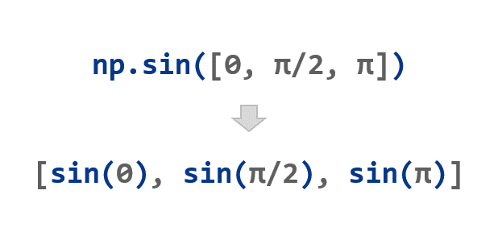

<!-- TOC -->

- [NumPy 범용 함수 ufunc](#numpy-%EB%B2%94%EC%9A%A9-%ED%95%A8%EC%88%98-ufunc)
    - [예제](#%EC%98%88%EC%A0%9C)

<!-- /TOC -->

# 6. NumPy 범용 함수 (ufunc)

NumPy는 **np.sin()**, **np.cos()**, **np.exp()**와 같은 다양한 수학 함수들을 제공하며,

이 함수들을 범용 함수 (Universal function, ufunc)라고 한다.

이러한 범용 함수들은 아래 그림과 같이 어레이의 요소별로 동작한다.



## 예제
```python
import numpy as np

a = np.array([0, np.pi/2, np.pi])
print(np.sin(a))
print(np.cos(a))

b = np.arange(3)
print(b)
print(np.exp(b))
print(np.sqrt(b))

c = np.array([2., -1., 4.])
print(np.add(b, c))
```
```python
[0.0000000e+00 1.0000000e+00 1.2246468e-16]
[ 1.000000e+00  6.123234e-17 -1.000000e+00]
[0 1 2]
[1.         2.71828183 7.3890561 ]
[0.         1.         1.41421356]
[2. 0. 6.]
```
위의 예제와 같이 **np.exp()**, **np.sqrt()**, **np.add()** 와 같은 NumPy의 범용 함수들은 어레이의 요소별로 동작하며, 출력 결과도 어레이이다.

NumPy에는 60개 이상의 범용 함수가 정의되어 있다.

**np.add()**, **np.subtract()**, **np.multiply()** 와 같은 수학 함수와 **np.sin()**, **np.cos()** 와 같은 삼각 함수 등이 있다.