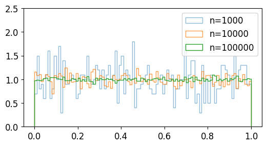
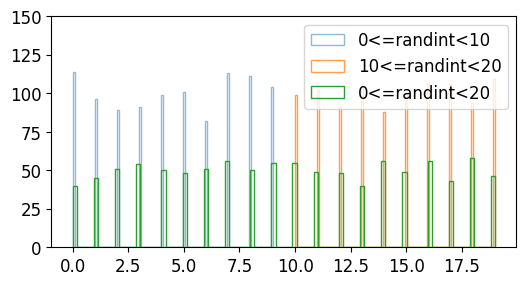
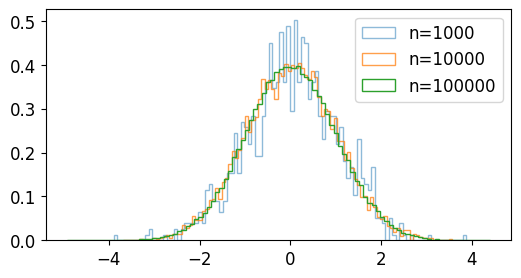
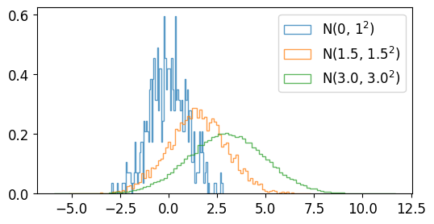
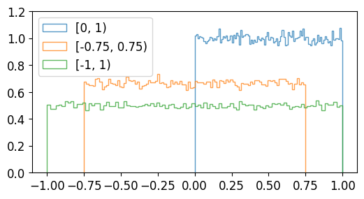
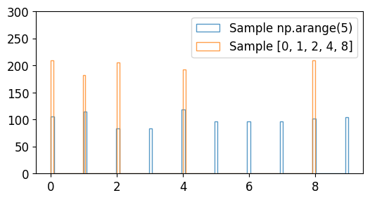

<!-- TOC -->

- [9. NumPy 난수 생성 (Random 모듈)](#9-numpy-난수-생성-random-모듈)
  - [random.rand()](#randomrand)
    - [예제1 - 기본 사용](#예제1---기본-사용)
    - [예제2 - Matplotlib 시각화](#예제2---matplotlib-시각화)
  - [random.randint()](#randomrandint)
    - [예제1 - 기본 사용](#예제1---기본-사용-1)
    - [예제2 - Matplotlib 시각화](#예제2---matplotlib-시각화-1)
  - [random.randn()](#randomrandn)
    - [예제1 - 기본 사용](#예제1---기본-사용-2)
    - [예제2 - Matplotlib 시각화](#예제2---matplotlib-시각화-2)
  - [random.standard\_normal()](#randomstandard_normal)
    - [예제1 - 기본 사용](#예제1---기본-사용-3)
    - [예제2 - Matplotlib 시각화](#예제2---matplotlib-시각화-3)
  - [random.normal()](#randomnormal)
    - [예제1 - 기본 사용](#예제1---기본-사용-4)
    - [예제2 - Matplotlib 시각화](#예제2---matplotlib-시각화-4)
  - [random.random\_sample()](#randomrandom_sample)
    - [예제1 - 기본 사용](#예제1---기본-사용-5)
    - [예제2 - Matplotlib 시각화](#예제2---matplotlib-시각화-5)
  - [random.choice()](#randomchoice)
    - [예제1 - 기본 사용](#예제1---기본-사용-6)
    - [예제2 - Matplotlib 시각화](#예제2---matplotlib-시각화-6)
  - [random.seed()](#randomseed)
    - [예제](#예제)

<!-- /TOC -->

# 9. NumPy 난수 생성 (Random 모듈)

## random.rand()
random.rand() 함수는 주어진 형태의 난수 어레이를 생성한다.
### 예제1 - 기본 사용
```python
import numpy as np

a = np.random.rand(5)
print(a)

b = np.random.rand(2, 3)
print(b)
```
```python
[0.41626628 0.40269923 0.80574938 0.67014962 0.47630372]

[[0.83739956 0.62462355 0.66043459]
 [0.96358531 0.23121274 0.68940178]]
```
만들어진 난수 어레이는 주어진 값에 의해 결정되며, [0, 1) 범위에서 균일한 분포를 갖는다.

### 예제2 - Matplotlib 시각화
```python
import numpy as np
import matplotlib.pyplot as plt

np.random.seed(0)

plt.style.use('default')
plt.rcParams['figure.figsize'] = (6, 3)
plt.rcParams['font.size'] = 12

a = np.random.rand(1000)
b = np.random.rand(10000)
c = np.random.rand(100000)

plt.hist(a, bins=100, density=True, alpha=0.5, histtype='step', label='n=1000')
plt.hist(b, bins=100, density=True, alpha=0.75, histtype='step', label='n=10000')
plt.hist(c, bins=100, density=True, alpha=1.0, histtype='step', label='n=100000')

plt.ylim(0, 2.5)
plt.legend()
plt.show()
```
NumPy와 Matplotlib을 이용해서 난수의 분포를 확인해보면,

샘플의 개수가 1000, 10000, 100000개로 증가할수록 더욱 균일한 분포를 보임을 알 수 있다.



</br></br>

## random.randint()
random.randint() 함수는 [최소값, 최대값)의 범위에서 임의의 정수를 만든다.

### 예제1 - 기본 사용
```python
import numpy as np

a = np.random.randint(2, size=5)
print(a)

b = np.random.randint(2, 4, size=5)
print(b)

c = np.random.randint(1, 5, size=(2, 3))
print(c)
```
```python
[0 0 0 0 0]

[3 3 2 2 3]

[[3 2 4]
 [2 2 2]]
```
np.random.randint(2, size=5)는 [0, 2) 범위에서 다섯개의 임의의 정수를 생성한다.

np.random.randint(2, 4, size=5)는 [2, 4) 범위에서 다섯개의 임의의 정수를 생성한다.

np.random.randint(1, 5, size=(2, 3))는 [1, 5) 범위에서 (2, 3) 형태의 어레이를 생성한다.

### 예제2 - Matplotlib 시각화
```python'
import numpy as np
import matplotlib.pyplot as plt

plt.style.use('default')
plt.rcParams['figure.figsize'] = (6, 3)
plt.rcParams['font.size'] = 12

a = np.random.randint(0, 10, 1000)
b = np.random.randint(10, 20, 1000)
c = np.random.randint(0, 20, 1000)

plt.hist(a, bins=100, density=False, alpha=0.5, histtype='step', label='0<=randint<10')
plt.hist(b, bins=100, density=False, alpha=0.75, histtype='step', label='10<=randint<20')
plt.hist(c, bins=100, density=False, alpha=1.0, histtype='step', label='0<=randint<20')

plt.ylim(0, 150)
plt.legend()
plt.show()
```
a는 [0, 10) 범위의 임의의 정수 1000개,

b는 [10, 20) 범위의 임의의 정수 1000개,

c는 [0, 20) 범위의 임의의 정수 1000개이다.

분포를 확인해보면 아래와 같다.



</br></br>

## random.randn()
random.randn() 함수는 표준정규분포 (Standard normal distribution)로부터 샘플링된 난수를 반환한다.

### 예제1 - 기본 사용
```python
import numpy as np

a = np.random.randn(5)
print(a)

b = np.random.randn(2, 3)
print(b)

sigma, mu = 1.5, 2.0

c = sigma * np.random.randn(5) + mu
print(c)
```
```python
[ 0.06704336 -0.48813686  0.4275107  -0.9015714  -1.30597604]

[[ 0.87354043  0.03783873  0.77153503]
 [-0.35765934  2.11477207  1.28474164]]

[0.47894537 1.2894864  2.51428183 1.55888021 0.08079876]
```
표준정규분포 N(1, 0)이 아닌, 평균 𝜇, 표준편차 𝜎를 갖는 정규분포 N(𝜇, 𝜎2)의 난수를 생성하기 위해서는 𝜎* np.random.randn(…) + 𝜇 와 같은 형태로 사용할 수 있다.


### 예제2 - Matplotlib 시각화
```python
import numpy as np
import matplotlib.pyplot as plt

plt.style.use('default')
plt.rcParams['figure.figsize'] = (6, 3)
plt.rcParams['font.size'] = 12

a = np.random.randn(100000)
b = 2 * np.random.randn(100000) - 1
c = 4 * np.random.randn(100000) + 2

plt.hist(a, bins=100, density=True, alpha=0.5, histtype='step', label='(mean, stddev)=(0, 1)')
plt.hist(b, bins=100, density=True, alpha=0.75, histtype='step', label='(mean, stddev)=(-1, 2)')
plt.hist(c, bins=100, density=True, alpha=1.0, histtype='step', label='(mean, stddev)=(2, 4)')

plt.xlim(-15, 25)
plt.legend()
plt.show()
```
a는 평균과 표준편차가 각각 0, 1인 정규분포의 난수 100000개,

b는 평균과 표준편차가 각각 -1, 2인 정규분포의 난수 100000개,

c는 평균과 표준편차가 각각 2, 4인 정규분포의 난수 100000개이다.

분포를 확인해보면 아래와 같다.


</br></br>

## random.standard_normal()
random.standard_normal() 함수는 표준정규분포 (Standard normal distribution)로부터 샘플링된 난수를 반환한다.

standard_normal() 함수는 randn() 함수와 비슷하지만, 튜플을 인자로 받는다는 점에서 차이가 있다.

### 예제1 - 기본 사용
```python
import numpy as np

d = np.random.standard_normal(3)
print(d)

e = np.random.standard_normal((2, 3))
print(e)
```
```python
[ 0.72496842 -1.94269564 -0.39983457]

[[-0.36962525  0.61226929  1.91266759]
 [ 0.2095275  -0.66655062  0.74094405]]
 ```

 ### 예제2 - Matplotlib 시각화
```python
import numpy as np
import matplotlib.pyplot as plt

plt.style.use('default')
plt.rcParams['figure.figsize'] = (6, 3)
plt.rcParams['font.size'] = 12

a = np.random.standard_normal(1000)
b = np.random.standard_normal(10000)
c = np.random.standard_normal(100000)

plt.hist(a, bins=100, density=True, alpha=0.5, histtype='step', label='n=1000')
plt.hist(b, bins=100, density=True, alpha=0.75, histtype='step', label='n=10000')
plt.hist(c, bins=100, density=True, alpha=1.0, histtype='step', label='n=100000')

plt.legend()
plt.show()
```
a는 표준정규분포를 갖는 난수 1000개,

b는 표준정규분포를 갖는 난수 10000개,

c는 표준정규분포를 갖는 난수 100000개이다.

분포를 확인해보면 아래와 같다.



</br></br>

## random.normal()
random.normal() 함수는 정규 분포 (Normal distribution)로부터 샘플링된 난수를 반환한다.

### 예제1 - 기본 사용
```python
import numpy as np

a = np.random.normal(0, 1, 2)
print(a)

b = np.random.normal(1.5, 1.5, 4)
print(b)

c = np.random.normal(3.0, 2.0, (2, 3))
print(c)
```
```python
[-0.66144234  2.52980783]
[2.96297363 1.71391993 1.61165712 3.57817189]
[[3.28846179 5.14251661 4.31800249]
[4.79395804 1.59956438 4.46791867]]
```
어레이 a는 정규 분포 𝑁(0,1)
로부터 얻은 임의의 숫자 2개,

어레이 b는 정규 분포 𝑁(1.5,1.52)
로부터 얻은 임의의 숫자 4개,

어레이 c는 정규 분포 𝑁(3.0,2.02)
로부터 얻은 (2, 3) 형태의 임의의 숫자 어레이이다.


### 예제2 - Matplotlib 시각화
```python
import numpy as np
import matplotlib.pyplot as plt

plt.style.use('default')
plt.rcParams['figure.figsize'] = (6, 3)
plt.rcParams['font.size'] = 12

a = np.random.normal(0, 1, 500)
b = np.random.normal(1.5, 1.5, 5000)
c = np.random.normal(3.0, 2.0, 50000)

plt.hist(a, bins=100, density=True, alpha=0.75, histtype='step', label=r'N(0, $1^2$)')
plt.hist(b, bins=100, density=True, alpha=0.75, histtype='step', label=r'N(1.5, $1.5^2$)')
plt.hist(c, bins=100, density=True, alpha=0.75, histtype='step', label=r'N(3.0, $3.0^2$)')

plt.legend()
plt.show()
```
a는 정규 분포를 갖는 난수 500개,

b는 정규 분포를 갖는 난수 5000개,

c는 정규 분포를 갖는 난수 50000개이다.

분포를 확인해보면 아래와 같다.



</br></br>

## random.random_sample()
random.random_sample() 함수는 [0.0, 1.0) 범위에서 샘플링된 임의의 실수를 반환한다.

### 예제1 - 기본 사용
```python
import numpy as np

a = np.random.random_sample()
print(a)

b = np.random.random_sample((5, 2))
print(b)

c = 5 * np.random.random_sample((3, 2)) - 3
print(c)
```
```python
0.9662064052518934

[[0.21827699 0.39935976]
 [0.4444503  0.53683571]
 [0.63821048 0.89894424]
 [0.07794204 0.80244891]
 [0.36607828 0.15745157]]

[[ 1.17525258  0.58536383]
 [ 1.44294647 -2.39544082]
  [-0.48931127  1.84401433]]
```
주어진 범위와 형태를 갖는 난수의 어레이를 반환한다.

### 예제2 - Matplotlib 시각화
```python
import numpy as np
import matplotlib.pyplot as plt

plt.style.use('default')
plt.rcParams['figure.figsize'] = (6, 3)
plt.rcParams['font.size'] = 12

a = np.random.random_sample(100000)
b = 1.5 * np.random.random_sample(100000) - 0.75
c = 2 * np.random.random_sample(100000) - 1

plt.hist(a, bins=100, density=True, alpha=0.75, histtype='step', label='[0, 1)')
plt.hist(b, bins=100, density=True, alpha=0.75, histtype='step', label='[-0.75, 0.75)')
plt.hist(c, bins=100, density=True, alpha=0.75, histtype='step', label='[-1, 1)')

plt.ylim(0.0, 1.2)
plt.legend()
plt.show()
```
[0.0, 1.0) 범위가 아닌 [a, b) 범위의 난수를 생성하려면,

(b-a) * random_sample() + a와 같이 생성하면 된다.

분포는 아래와 같다.



</br></br>

## random.choice()
random.choice() 함수는 주어진 1차원 어레이로부터 임의의 샘플을 생성한다.

### 예제1 - 기본 사용
```python
import numpy as np

a = np.random.choice(5, 3)
print(a)

b = np.random.choice(10, (2, 3))
print(b)
```
```python
[4 0 2]
[[0 2 1]
 [4 7 2]]
```
어레이 a는 np.arange(5)에서 3개의 샘플을 뽑은 1차원 어레이이다.

어레이 b는 np.arange(10)에서 샘플을 뽑은 (2, 3) 형태의 어레이이다.

### 예제2 - Matplotlib 시각화
```python
import numpy as np
import matplotlib.pyplot as plt

plt.style.use('default')
plt.rcParams['figure.figsize'] = (6, 3)
plt.rcParams['font.size'] = 12

a = np.random.choice(10, 1000)
b = np.random.choice([0, 1, 2, 4, 8], 1000)

plt.hist(a, bins=100, density=False, alpha=0.75, histtype='step', label='Sample np.arange(5)')
plt.hist(b, bins=100, density=False, alpha=0.75, histtype='step', label='Sample [0, 1, 2, 4, 8]')

plt.ylim(0, 300)
plt.legend()
plt.show()
```
a는 np.arange(10)에서 임의로 뽑은 1000개의 샘플

b는 [0, 1, 2, 4, 8]에서 임의로 뽑은 1000개의 샘플이다.

분포는 아래와 같다.



</br></br>

## random.seed()
random.seed() 함수는 난수 생성에 필요한 시드를 설정한다.

### 예제
```python
import numpy as np

np.random.seed(0)

print(np.random.rand(2, 3))
```
```python
[[0.5488135  0.71518937 0.60276338]
 [0.54488318 0.4236548  0.64589411]]
```
(2, 3) 형태의 2차원 난수 어레이가 생성되었다.

코드를 실행할 때마다 동일한 난수가 생성된다.