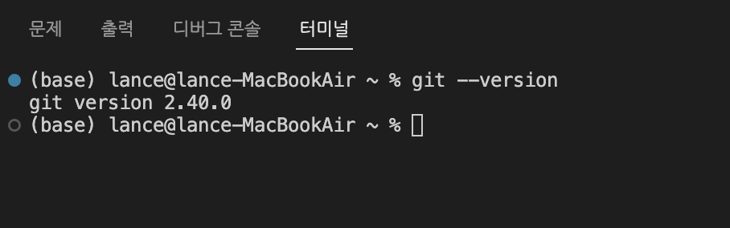
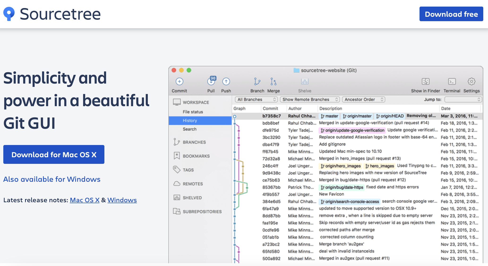

# 3. Git 설치하기(MAC)

## 1. Git 설치

맥은 기본적으로 Git 설치되어 있음.

```
git config --global core.autocrlf input
```
- 협업 시 윈도우와 맥에서 엔터 방식 차이로 인한 오류를 방지함.

  

https://git-scm.com/download/mac 참고하여 Git 최신 버전 설치  
Homebrew 설치 : https://brew.sh/
- M1칩 맥의 경우 Homebrew가 동작하지 않을 경우 아래를 추가로 실행
  - whoami 명령어로 사용자명 확인
  - echo 'eval "$(/opt/homebrew/bin/brew shellenv)"' >> /Users/사용자명/.zprofile
  - eval "$(/opt/homebrew/bin/brew shellenv)"

아래 명령어로 Git 설치
```
brew install git
```
터미널 재실행 후 git --version 으로 확인  

## 2. SourceTree 설치
https://www.sourcetreeapp.com/ : Git을 GUI로 다룰 수 있도록 해주는 툴  

설치 시 BitBucket 계정 관련은 건너뛰어도 됨.  

## 3. VS Code 설치
https://code.visualstudio.com/ : 가장 인기있는 코드 에디터 중 하나.

- control + ` 으로 터미널 열기 (Mac)
  - 프로그래밍 중 바로 Git 명령어 사용
  - 대부분의 타 에디터/IDE에도 터미널 기능 제공

## 4. iTerms2 설치와 터미널 세팅
https://iterm2.com/ 에서 iTerm2 다운로드 및 설치
- 탭, split view, 자동완성 등 다양한 기능