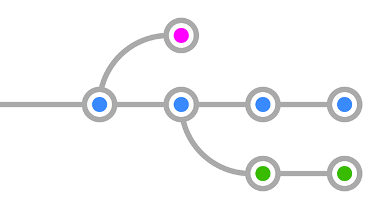
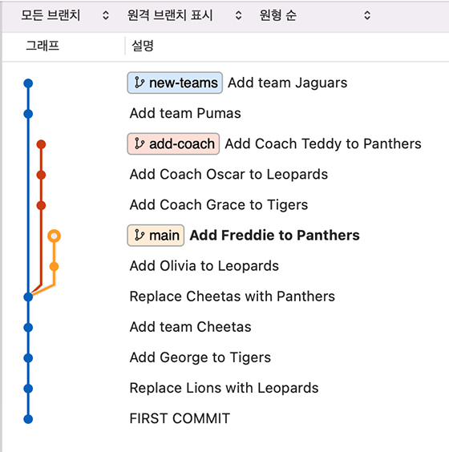

# 1. 여러 branch 만들어보기


Branch : 분기된 가지 (다른 차원)  
- 프로젝트를 하나 이상의 모습으로 관리해야 할 때
  - 예) 실배포용, 테스트서버용, 새로운 시도용
- 여러 작업들이 각각 독립되어 진행될 때
  - 예) 신기능 1, 신기능 2, 코드개선, 긴급수정...
  - 각각의 차원에서 작업한 뒤 확정된 것을 메인 차원에 통합

이 모든 것을 하나의 프로젝트 폴더에서 진행할 수 있도록


## 1. 브랜치 생성 / 이동 / 삭제하기
add-coach란 이름의 브랜치 생성
```
git branch add-coach
```

브랜치 목록 확인
```
git branch
```

add-coach 브랜치로 이동
```
git switch add-coach
```
checkout명령어가 Git 2.23버전부터 switch, restore로 분리

브랜치 생성과 동시에 이동하기
```
git switch -c new-teams
```
- 기존의 git checkout -b (새 브랜치명)

브랜치 삭제하기
```
git branch -d (삭제할 브랜치명)
```
- to-delete란 브랜치 만들고 삭제해보기

> 추가사항  
지워질 브랜치에만 있는 내용의 커밋이 있을 경우  
즉 다른 브랜치로 가져오지 않은 내용이 있는 브랜치를 지울 때는  
-d 대신 -D(대문자)로 강제 삭제해야 한다.

```
git branch -D (강제삭제할 브랜치명)
```

브랜치 이름 바꾸기
```
git branch -m (기존 브랜치명) (새 브랜치명)
```

## 2. 각각의 브랜치에서 서로 다른 작업해보기
### A. main 브랜치
1. Leopards의 members에 Olivia 추가
   - 커밋 메시지 : Add Olivia to Leopards
2. Panthers의 members에 Freddie 추가
   - 커밋 메시지 : Add Freddie to Panthers

### B. add-coach 브랜치
1. Tigers의 매니저 정보 아래 coach: Grace 추가
   - 커밋 메시지 : Add Coach Grace to Tigers
2. Leopards의 매니저 정보 아래 coach: Oscar 추가
   - 커밋 메시지 : Add Coach Oscar to Leopards
3. Panthers의 매니저 정보 아래 coach: Teddy 추가
   - 커밋 메시지 : Add Coach Teddy to Panthers

### C. new-teams 브랜치
1. pumas.yaml 추가
   - 커밋 메시지 : Add team Pumas
```
team: Pumas

manager: Jude

members:
- Ezra
- Carter
- Finn
```
2. jaguars.yaml 추가
   - 커밋 메시지 : Add team Jaguars
```
team: Jaguars

manager: Stanley

members:
- Caleb
- Harvey
- Myles
```

## 3. 결과 살펴보기
git log : 위치한 브랜치에서의 내역만 볼 수 있음  

여러 브랜치의 내역 편리하게 보기
```
git log --all --decorate --oneline --graph
```

소스트리에서 확인  
