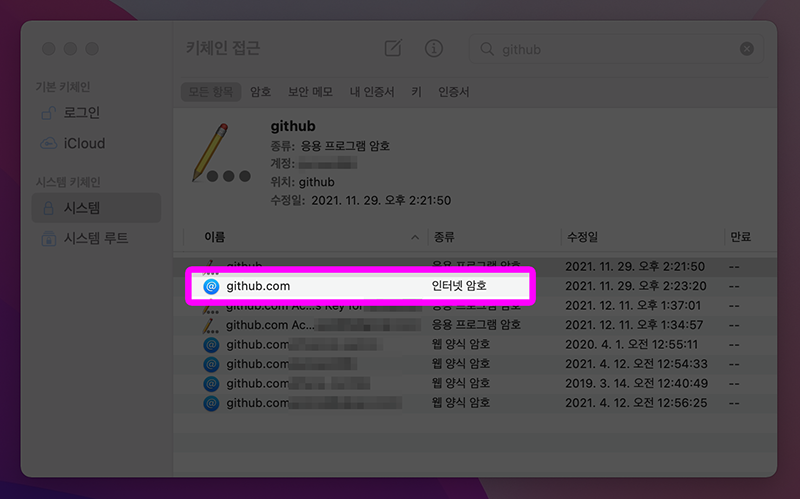

# 2. GitHub 시작하기

## 1. github.com 살펴보기
- Git으로 관리되는 프로젝트의 원격 저장소
- 오픈 소스의 성지
  - Git, VS Code, Tensorflow, React 등 살펴보기

## 2. 가입하고 토큰 만들기
1. Sign Up으로 가입 후 로그인
2. Personal access token 만들기
   - 우측 상단의 프로필 - `Settings`
   - `Developer Settings`
   - `Personal access tokens` - `Generate new token`
   - `repo` 및 원하는 기능에 체크, 기간 설정 뒤 `Generage token`
   - 토큰 안전한 곳에 보관해 둘 것
3. 토큰 컴퓨터에 저장하기
    - Windows 
      - `Windows 자격 증명 관리자`
      - `Windows 자격 증명` 선택
      - `git:https://github.com` 자격 정보 생성
      - 사용자명과 토큰 붙여넣기
    - Mac
      - `Keychain Access` 앱 실행
      - github의 `인터넷 암호` 항목 선택
      - 사용자명(`계정` 칸)과 토큰(`암호 보기` 누른 뒤 오른쪽 칸) 붙여넣기
        - 키체인 관련 팝업이 먼저 뜨면 맥 로그인 암호를 입력
  
    - 맥에서 KeyChain Access에 github 항목이 없다면?
      - 아직 맥에서 GitHub 로그인을 해보지 않은 경우이다.
      - 일단 이 부분을 넘기고 4번부터 마저 진행한 다음에 다음 강을 진행하면 push 명령어 사용 시 터미널에서 토큰(패스워드)을 입력하라고 요구할 것이다. 그 때 토큰을 입력하면 키체인에 해당 항목이 생기고 토큰도 자동등록될 것이다.
1. 소스트리에도 추가
   - `설정` > `계정`탭>`추가`버튼
   - 인증방식은 `베이직`, 프로토콜은 `HTTP`로 설정
   - 사용자명(GitHub 아이디)와 암호(토큰)설정
2. GitHub에 새 Repository 생성
    - Public : 모두에게 보일 수 있는 프로젝트
    - Private : 허용된 인원만 볼 수 있는 프로젝트
3. 협업할 팀원 추가
   - 레포지토리의 `Settings` - `Collaborators`
   - `Add people`