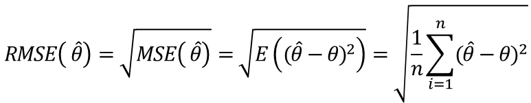
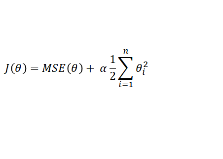
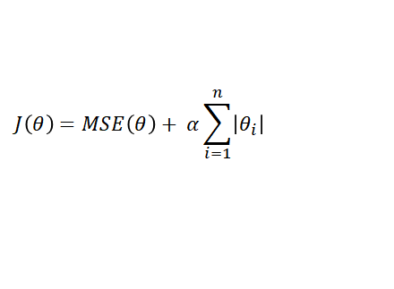

# 5. 규제가 있는 모델

## 선형회귀 모델의 성능측정

### 모델의 성능 측정

- 회귀 모델의 예측 능력 평가 지표 : 평균 제곱근 오차 RMSE (Root Mean Square Error)
- 평균 제곱근 오차는 분산의 제곱근, 즉 표준 오차가 됨



```python
def rmse(y_real, y_pred):
    return np.sqrt(np.mean(y_real - y_pred)**2)
```

```python
np.round(rmse(y_test, y_pred), 2)
#0.73
```

```python
from sklearn.metrics import mean_squared_error

np.round(np.sqrt(mean_squared_error(y_test, y_pred)), 2)
#0.73
```


## 규제가 있는 선형 모델

### 규제가 없는 선형 모델의 적합

```python
from sklearn.model_selection import train_test_split

X = wine.drop(['type', 'quality'], axis=1)
y = wine.quality

X_train, X_test, y_train, y_test = train_test_split(X, y, random_state=1)
```

```python
from sklearn.linear_model import LinearRegression

model = LinearRegression()
model.fit(X_train, y_train)
y_pred = model.predict(X_test)
np.round(np.sqrt(mean_squared_error(y_test, y_pred)), 3)
#0.725
```


### 규제가 있는 선형 모델의 적합

회귀모델

1. 리지(Ridge)
2. 라쏘(Lasso)
3. 엘라스틱 넷

```python
from sklearn.linear_model import Ridge

model = Ridge(alpha=0.05)
model.fit(X_train, y_train)
y_pred = model.predict(X_test)
np.round(np.sqrt(mean_squared_error(y_test, y_pred)), 3)
#0.727
```

```python
from sklearn.linear_model import Lasso

model = Lasso(alpha=0.05)
model.fit(X_train, y_train)
y_pred = model.predict(X_test)
np.round(np.sqrt(mean_sqared_error(y_test, y_pred)), 3)
#0.761
```


### 규제가 있는 선형 모델의 필요성

- 과분산 모델에 대해 모델을 규제하면 오버피팅을 감소시킬 수 있음
- 규제란 오버피팅된 파라미터 값에 대해 페널티를 부여하는 것
- 페널티를 추가하게 되면 규제가 없는 회귀 모델보다 계수의 절댓값이 작아지게 되는 원리를 이용해 오버피팅을 방지할 수 있음
- 페널티를 가한다는 것은 편향을 높인다는 것을 의미하며, 규제가 없는 모델보다 훈련 데이터의 적합도가 떨어지지만 전체적인 결과는 좋아짐
- 오버피팅된 모델은 지나친 노이즈를 반영할 수 있으므로 모델을 단순화하여 좀 더 일반화된 모델로 만들 필요가 있음


## 리지 회귀 모델

### 리지 회귀 모델 개요

- Ridge 회귀는 규제가 추가된 선형 회귀 모델
- 규제 항이 비용함수에 추가됨
- 가중치 벡터의 제곱항을 합한 L2 Norm을 2로 나눈 값을 적용함




- 모델의 가중치가 가능한 작게 유지되도록 함
- 규제항은 훈련하는 동안에만 비용함수에 추가됨
- 모델의 훈련이 끝나면 모델의 성능을 규제가 없는 성능 지표로 평가함
- 하이퍼파라미터 α는 모델 규제를 조절
- α=0 이면 선형회귀와 동일하며, α가 아주 크면 모든 가중치가 0에 가까워짐

```python
from sklearn.linear_model import Ridge

model_name = "ridge"
alpha = 0.05
fig = plt.figure(figsize=(6, 3))
ax = fig.add_subplot(111)
ridge = Ridge(alpha = alpha)
ridge.fit(X_train, y_train)
y_pred = ridge.predict(X_test)
rmse = np.round(np.sqrt(mean_squared_error(y_test, y_pred)), 3)
coef = pd.Series(data=ridge.coef_, index=X_train.columns).sort_values()
ax.bar(coef.index, coef.values)
ax.set_xticklabels(coef.index, rotation=90)
ax.set_title("{0}: alpha = {1}, rmse = {2}".format(model_name, alpha, rmse))
```


## 라쏘 회귀 모델

### 라쏘 회귀 모델 개요

- Lasso 회귀는 선형 회귀 모델의 또 다른 규제된 버전
- 가중치 벡터의 절댓값의 합인 L1 Norm을 적용함



- 덜 중요한 특징의 가중치(0)를 완전히 제거하려고 함
- 차수가 높은 다항 특징의 가중치를 0으로 만듦

라쏘는 가중치를 0으로 만들어 전체적으로 오버피팅이 줄어들어 모델의 복잡도가 낮아짐

``` python
from sklearn.linear_model import Lasso

model_name = "lasso"
alpha = 2
fig = plt.figure(figsize=(6, 3))
ax = fig.add_subplot(111)
lasso = Lasso(alpha = alpha)
lasso.fit(X_train, y_train)
y_pred = lasso.predict(X_test)
rmse = np.round(np.sqrt(mean_squared_error(y_test, y_pred)), 3)
coef = pd.Series(data=lasso.coef_, index=X_train.columns).sort_values()
ax.bar(coef.index, coef.values)
ax.set_xticklabels(coef.index, rotation=90)
ax.set_title("{0}: alpha = {1}, rmse = {2}".format(model_name, alpha, rmse))
```


## 주요 정리

1. 선형 회귀 모델의 성능을 측정하는 평가 지표로 RMSE를 사용할 수 있다.
2. 과분산 선형 회귀 모델에 대해 규제를 적용하면 오버피팅 문제를 감소시킬 수 있다.
3. 리지 회귀 모델은 규제가 있는 선형 회귀 모델로 가중치 벡터의 제곱항을 합한 L2 Norm을 2로 나눈 값을 적용한다.
4. 라쏘 회귀 모델은 규제가 있는 선형 회귀 모델로 가중치 벱ㄱ터의 절댓값의 합인 L1 Norm을 적용한다.