# 6. 의사결정트리

## 의사결정 트리란?

### 의사결정 트리의 개요

- Decision Tree
- 분류, 회귀 작업에 사용되며, 복잡한 데이터 세트도 학습할 수 있음
- 설명하기도 쉽고 해석하기도 쉬우면서 나이브 베이즈와 같이 범주형 데이터를 잘 다룰 수 있음
- 의사결정 트리는 강력한 머신러닝 알고리즘 가운데 하나인 랜덤 포레스트의 기본 구성 요소
- ID3, C4.5, CART, CHAID와 같은 알고리즘이 있음


## 의사결정 트리의 특징

### 의사결정 트리의 생성

- 데이터를 분할하기 위해 가장 중요한 특징이 무엇인지 선택하는 로컬 최적화 방법을 계속 적용하는 탐욕적 방식으로 트리를 생성함
- 의사결정 트리는 학습 샘플을 서브 셋으로 분할하면서 생성되며, 분할의 과정은 각 서브 셋에 대해 재귀 형태로 진행됨
- 각 노드에서의 분할을 특정 값을 기반으로 조건 검사를 통해 진행되며, 서브 셋이 동일한 클래스 레이블을 가지는 경우나 분할을 통한 클래스 분류가 더 이상 의미가 없을 경우 분할 작업을 마침


## CART 알고리즘

### CART 알고리즘의 특징

- Classification and Regression Tree

- 노드를 왼쪽, 오른쪽 자식 노드로 분할 확장하면서 트리를 생성함

- 분할 단계에서 가장 중요한 특징과 해당 값의 모든 가능한 조합을 측정 함수를 이용해 탐욕적으로 찾음

- 범주형 특징의 경우 해당 특징 값을 가진 샘플들을 오른쪽 자식 노드에 할당함

- 수치형 특징의 경우 해당 값보다 큰 값을 가진 샘플들을 오른쪽 자식 노드에 할당함

  CART는 scikit-learn의 의사결정 트리, 랜덤 포레스트가 사용하는 내부 알고리즘

### 트리 분할의 측정 기준

- 지니 불순도 : Gini Impurity

  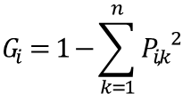

P_(i,k)  : i번째 노드에 있는 훈련 샘플 중 k 클래스에 속한 샘플의 비율

- 한 노드에 모든 샘플이 같은 클래스에 있을 경우 순수(gini==0)하다고 함

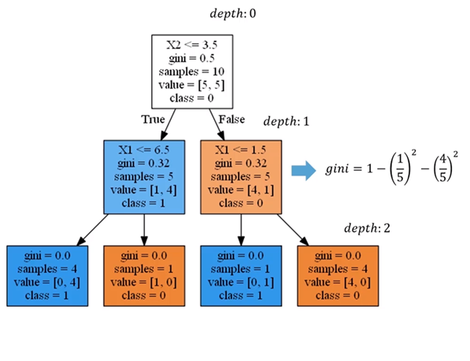

Leaf노드(자식노드가 없는 노드)에서 지니계수는 0이 됨


### 비용함수

- CART가 분류에 대해 최소화해야 하는 비용함수

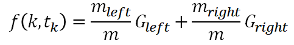

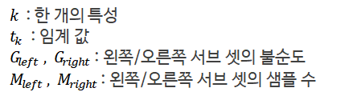

- 훈련 세트의 분할은 최대 깊이가 되면 중지하거나, 샘플의 개수가 분할에 필요한 최소 개수 이하일 경우나, 불순도를 줄이는 분할을 찾을 수 없을 때 중지됨


## Scikit-Learn의 의사결정 트리 분류기

### iris 데이터 준비

```python
from sklearn.datasets import load_iris
iris = load_iris()
iris.keys()
# dict_keys(['data', 'target', 'target_names', 'DESCR', 'feature_names', 'filename'])
```

```python
iris.data[:5]
# array([[5.1, 3.5, 1.4, 0.2],
#		[		...			],
#		[		...			],
#		[		...			],
#				...			])
```

```python
iris.feature_names
# ['sepal length (cm)',
#  'sepal width (cm)',
#  'petal length (cm)',
#  'petal width (cm)']
```

```python
X = iris.data[:, 2:]
iris.target[:5]
# array([0, 0, 0, 0, 0])

import numpy as np
np.unique(iris.target, return_counts=True)
# (array([0, 1, 2])), array([50, 50, 50], dtype=int64))
```

```python
iris.target_names
# array(['setosa', 'versicolor', 'virginica'], dtype='<U10')

y = iris.target
```

### Decision Tree 모델 객체 생성 및 적합화

```python
from sklearn.tree import DecisionTreeClassifier
tree = DecisionTreeClassifier(max_depth=2) # 트리의 최대 깊이
tree.fit(X, y)
```

### 트리 출력하기

```python
from sklearn.tree import export_graphviz

export_graphviz(tree, outfile='iris.dot', feature_names=iris.feature_names[2:],
               class_names=iris.target_names, rounded=True, filled=True, impurity=True)
```

```python
import pydot
graph = pydot.graph_from_dot_file('iris.dot')[0]
iris_png = graph.create_png()

from IPython.core.display import Image
Image(iris_png)
```

pydot 패키지 : conda install -n <<개발환경명>> pydot

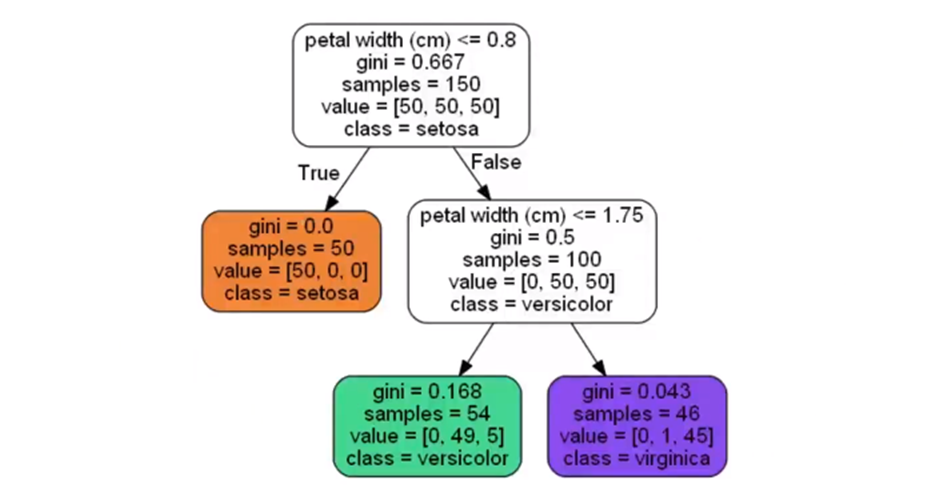


### 의사결정 트리의 특징중요도

- 의사결정 트리를 기반으로 하는 모델은 상대적 중요도를 측정하기 쉬운 장점을 지님
- 의사결정 트리는 일부 특징은 배제함
- 의사결정 트리의 각 노드에 사용된 특징 중요도

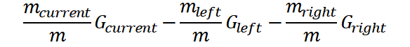

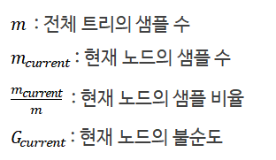

- 각 노드에 사용된 특징 중요도의 합이 1이 되도록 전체 합으로 나누어 정규화함

```python
for feature, importance in zip(iris.feature_names[2:], tree.feature_importances_):
    print(f"{feature} : {importance}")
# petal length (cm) : 0.0
# petal width (cm) : 1.0
```


### 분류 모델의 성능측정 방법

**혼동행렬**

- 실제 관측값을 얼마나 정확하게 예측했는지를 보여주는 행렬

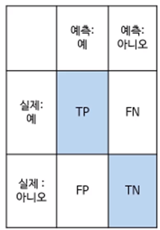


**분류 모델의 평가 지표**

- 정확도 : accuracy. 전체 샘플에서 정확하게 예측한 샘플 수의 비율


- 정밀도 : precision. Positive 클래스로 예측한 샘플에서 실제 Positive 클래스에 속하는 샘플 수의 비율


- 재현율 : recall. 실제 Positive 클래스에 속한 샘플에서 Positive 클래스에 속한다고 예측한 샘플 수의 비율(참 긍정률 : TruePositive rate, 민감도 : Sensitivity)

  

- 위양성율 :  fallout. 실제 Positive클래스에 속하지 않는 샘플에서 Positive 클래스에 속한다고 예측한 샘플 수의 비율 (거짓 긍정률 : False Positive Rate)


- F1 점수 : f1 score. 정밀도와 재현율의 조화평균. 점수에 상수 2를 곱해 정밀도와 재현율이 모두 1일 경우, 점수 1이 되도록 만듦


- 특이성 : specificity. 실제 Negative 클래스에 속한 샘플에서 Negative 클래스에 속한다고 예측한 샘플 수의 비율 (1-False Positive Rate)


- AUC : Area Under The Curve. 곡선하 면적
- 참 긍정률(TPR)과 거짓 부정률(FPR) 사이를 표현하기 위해 ROC(Receiver Operating Characteristics) 커브를 사용
- 예측된 확률로부터 여러 클래스로 분류를 수행하는 데 활용

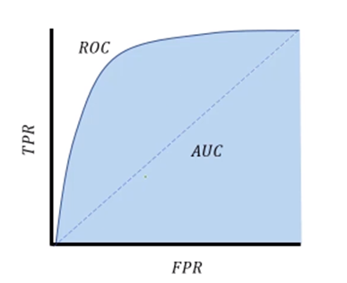

모든 케이스에 대해 정확히 분류할 경우 (TPR=1, FPR=0) AUC 면적은 1이 됨 (사각형 모양)


### 의사결정 트리 모델의 성능 측정 : 정확도, 혼동행렬, ROC의 AUC

```python
y_pred = decision_tree_best.predict(X_test)
y_pred
# array([0, 0, 0, ..., 0, 0, 0], dtype=int64)
```

```python
np.unique(y_pred, return_counts=True)
# (array([0, 1], dtype=int64), array([96545, 3455], dtype=int64))
```

```python
from sklearn.metrics import accuracy_score # 정확도
accuracy_score(y_test, y_pred)
# 0.83249
```

```python
from sklearn.metrics import confusion_matrix # 혼동행렬
confusion_matrix(y_test, y_pred)
# array([[81152, 1358],
#       [15393, 2097], dtype=int64])
```

```python
from sklearn.metrics import roc_auc_score, roc_curve

y_pred_proba = decision_tree_best.predict_proba(X_test)[:, 1]

fpr, tpr, _ = roc_curve(y_test, y_pred_proba) # ROC 커브 계산

auc = roc_auc_score(y_test, y_pred_proba) # ROC 커브의 auc 계산

plt.plot(fpr, tpr, "r-", label="DecisionTreeClassifier")
plt.plot([0, 1], [0, 1], 'b--', label='random guess')
plt.xlabel('false positive rate')
plt.ylabel('true positive rate')
plt.title("AUC={0:.2f}".format(auc))
plt.legend(loc='lower right') # ROC 커브 시각화
```

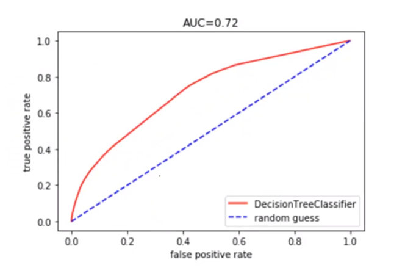

### 앙상블 학습과 배깅

앙상블은 성능이 좋지 않은 알고리즘들을 결합시켜 종합한 결과 더 좋게 만드는 것

- 부트스트랩 : Bootstrap. 중복을 허용하는 리샘플링
- 배깅 : Bagging. Bootstrap aggregating의 약자
- 훈련 데이터에서 부트스프래핑한 샘플에 대해 모든 변수를 선택해 다수의 의사결정 트리를 구성(의사결정 트리의 분할을 위해 선택된 변수가 모든 트리에서 대체로 비슷해져 상관관계를 가지면 종합을 한다 해도 분산 감소 효과가 기대만큼 크지 않을 수도 있음)
- 하나의 예측기를 위해 같은 훈련 샘플을 여러 번 샘플링 할 수 있음
- 동시에 CPU의 멀티 코어나 병렬 프로세서에서 학습을 진행하는 모든 예측기가 훈련을 마치면 앙상블은 모든 예측기의 예측을 모아서 새로운 샘플에 대한 예측을 만듦
- 개별 예측기의 편향은 높지만, 수집함수를 통과한 후 앙상블의 결과는 원본 데이터 셋으로 하나의 예측기를 훈련시킬 때 보다 편향은 비슷하지만 대체로 분산은 줄어듦

### 앙상블 학습과 랜덤 포레스트

- 랜덤 포레스트는 특징 기반 배깅 방법을 적용한 의사결정 트리의 앙상블

- 트리 배깅은 의사결정 트리 모델의 단점 중 하나인 고분산을 줄여주며 이를 통해 단일 트리보다 훨씬 더 좋은 성능을 제공함

- 개별 트리간의 상관관계 문제를 피하기 위해 부트스트래핑 과정에서 훈련 데이터로부터 전체 p개 변수 중 무작위 m개의 변수만 선택

  분류기 문제 -> m=sqrt(p)

  회귀 문제 -> m = p/3

- 랜덤 포레스트의 무작위성 주입은 트리를 보다 다양하게 만들고, 편향을 손해보는 대신 분산을 낮추어 훌륭한 모델을 만듦


### 랜덤 포레스트와 특징 중요도

- 의사결정 트리를 기반으로 하는 모델이므로 특징의 상대적 중요도를 측정하기 쉬운 장점을 지님
- 무작위성이 주입된 랜덤포레스트 모델은 의사결정 트리와 달리 모든 특징에 대해 중요도를 특정함
- 랜덤 포레스트의 특징 중요도는 각 의사결정 트리의 특징 중요도를 모두 합한 후 트리의 수로 나눈 것으로, sckit-learn의 경우 중요도의 합이 1이 되도록 결과값을 정규화함


```python
from sklearn.datasets import load_iris
iris = load_iris()

from sklearn.ensemble import RandomForestClassifier
random_forest = RandomForestClassifier(n_estimators=500, n_job=-1) # n_job: 사용할 프로세스 수(-1일 경우 전체)
random_forest.fit(iris.data, iris.target)

for feature, importance in zip(iris.feature_names, random_forest.feature_importances_):
    print(f"{feature} : {importance}")
   
# sepal_length (cm) : 0.100...
# sepal_width (cm) : 0.225...
# petal_length (cm) : 0.462...
# petal_width (cm) : 0.414...
```


### 특징 기반 배깅을 이용하는 트리 배깅 모델 랜덤 포레스트의 학습

```python
from skelarn.ensemble import RandomForestClassifier
random_forest = RandomForestClassifier(n_estimators=100, criterion='gini',
                                      min_samples_split=30, n_jobs=-1)
grid_search = GridSearchCV(random_forest, parameters, n_jobs=-1, cv=3, scoreing='roc_auc')
grid_search.fit(X_train, y_train)
```


### 랜덤 포레스트의 성능 개선을 위한 주요 파라미터

- max_features : 최적의 분할 지점을 찾기 위해 검토할 특징의 개수. 일반적으로 n차원의 데이터 세트의 √n의 반올림 값을 설정
- n_estimator : 트리의 개수가 많을수록 성능이 더 좋지만 계산 시간이 많이 걸림. 일반적으로 100, 200, 500을 설정
- min_sample_split : 노드에서 추가 분할을 위해 필요한 샘플의 최소 개수. 숫자가 너무 작으면 오버피팅, 너무 크면 언더피팅이 일어날 수 있음. 일반적으로 10, 30, 50으로 시작


### 랜덤 포레스트의 성능 측정 : 정확도, 혼동행렬, ROC의 AUC

```python
grid_search.best_params
# {'max_depth': None}

random_forest_best = grid_search.best_estimator_

y_pred = random_forest_best.predict(X_test)
y_pred
# array([0, 0, 0, ..., 0, 0, 0], dtype=int64)

accuracy_score(y_test, y_pred)
# 0.85215

confusion_matrix(y_test, y_pred)
# array([[81323, 1187]
#		[13598, 3892]], dtype=int64)

y_pred_proba = random_forest_best.predict_proba(X_test)[:, 1]
y_pred_proba
# array([..., ..., ..., ..., ..., ..., ...])

fpr, tpr, _ = roc_curve(y_test, y_pred_proba)
auc = roc_auc_score(y_test, y_pred_proba)

plt.plot(fpr, tpr, 'r-', label='RandomForestClassifier')
plt.plot([0, 1], [0, 1], 'b--', label='random guess')
plt.xlabel('false positive rate')
plt.ylabel('true positive rate')
plt.title('AUC = {0: .2f}'.formant(auc))
plt.legend(loc='lower right')
```

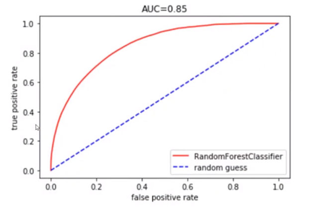

전 트리보다 더 좋은 선을을 제공해주는 강점이 있음


## 주요정리

1. Scikit-learn의 의사결정 트리 분류기는 CART 알고리즘의 분류에 대한 비용함수에서 지니 불순도를 기본적으로 사용한다.
2. Scikit-learn의 트리 기반 알고리즘은 수치형 특징을 입력 값으로 하기 때문에 범주형 특징은 원 핫 인코딩을 통해 이진 특징으로 변환한다.
3. 혼동행렬은 실제 관측값을 얼마나 정확하게 예측했는지를 보여주는 행렬로 분류 모델의 성능 측정을 위한 평가지표 계산의 기반이 된다.
4. 분류 모델의 평가지표로 정확도, 정밀도, 재현율, F1 점수, 특이성, ROC 커브의 AUC(곡선하 면적) 등을 사용한다.
5. 랜덤 포레스트는 특징 기반 배깅 방법을 적용한 의사결정 트리의 앙상블로 의사결정 트리 모델의 고분산을 줄이며, 단일 트리보다 훨씬 더 좋은 성능을 제공한다.
6. Scikit-learn의 랜덤 포레스트 특징 중요도는 개별 트리의 특징 중요도를 모두 합한 후 트리의 수로 나눈 것으로, 중요도의 합이 1이 되도록 결과값을 정규화한다.