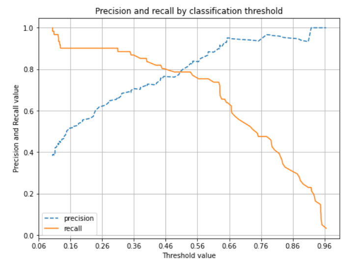
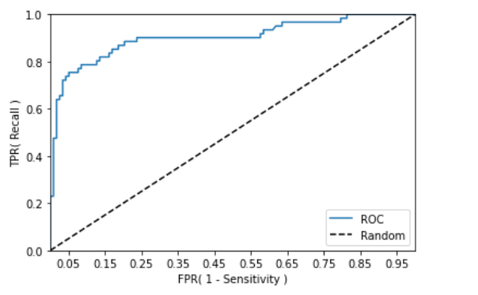

# 평가(Evaluate)

## 이진 분류 성능평가 지표

- 정확도(Accuracy)
- 오차행렬(Confusion Matrix)
- 정밀도(Precision)
- 재현율(Recall)
- F1 스코어
- ROC, AUC


## 정확도(Accuracy)


정확도는 직관적으로 모델 예측 성능을 나타내는 평가 지표. 하지만 이진 분류의 경우 데이터의 구성에 따라 ML 모델의 성능을 왜곡할 수 있기 때문에 정확도 수치 하나만 가지고 성능을 평가하지 않는다.

특히 정확도는 불균형한 레이블 값 분포에서 ML 모델의 성능을 판단할 경우 적합한 평가 지표가 아니다

### 정확도의 문제점

ex) 타이타닉 데이터 -> 타이타닉 생존자 예측에서 여성은 모두 생존으로 판별했을 때 정확도가 약 80% 정도로 나온다.

```python
titanic_df = pd.read_csv('./titanic_train.csv')
titanic_df.head()
```


```python
titanic_df.shape
```

```python
(891, 12)
```


```python
pred = np.zeros( (titanic_df.shape[0], 1) )

print(len(pred))
pred[:10]
```

```python
891
array([[0.],
       [0.],
       [0.],
       [0.],
       [0.],
       [0.],
       [0.],
       [0.],
       [0.],
       [0.]])
```


```python
import numpy as np
from sklearn.base import BaseEstimator

# 성별로만 생존, 사망을 예측하는 클래스
class MyDummyClassifier(BaseEstimator):
    # fit 메소드는 아무것도 학습하지 않음.
    def fit(self, X , y=None):
        pass
    
    # 데이터프레임(X)의 성별(Sex)이 여자면(0) 생존(1), 남자(1)면 사망(0)으로 하는 pred를 반환함.
    def predict(self, X):
        # pred는 성별을 기준으로 생존(1), 사망(0)을 예측하는 것
        pred = np.zeros( ( X.shape[0], 1 ))
        for i in range (X.shape[0]) :
            if X['Sex'].iloc[i] == 1:
                pred[i] = 0
            else :
                pred[i] = 1
        
        return pred
```

```python
# 데이터 전처리 함수들
import pandas as pd
from sklearn.preprocessing import LabelEncoder

# Null 처리 함수
def fillna(df):
    df['Age'].fillna(df['Age'].mean(),inplace=True)
    df['Cabin'].fillna('N',inplace=True)
    df['Embarked'].fillna('N',inplace=True)
    df['Fare'].fillna(0,inplace=True)
    return df

# 머신러닝 알고리즘에 불필요한 속성 제거
def drop_features(df):
    df.drop(['PassengerId','Name','Ticket'],axis=1,inplace=True)
    return df

# 레이블 인코딩 수행. 
def format_features(df):
    df['Cabin'] = df['Cabin'].str[:1]
    features = ['Cabin','Sex','Embarked']
    for feature in features:
        le = LabelEncoder()
        le = le.fit(df[feature])
        df[feature] = le.transform(df[feature])
    return df

# 앞에서 설정한 Data Preprocessing 함수 호출
def transform_features(df):
    df = fillna(df)
    df = drop_features(df)
    df = format_features(df)
    return df
```

```python
import pandas as pd
from sklearn.model_selection import train_test_split
from sklearn.metrics import accuracy_score

# 타이타닉 데이터 로드 및 feature(X), target(y) 데이터 분리
titanic_df = pd.read_csv('./titanic_train.csv')
y_titanic_df = titanic_df['Survived']
X_titanic_df= titanic_df.drop('Survived', axis=1)

# 데이터 전처리
X_titanic_df = transform_features(X_titanic_df)

# train, test 데이터 분리 
X_train, X_test, y_train, y_test=train_test_split(X_titanic_df, y_titanic_df, \
                                                  test_size=0.2, random_state=0)
```

```python
# MyDummyClassifier 객체 생성
myclf = MyDummyClassifier()

# MyDummyClassifier 학습
myclf.fit(X_train, y_train)

# 테스트 데이터 예측
mypredictions = myclf.predict(X_test)
print('MyDummyClassifier의 정확도는: {0:.4f}'.format(accuracy_score(y_test , mypredictions)))
```

```python
MyDummyClassifier의 정확도는: 0.7877
```

-> 여성이면 생존, 남성이면 사망이라는 단순한 모델로 예측해도 정확도가 79%가 나온다	


## 오차 행렬과 정밀도, 재현율

### 오차 행렬 (Confusion Matrix)

오차 행렬은 이진 분류의 예측 오류가 얼마인지와 더불어 어떠한 유형의 예측 오류가 발생하고 있는지를 함께 나타내는 지표

가로열 : 실제 클래스(Actual Class)

세로열 : 예측 클래스(Predicted Class)


```python
from sklearn.metrics import confusion_matrix

# 예측 결과 fakepred와 실제 결과 y_test의 Confusion Matrix출력
confusion_matrix(y_test, fakepred)
```

```python
array([[405,   0],
       [ 45,   0]])
```


mnist dataset에서 오차 행렬을 통한 정확도 지표 문제점 인지

숫자가 7인지 예측하는 이진분류 문제 -> 전부 다 Negative로 예측


TP는 0임. Positive로 예측이 한 건도 성공하지 않음

이와 더불어 FP가 0이므로 Positive로 예측 자체를 수행하지 않음을 알 수 있음


정확도 : 예측 결과와 실제 값이 동일한 건수 / 전체 데이터 

= (TN + TP) / (TN + TP + FN + FP) = 90%


### 정밀도(Precision)와 재현율(Recall)

- 정밀도 : TP / (FP + TP)
- 재현율 : TP / (FN + TP)


정밀도는 예측을 Positive로 한 대상 중에 예측과 실제 값이 Positive로 일치한 데이터의 비율

재현율은 실제 값이 Positive인 대상 중에 예측과 실제 값이 Positve로 일치한 데이터의 비율


정밀도는 precision_score(), 재현율은 recall_score()제공

```python
from sklearn.metrics import accuracy_score, precision_score , recall_score

print("정밀도:", precision_score(y_test, fakepred))
print("재현율:", recall_score(y_test, fakepred))
```

```python
정밀도: 0.0
재현율: 0.0
```

-> 정밀도, 재현율이 0인 것을 보니, MyFakeClassifier가 이상한 모델임이 드러남

### 오차행렬, 정확도, 정밀도, 재현율을 한꺼번에 계산하는 함수 생성

```python
from sklearn.metrics import accuracy_score, precision_score , recall_score , confusion_matrix

# confusion matrix, accuracy, precision, recall을 한꺼번에 계산하는 함수
def get_clf_eval(y_test , pred):
    confusion = confusion_matrix( y_test, pred)
    accuracy = accuracy_score(y_test , pred)
    precision = precision_score(y_test , pred)
    recall = recall_score(y_test , pred)

    print('오차 행렬')
    print(confusion)
    print('정확도: {0:.4f}, 정밀도: {1:.4f}, 재현율: {2:.4f}'.format(accuracy , precision ,recall), '\n')
```


### 타이타닉 데이터에 로지스틱 회귀 모델로 이진 분류한 후에 오차행렬, 정확도, 정밀도, 재현율 구해보기

```python
import numpy as np
import pandas as pd

from sklearn.model_selection import train_test_split 
from sklearn.linear_model import LogisticRegression

# 타이타닉 데이터 로드
titanic_df = pd.read_csv('./titanic_train.csv')

# feature(X), target(y) 데이터 분리
y_titanic_df = titanic_df['Survived']
X_titanic_df= titanic_df.drop('Survived', axis=1)

# 데이터 전처리
X_titanic_df = transform_features(X_titanic_df)

# train, test 데이터 분리
X_train, X_test, y_train, y_test = train_test_split(X_titanic_df, y_titanic_df, \
                                                    test_size=0.20, random_state=11)
```

```python
# 로지스틱 회귀(분류 모델) 모델 정의
lr_clf = LogisticRegression()
lr_clf
```

```python
LogisticRegression()
```


```python
# 학습
lr_clf.fit(X_train , y_train)

# 예측
pred = lr_clf.predict(X_test)
get_clf_eval(y_test , pred)
```

```python
LogisticRegression()
오차 행렬
[[104  14]
 [ 13  48]]
정확도: 0.8492, 정밀도: 0.7742, 재현율: 0.7869 
```


## 정밀도와 재현율의 trade-off 관계

적절한 분류 임계값을 설정하면 원하는 정밀도, 재현율 각각의 값을 구할 수 있다.

### predict_proba 함수 : 분류 결정 예측 확률을 반환하는 함수

```python
# 테스트 데이터(타이타닉)의 분류 결정 예측 확률을 반환해준다.
pred_proba = lr_clf.predict_proba(X_test)

pred_proba.shape
pred_proba[:10]  # [Negatve(0)가 될 확률, Positive(1)가 될 확률]
```

```python
(179, 2)
array([[0.46210752, 0.53789248],
       [0.87868089, 0.12131911],
       [0.87716101, 0.12283899],
       [0.8825918 , 0.1174082 ],
       [0.85538442, 0.14461558],
       [0.88221541, 0.11778459],
       [0.88842202, 0.11157798],
       [0.20882607, 0.79117393],
       [0.78295207, 0.21704793],
       [0.36934225, 0.63065775]])
```


```python
# 테스트 데이터 predict 결과
pred  = lr_clf.predict(X_test)
pred
```

```python
array([1, 0, 0, 0, 0, 0, 0, 1, 0, 1, 0, 0, 0, 0, 1, 0, 0, 0, 0, 1, 0, 0,
       0, 0, 0, 0, 0, 0, 0, 0, 1, 1, 0, 1, 0, 0, 0, 1, 0, 0, 0, 0, 1, 1,
       1, 1, 1, 0, 1, 0, 1, 0, 0, 1, 0, 0, 0, 0, 0, 0, 0, 0, 1, 1, 0, 0,
       1, 1, 1, 0, 0, 0, 0, 1, 0, 0, 0, 0, 1, 0, 1, 1, 1, 0, 1, 1, 0, 0,
       1, 0, 0, 0, 0, 0, 1, 0, 1, 0, 1, 1, 1, 0, 1, 0, 1, 0, 0, 0, 0, 0,
       0, 0, 0, 1, 0, 0, 0, 0, 1, 0, 0, 0, 0, 0, 0, 0, 0, 0, 1, 0, 1, 0,
       1, 0, 1, 0, 1, 0, 0, 1, 1, 0, 0, 0, 0, 1, 0, 0, 1, 0, 0, 1, 1, 0,
       1, 1, 0, 0, 1, 1, 0, 1, 0, 1, 0, 1, 1, 0, 0, 1, 0, 1, 0, 0, 0, 0,
       0, 1, 1])
```


### 예측 확률(pred_proba)과 예측 결과값(pred)을 결합해서 비교

```python
# 예측 결과값은 1차원 이므로 2차원으로 reshape 한 후에 예측 확률과 oncatenate 함
pred_proba_result = np.concatenate([pred_proba , pred.reshape(-1, 1)],axis=1)

# 두개의 class 중에서 더 큰 확률을 클래스 값으로 예측
pred_proba_result[:10]
```

```python
array([[0.46210752, 0.53789248, 1.        ],
       [0.87868089, 0.12131911, 0.        ],
       [0.87716101, 0.12283899, 0.        ],
       [0.8825918 , 0.1174082 , 0.        ],
       [0.85538442, 0.14461558, 0.        ],
       [0.88221541, 0.11778459, 0.        ],
       [0.88842202, 0.11157798, 0.        ],
       [0.20882607, 0.79117393, 1.        ],
       [0.78295207, 0.21704793, 0.        ],
       [0.36934225, 0.63065775, 1.        ]])
```


### Binarizer : 요소들이 기준값보다 큰지 작은지를 알려주는 함수

Binarizer : 요소가 기준값(threshold)과 비교해서,

- 같거나 작으면 0을 반환
- 크면 1을 반환

```python
X = [[ 1, -1,  2],
     [ 2,  0,  0],
     [ 0,  1.1, 1.2]]
```

```python
from sklearn.preprocessing import Binarizer

# Binarizer의 threshold를 1.1로 세팅.
binarizer = Binarizer(threshold=1.1)                     

# array X의 값들이 1.1보다 작거나 같으면 0, 크면 1을 반환한다.
binarizer.fit_transform(X)
```

```python
array([[0., 0., 1.],
       [1., 0., 0.],
       [0., 0., 1.]])
```


### 분류 임계값 0.5로 예측값 변환(Binarizer 이용)

```python
from sklearn.preprocessing import Binarizer

# predict_proba 반환값의 두번째 컬럼, 즉 Positive 컬럼을 추출한 후
# (1차원 이므로 2차원으로 reshape으로 해준다.)
pred_proba_1 = pred_proba[:, 1].reshape(-1, 1)
pred_proba_1
```

```python
array([[0.53789248],
       [0.12131911],
       [0.12283899],
       [0.1174082 ],
       [0.14461558],
       [0.11778459],
       [0.11157798],
       [0.79117393],
       [0.21704793],
       [0.63065775],
       [0.10022231],
       [0.12493722],
       [0.12284495],
       [0.11162375],
       [0.56331971],
       [0.1410109 ],
       [0.09624082],
       [0.26657306],
       [0.27512926],
       [0.8283008 ],
       [0.24640074],
       [0.38080712],
       [0.14537192],
       [0.1852803 ],
       [0.11199334],
       [0.23449928],
       [0.14035782],
       [0.07415405],
       [0.28039696],
       [0.30437797],
       [0.94717762],
       [0.81724192],
       [0.12684517],
       [0.82611185],
       [0.39932365],
       [0.23449928],
       [0.07237998],
       [0.61085551],
       [0.05289489],
       [0.10391804],
       [0.3508219 ],
       [0.08336214],
       [0.82168265],
       [0.70754453],
       [0.63041004],
       [0.63042628],
       [0.91882337],
       [0.35889493],
       [0.94881756],
       [0.11202777],
       [0.59265842],
       [0.11162375],
       [0.13278582],
       [0.72514861],
       [0.30931558],
       [0.19704277],
       [0.22631982],
       [0.12284003],
       [0.15419186],
       [0.43234499],
       [0.28010599],
       [0.10071566],
       [0.54535719],
       [0.51408311],
       [0.44429239],
       [0.09460203],
       [0.66670251],
       [0.59404061],
       [0.95179236],
       [0.14819224],
       [0.12882713],
       [0.16843074],
       [0.10392028],
       [0.94790875],
       [0.19864195],
       [0.11162375],
       [0.34783553],
       [0.18366938],
       [0.83555262],
       [0.12284003],
       [0.79475408],
       [0.64545931],
       [0.93102027],
       [0.13309582],
       [0.94889998],
       [0.95030388],
       [0.1535364 ],
       [0.12548514],
       [0.87444892],
       [0.11162375],
       [0.11162375],
       [0.23449928],
       [0.23230786],
       [0.11162375],
       [0.63042628],
       [0.07572551],
       [0.92876854],
       [0.10071836],
       [0.5053386 ],
       [0.96506342],
       [0.50147191],
       [0.09437235],
       [0.94788428],
       [0.0975455 ],
       [0.52986225],
       [0.12837434],
       [0.14105779],
       [0.14819193],
       [0.44899818],
       [0.10783911],
       [0.11706701],
       [0.10889029],
       [0.40311886],
       [0.65390047],
       [0.11199334],
       [0.07096462],
       [0.12439058],
       [0.19841243],
       [0.92593485],
       [0.06867346],
       [0.11161493],
       [0.13074899],
       [0.06365444],
       [0.32178994],
       [0.01158277],
       [0.11161493],
       [0.11619403],
       [0.31661035],
       [0.67764786],
       [0.32166206],
       [0.96506342],
       [0.45374078],
       [0.73519918],
       [0.44293488],
       [0.56968471],
       [0.35091453],
       [0.74838142],
       [0.18612917],
       [0.10394536],
       [0.80322693],
       [0.90890218],
       [0.14819193],
       [0.11804572],
       [0.10114263],
       [0.09163703],
       [0.66772533],
       [0.07568059],
       [0.23379253],
       [0.91802514],
       [0.16812474],
       [0.42867753],
       [0.6314343 ],
       [0.63642725],
       [0.1227846 ],
       [0.77759266],
       [0.88061723],
       [0.48717995],
       [0.1329487 ],
       [0.75157557],
       [0.69038551],
       [0.14976497],
       [0.79292022],
       [0.09127764],
       [0.66663519],
       [0.37991947],
       [0.65120554],
       [0.8841729 ],
       [0.3091076 ],
       [0.09165624],
       [0.89292445],
       [0.11157798],
       [0.85407249],
       [0.2506313 ],
       [0.24009707],
       [0.40098102],
       [0.06232042],
       [0.14106479],
       [0.54479202],
       [0.62672818]])
```


```python
# Binarizer를 적용 - threshold는 0.5로 세팅(0.5 : 분류 결정 임계값)
custom_threshold = 0.5
binarizer = Binarizer(threshold=custom_threshold).fit(pred_proba_1) 
binarizer
```

```python
Binarizer(threshold=0.5)
```


```python
# Positive 컬럼에 Binarizer를 적용하면 1 or 0을 예측한다.
custom_predict = binarizer.transform(pred_proba_1)

# 예측 결과와 실제 값 간의 오차행렬을 구해보면
get_clf_eval(y_test, custom_predict)
```

```python
오차 행렬
[[104  14]
 [ 13  48]]
정확도: 0.8492, 정밀도: 0.7742, 재현율: 0.786
```

-> 위에서의 결과(정확도: 0.8492, 정밀도: 0.7742, 재현율: 0.7869)와 동일하다.


### 이번에는 분류 임계값을 0.4로 낮춰서 예측값을 보면 재현율이 높아지는지 확인

```python
# Binarizer의 threshold 설정값을 0.4로 설정. 즉 분류 결정 임곗값을 0.5에서 0.4로 낮춤  
custom_threshold = 0.4
pred_proba_1 = pred_proba[:,1].reshape(-1,1)
binarizer = Binarizer(threshold=custom_threshold).fit(pred_proba_1) 
custom_predict = binarizer.transform(pred_proba_1)

get_clf_eval(y_test , custom_predict)
```

```python
오차 행렬
[[98 20]
 [10 51]]
정확도: 0.8324, 정밀도: 0.7183, 재현율: 0.8361
```

-> 분류 결정 임계값이 낮아지니 재현율이 높아졌다(0.7869 -> 0.8361).


### 분류 임곗값을 증가시키면서 예측값 변환(Binarizer 이용)

```python
# 임곗값(threshold)을 점차 높여보면 재현율이 감소할까?
thresholds = [0.4, 0.45, 0.50, 0.55, 0.60]

def get_eval_by_threshold(y_test , pred_proba_c1, thresholds):
    # 임계값을 차례로 돌면서 Evaluation 수행.
    for custom_threshold in thresholds:
        binarizer = Binarizer(threshold=custom_threshold).fit(pred_proba_c1) 
        custom_predict = binarizer.transform(pred_proba_c1)
        
        # 임계값에 따른 결과들이 출력된다.
        print('임곗값:', custom_threshold)
        get_clf_eval(y_test , custom_predict)

get_eval_by_threshold(y_test, pred_proba[:,1].reshape(-1,1), thresholds )
```

```python
임곗값: 0.4
오차 행렬
[[98 20]
 [10 51]]
정확도: 0.8324, 정밀도: 0.7183, 재현율: 0.8361 

임곗값: 0.45
오차 행렬
[[103  15]
 [ 12  49]]
정확도: 0.8492, 정밀도: 0.7656, 재현율: 0.8033 

임곗값: 0.5
오차 행렬
[[104  14]
 [ 13  48]]
정확도: 0.8492, 정밀도: 0.7742, 재현율: 0.7869 

임곗값: 0.55
오차 행렬
[[109   9]
 [ 15  46]]
정확도: 0.8659, 정밀도: 0.8364, 재현율: 0.7541 

임곗값: 0.6
오차 행렬
[[112   6]
 [ 16  45]]
정확도: 0.8771, 정밀도: 0.8824, 재현율: 0.7377 

-> 분류 임계값을 점차 높이니 재현율은 점차 감소하고, 정밀도는 점차 증가한다.
```

결론 :
적절한 분류 임계값을 설정하면 원하는 정밀도, 재현율 각각의 값을 구할 수 있다. 


### precision_recall_curve( ) 를 이용하여 임곗값에 따른 정밀도-재현율 값 추출

```python
# 예측값 Positive(1)일 확률 
lr_clf.predict_proba(X_test)[:, 1]
```

```python
array([0.53789248, 0.12131911, 0.12283899, 0.1174082 , 0.14461558,
       0.11778459, 0.11157798, 0.79117393, 0.21704793, 0.63065775,
       0.10022231, 0.12493722, 0.12284495, 0.11162375, 0.56331971,
       0.1410109 , 0.09624082, 0.26657306, 0.27512926, 0.8283008 ,
       0.24640074, 0.38080712, 0.14537192, 0.1852803 , 0.11199334,
       0.23449928, 0.14035782, 0.07415405, 0.28039696, 0.30437797,
       0.94717762, 0.81724192, 0.12684517, 0.82611185, 0.39932365,
       0.23449928, 0.07237998, 0.61085551, 0.05289489, 0.10391804,
       0.3508219 , 0.08336214, 0.82168265, 0.70754453, 0.63041004,
       0.63042628, 0.91882337, 0.35889493, 0.94881756, 0.11202777,
       0.59265842, 0.11162375, 0.13278582, 0.72514861, 0.30931558,
       0.19704277, 0.22631982, 0.12284003, 0.15419186, 0.43234499,
       0.28010599, 0.10071566, 0.54535719, 0.51408311, 0.44429239,
       0.09460203, 0.66670251, 0.59404061, 0.95179236, 0.14819224,
       0.12882713, 0.16843074, 0.10392028, 0.94790875, 0.19864195,
       0.11162375, 0.34783553, 0.18366938, 0.83555262, 0.12284003,
       0.79475408, 0.64545931, 0.93102027, 0.13309582, 0.94889998,
       0.95030388, 0.1535364 , 0.12548514, 0.87444892, 0.11162375,
       0.11162375, 0.23449928, 0.23230786, 0.11162375, 0.63042628,
       0.07572551, 0.92876854, 0.10071836, 0.5053386 , 0.96506342,
       0.50147191, 0.09437235, 0.94788428, 0.0975455 , 0.52986225,
       0.12837434, 0.14105779, 0.14819193, 0.44899818, 0.10783911,
       0.11706701, 0.10889029, 0.40311886, 0.65390047, 0.11199334,
       0.07096462, 0.12439058, 0.19841243, 0.92593485, 0.06867346,
       0.11161493, 0.13074899, 0.06365444, 0.32178994, 0.01158277,
       0.11161493, 0.11619403, 0.31661035, 0.67764786, 0.32166206,
       0.96506342, 0.45374078, 0.73519918, 0.44293488, 0.56968471,
       0.35091453, 0.74838142, 0.18612917, 0.10394536, 0.80322693,
       0.90890218, 0.14819193, 0.11804572, 0.10114263, 0.09163703,
       0.66772533, 0.07568059, 0.23379253, 0.91802514, 0.16812474,
       0.42867753, 0.6314343 , 0.63642725, 0.1227846 , 0.77759266,
       0.88061723, 0.48717995, 0.1329487 , 0.75157557, 0.69038551,
       0.14976497, 0.79292022, 0.09127764, 0.66663519, 0.37991947,
       0.65120554, 0.8841729 , 0.3091076 , 0.09165624, 0.89292445,
       0.11157798, 0.85407249, 0.2506313 , 0.24009707, 0.40098102,
       0.06232042, 0.14106479, 0.54479202, 0.62672818])
```


```python
from sklearn.metrics import precision_recall_curve

# 레이블 값이 1일 예측 확률들을 추출
pred_proba_class1 = lr_clf.predict_proba(X_test)[:, 1]

print(pred_proba_class1.shape)
pred_proba_class1  
```

```python
(179,)
array([0.53789248, 0.12131911, 0.12283899, 0.1174082 , 0.14461558,
       0.11778459, 0.11157798, 0.79117393, 0.21704793, 0.63065775,
       0.10022231, 0.12493722, 0.12284495, 0.11162375, 0.56331971,
       0.1410109 , 0.09624082, 0.26657306, 0.27512926, 0.8283008 ,
       0.24640074, 0.38080712, 0.14537192, 0.1852803 , 0.11199334,
       0.23449928, 0.14035782, 0.07415405, 0.28039696, 0.30437797,
       0.94717762, 0.81724192, 0.12684517, 0.82611185, 0.39932365,
       0.23449928, 0.07237998, 0.61085551, 0.05289489, 0.10391804,
       0.3508219 , 0.08336214, 0.82168265, 0.70754453, 0.63041004,
       0.63042628, 0.91882337, 0.35889493, 0.94881756, 0.11202777,
       0.59265842, 0.11162375, 0.13278582, 0.72514861, 0.30931558,
       0.19704277, 0.22631982, 0.12284003, 0.15419186, 0.43234499,
       0.28010599, 0.10071566, 0.54535719, 0.51408311, 0.44429239,
       0.09460203, 0.66670251, 0.59404061, 0.95179236, 0.14819224,
       0.12882713, 0.16843074, 0.10392028, 0.94790875, 0.19864195,
       0.11162375, 0.34783553, 0.18366938, 0.83555262, 0.12284003,
       0.79475408, 0.64545931, 0.93102027, 0.13309582, 0.94889998,
       0.95030388, 0.1535364 , 0.12548514, 0.87444892, 0.11162375,
       0.11162375, 0.23449928, 0.23230786, 0.11162375, 0.63042628,
       0.07572551, 0.92876854, 0.10071836, 0.5053386 , 0.96506342,
       0.50147191, 0.09437235, 0.94788428, 0.0975455 , 0.52986225,
       0.12837434, 0.14105779, 0.14819193, 0.44899818, 0.10783911,
       0.11706701, 0.10889029, 0.40311886, 0.65390047, 0.11199334,
       0.07096462, 0.12439058, 0.19841243, 0.92593485, 0.06867346,
       0.11161493, 0.13074899, 0.06365444, 0.32178994, 0.01158277,
       0.11161493, 0.11619403, 0.31661035, 0.67764786, 0.32166206,
       0.96506342, 0.45374078, 0.73519918, 0.44293488, 0.56968471,
       0.35091453, 0.74838142, 0.18612917, 0.10394536, 0.80322693,
       0.90890218, 0.14819193, 0.11804572, 0.10114263, 0.09163703,
       0.66772533, 0.07568059, 0.23379253, 0.91802514, 0.16812474,
       0.42867753, 0.6314343 , 0.63642725, 0.1227846 , 0.77759266,
       0.88061723, 0.48717995, 0.1329487 , 0.75157557, 0.69038551,
       0.14976497, 0.79292022, 0.09127764, 0.66663519, 0.37991947,
       0.65120554, 0.8841729 , 0.3091076 , 0.09165624, 0.89292445,
       0.11157798, 0.85407249, 0.2506313 , 0.24009707, 0.40098102,
       0.06232042, 0.14106479, 0.54479202, 0.62672818])
```


```python
# 실제값과 예측 확률(레이블 값이 1일 때)을 precision_recall_curve 인자로 입력
precisions, recalls, thresholds = precision_recall_curve(y_test, pred_proba_class1)
print('분류 임곗값 Shape  :', thresholds.shape, '\n')

print('precisions Shape:', precisions.shape)
print('recalls Shape   :', recalls.shape)
```

```python
분류 임곗값 Shape  : (143,) 

precisions Shape: (144,)
recalls Shape   : (144,)
```


```python
print("thresholds 5 sample:", thresholds[:5], '\n')

print("precisions 5 sample:", precisions[:5])
print("recalls 5 sample:   ", recalls[:5])
```

```python
thresholds 5 sample: [0.10391804 0.10392028 0.10394536 0.10783911 0.10889029] 
    
precisions 5 sample: [0.38853503 0.38461538 0.38709677 0.38961039 0.38562092]
    
recalls 5 sample:    [1.         0.98360656 0.98360656 0.98360656 0.96721311]
```


```python
np.arange(0, 143, 15)
```

```python
array([  0,  15,  30,  45,  60,  75,  90, 105, 120, 135])
```


```python
# 반환된 임계값 배열 로우가 143건이므로 샘플로 10건만 추출하되, 임곗값을 15개씩 건너 뛰며 추출. 
thr_index = np.arange(0, thresholds.shape[0], 15)
print('임계값 배열 index 10개:', thr_index)
print('샘플용 10개의 임곗값: ', np.round(thresholds[thr_index], 2))
```

```python
임계값 배열 index 10개: [  0  15  30  45  60  75  90 105 120 135]
샘플용 10개의 임곗값:  [0.1  0.12 0.14 0.19 0.28 0.4  0.56 0.67 0.82 0.95]
```


```python
# 15 step 단위로 추출된 임계값에 따른 정밀도와 재현율 값 
print('샘플용 10개의 임곗값: ', np.round(thresholds[thr_index], 2), '\n')

print('샘플 임계값 별 정밀도: ', np.round(precisions[thr_index], 3))
print('샘플 임계값 별 재현율: ', np.round(recalls[thr_index], 3))
```

```python
샘플용 10개의 임곗값:  [0.1  0.12 0.14 0.19 0.28 0.4  0.56 0.67 0.82 0.95] 

샘플 임계값 별 정밀도:  [0.389 0.44  0.466 0.539 0.647 0.729 0.836 0.949 0.958 1.   ]
샘플 임계값 별 재현율:  [1.    0.967 0.902 0.902 0.902 0.836 0.754 0.607 0.377 0.148]
```


### 임곗값의 변경에 따른 정밀도-재현율 변화 곡선을 그림

```python
import matplotlib.pyplot as plt
import matplotlib.ticker as ticker
%matplotlib inline

# 정밀도, 재현율 변화 그래프 그리는 코드
def precision_recall_curve_plot(y_test , pred_proba_c1):
    # threshold ndarray와 이 threshold에 따른 정밀도, 재현율 ndarray 추출. 
    precisions, recalls, thresholds = precision_recall_curve( y_test, pred_proba_c1)
    
    # X축을 threshold값으로, Y축은 정밀도, 재현율 값으로 각각 Plot 수행. 정밀도는 점선으로 표시
    plt.figure(figsize=(8,6))
    threshold_boundary = thresholds.shape[0]
    plt.plot(thresholds, precisions[0:threshold_boundary], linestyle='--', label='precision')
    plt.plot(thresholds, recalls[0:threshold_boundary],label='recall')
    plt.title('Precision and recall by classification threshold')
    
    # threshold 값 X 축의 Scale을 0.1 단위로 변경
    start, end = plt.xlim()
    plt.xticks(np.round(np.arange(start, end, 0.1), 2))
    
    # x축, y축 label과 legend, 그리고 grid 설정
    plt.xlabel('Threshold value'); plt.ylabel('Precision and Recall value')
    plt.legend(); plt.grid()
    plt.show()

# 분류 임계값이 변화됨에 따라 정밀도(precision), 재현율(recall) 추이
precision_recall_curve_plot( y_test, lr_clf.predict_proba(X_test)[:, 1] )
```



-> 분류 임계값이 증가하면 재현율(recall)이 감소하고, 정밀도(precision)가 증가한다.
-> 분류 임계값이 감소하면 재현율(recall)이 증가하고, 정밀도(precision)가 감소한다.


## F1 Score

```python
from sklearn.metrics import f1_score 

# f1_score 클래스를 이용해서 f1 score 계산
f1 = f1_score(y_test, pred) # 실제값, 예측값
print('F1 스코어: {0:.4f}'.format(f1))
```

```python
F1 스코어: 0.7805
```


```python
def get_clf_eval(y_test , pred):
    confusion = confusion_matrix( y_test, pred)
    accuracy = accuracy_score(y_test , pred)
    precision = precision_score(y_test , pred)
    recall = recall_score(y_test , pred)
    
    # F1 스코어 추가
    f1 = f1_score(y_test,pred)
    print('오차 행렬')
    print(confusion)
    # f1 score print 추가
    print('정확도: {0:.4f}, 정밀도: {1:.4f}, 재현율: {2:.4f}, F1:{3:.4f}'.format(accuracy, precision, recall, f1), '\n')

thresholds = [0.4 , 0.45 , 0.50 , 0.55 , 0.60]
pred_proba = lr_clf.predict_proba(X_test)

# 분류 임계값 변경을 하면서 f1 score를 포함한 평가지표 확인
get_eval_by_threshold(y_test, pred_proba[:,1].reshape(-1,1), thresholds)
```

```python
임곗값: 0.4
오차 행렬
[[98 20]
 [10 51]]
정확도: 0.8324, 정밀도: 0.7183, 재현율: 0.8361, F1:0.7727 

임곗값: 0.45
오차 행렬
[[103  15]
 [ 12  49]]
정확도: 0.8492, 정밀도: 0.7656, 재현율: 0.8033, F1:0.7840 

임곗값: 0.5
오차 행렬
[[104  14]
 [ 13  48]]
정확도: 0.8492, 정밀도: 0.7742, 재현율: 0.7869, F1:0.7805 

임곗값: 0.55
오차 행렬
[[109   9]
 [ 15  46]]
정확도: 0.8659, 정밀도: 0.8364, 재현율: 0.7541, F1:0.7931 

임곗값: 0.6
오차 행렬
[[112   6]
 [ 16  45]]
정확도: 0.8771, 정밀도: 0.8824, 재현율: 0.7377, F1:0.8036 
```

-> 임계값이 0.6일 때 f1 score가 가장 높다.
그런데 재현율이 너무 낮기 때문에 여러가지 요소를 고려해야 한다.


## ROC Curve와 AUC

```python
from sklearn.metrics import roc_curve

# 레이블 값이 1일때의 예측 확률을 추출
pred_proba_class1 = lr_clf.predict_proba(X_test)[:, 1] 

print(len(pred_proba_class1))
pred_proba_class1[:20]
```

```python
179
array([0.53789248, 0.12131911, 0.12283899, 0.1174082 , 0.14461558,
       0.11778459, 0.11157798, 0.79117393, 0.21704793, 0.63065775,
       0.10022231, 0.12493722, 0.12284495, 0.11162375, 0.56331971,
       0.1410109 , 0.09624082, 0.26657306, 0.27512926, 0.8283008 ])
```


```python
# fpr, tps, thresholds
fprs , tprs , thresholds = roc_curve(y_test, pred_proba_class1)

print('분류 임곗값 Shape :', thresholds.shape, '\n')
```

```python
분류 임곗값 Shape  : (55,)
```


```python
# 반환된 임곗값 배열 로우가 55건이므로 샘플로 10건만 추출하되, 임곗값을 5 Step으로 추출. 
thr_index = np.arange(0, thresholds.shape[0], 5)
print('샘플 추출을 위한 임곗값 배열의 index 10개:', thr_index)
print('샘플용 10개의 임곗값: ', np.round(thresholds[thr_index], 2))
```

```python
샘플 추출을 위한 임곗값 배열의 index 10개: [ 0  5 10 15 20 25 30 35 40 45 50]
샘플용 10개의 임곗값:  [1.97 0.75 0.63 0.59 0.49 0.4  0.35 0.23 0.13 0.12 0.11]
```


```python
# 5 step 단위로 추출된 임계값에 따른 FPR, TPR 값
print('샘플 임곗값별 FPR: ', np.round(fprs[thr_index], 3))
print('샘플 임곗값별 TPR: ', np.round(tprs[thr_index], 3))
```

```python
샘플 임곗값별 FPR:  [0.    0.017 0.034 0.051 0.127 0.161 0.203 0.331 0.585 0.636 0.797]
샘플 임곗값별 TPR:  [0.    0.475 0.689 0.754 0.787 0.836 0.869 0.902 0.918 0.967 0.967]
```


```python
def roc_curve_plot(y_test , pred_proba_c1):
    # 임곗값에 따른 FPR, TPR 값을 반환 받음. 
    fprs , tprs , thresholds = roc_curve(y_test ,pred_proba_c1)

    # ROC Curve를 plot 곡선으로 그림. 
    plt.plot(fprs , tprs, label='ROC')
    
    # 가운데 대각선 직선(random 값일 때)을 그림. 
    plt.plot([0, 1], [0, 1], 'k--', label='Random')
    
    # FPR X 축의 Scale을 0.1 단위로 변경, X,Y 축명 설정등   
    start, end = plt.xlim()
    plt.xticks(np.round(np.arange(start, end, 0.1),2))
    plt.xlim(0,1); plt.ylim(0,1)
    plt.xlabel('FPR( 1 - Sensitivity )'); plt.ylabel('TPR( Recall )')
    plt.legend()
    plt.show()
    
roc_curve_plot(y_test, lr_clf.predict_proba(X_test)[:, 1] )
```




```python
from sklearn.metrics import roc_auc_score

### 아래는 roc_auc_score()의 인자를 잘못 입력한 것으로, 책에서 수정이 필요한 부분입니다. 
### 책에서는 roc_auc_score(y_test, pred)로 예측 타겟값을 입력하였으나 
### roc_auc_score(y_test, y_score)로 y_score는 predict_proba()로 호출된 예측 확률 ndarray중 Positive 열에 해당하는 ndarray입니다. 

# pred = lr_clf.predict(X_test)
# roc_score = roc_auc_score(y_test, pred)

# 수정된 내용
pred_proba = lr_clf.predict_proba(X_test)[:, 1]
roc_score = roc_auc_score(y_test, pred_proba)
print('ROC AUC 값: {0:.4f}'.format(roc_score))
```

```python
ROC AUC 값: 0.9024
```


```python
# ROC-AUC가 추가된 get_clf_eval 함수 
# : 모델의 평가지표들(오차 행렬, 정확도, 정밀도, 재현율, f1 score, ROC AUC)을 보여준다.
def get_clf_eval(y_test, pred=None, pred_proba=None):
    confusion = confusion_matrix( y_test, pred)
    accuracy = accuracy_score(y_test , pred)
    precision = precision_score(y_test , pred)
    recall = recall_score(y_test , pred)
    f1 = f1_score(y_test,pred)
    
    # ROC-AUC 추가 
    roc_auc = roc_auc_score(y_test, pred_proba)
    print('오차 행렬')
    print(confusion)
    # ROC-AUC print 추가
    print('정확도: {0:.4f}, 정밀도: {1:.4f}, 재현율: {2:.4f},\
          F1: {3:.4f}, AUC:{4:.4f}'.format(accuracy, precision, recall, f1, roc_auc), '\n')

```

