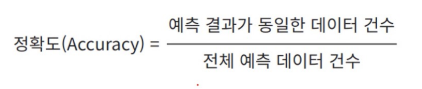
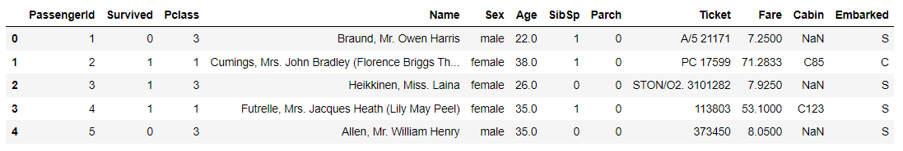
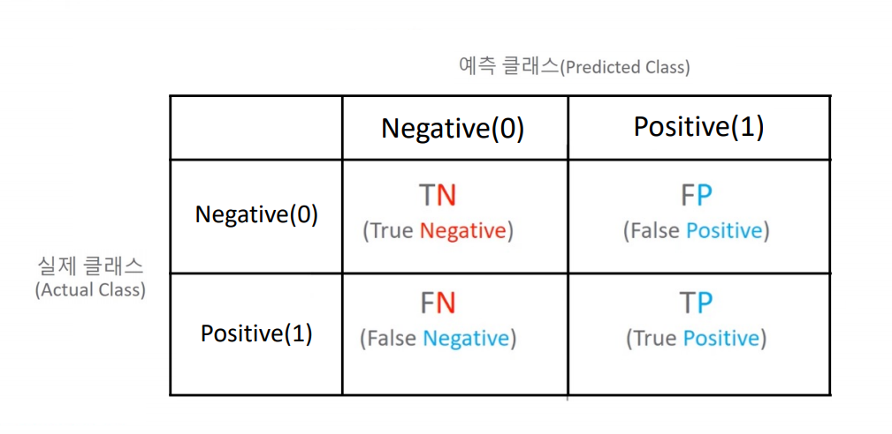
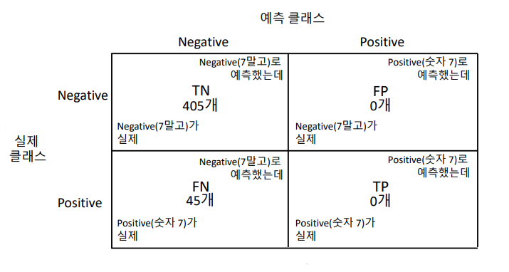
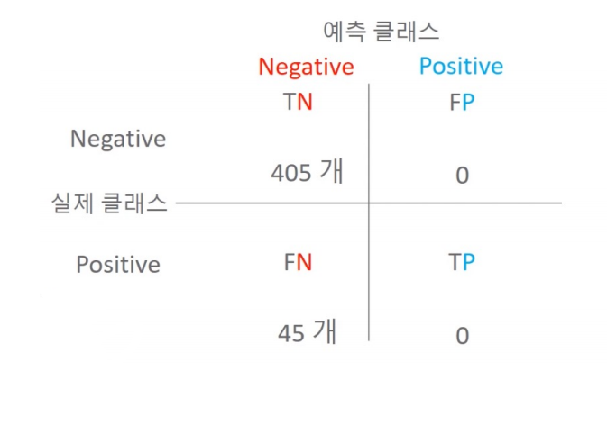

# 평가(Evaluate)

## 이진 분류 성능평가 지표

- 정확도(Accuracy)
- 오차행렬(Confusion Matrix)
- 정밀도(Precision)
- 재현율(Recall)
- F1 스코어
- ROC, AUC


## 정확도(Accuracy)



정확도는 직관적으로 모델 예측 성능을 나타내는 평가 지표. 하지만 이진 분류의 경우 데이터의 구성에 따라 ML 모델의 성능을 왜곡할 수 있기 때문에 정확도 수치 하나만 가지고 성능을 평가하지 않는다.

특히 정확도는 불균형한 레이블 값 분포에서 ML 모델의 성능을 판단할 경우 적합한 평가 지표가 아니다

### 정확도의 문제점

ex) 타이타닉 데이터 -> 타이타닉 생존자 예측에서 여성은 모두 생존으로 판별했을 때 정확도가 약 80% 정도로 나온다.

```python
titanic_df = pd.read_csv('./titanic_train.csv')
titanic_df.head()
```




```python
titanic_df.shape
```

```python
(891, 12)
```


```python
pred = np.zeros( (titanic_df.shape[0], 1) )

print(len(pred))
pred[:10]
```

```python
891
array([[0.],
       [0.],
       [0.],
       [0.],
       [0.],
       [0.],
       [0.],
       [0.],
       [0.],
       [0.]])
```


```python
import numpy as np
from sklearn.base import BaseEstimator

# 성별로만 생존, 사망을 예측하는 클래스
class MyDummyClassifier(BaseEstimator):
    # fit 메소드는 아무것도 학습하지 않음.
    def fit(self, X , y=None):
        pass
    
    # 데이터프레임(X)의 성별(Sex)이 여자면(0) 생존(1), 남자(1)면 사망(0)으로 하는 pred를 반환함.
    def predict(self, X):
        # pred는 성별을 기준으로 생존(1), 사망(0)을 예측하는 것
        pred = np.zeros( ( X.shape[0], 1 ))
        for i in range (X.shape[0]) :
            if X['Sex'].iloc[i] == 1:
                pred[i] = 0
            else :
                pred[i] = 1
        
        return pred
```

```python
# 데이터 전처리 함수들
import pandas as pd
from sklearn.preprocessing import LabelEncoder

# Null 처리 함수
def fillna(df):
    df['Age'].fillna(df['Age'].mean(),inplace=True)
    df['Cabin'].fillna('N',inplace=True)
    df['Embarked'].fillna('N',inplace=True)
    df['Fare'].fillna(0,inplace=True)
    return df

# 머신러닝 알고리즘에 불필요한 속성 제거
def drop_features(df):
    df.drop(['PassengerId','Name','Ticket'],axis=1,inplace=True)
    return df

# 레이블 인코딩 수행. 
def format_features(df):
    df['Cabin'] = df['Cabin'].str[:1]
    features = ['Cabin','Sex','Embarked']
    for feature in features:
        le = LabelEncoder()
        le = le.fit(df[feature])
        df[feature] = le.transform(df[feature])
    return df

# 앞에서 설정한 Data Preprocessing 함수 호출
def transform_features(df):
    df = fillna(df)
    df = drop_features(df)
    df = format_features(df)
    return df
```

```python
import pandas as pd
from sklearn.model_selection import train_test_split
from sklearn.metrics import accuracy_score

# 타이타닉 데이터 로드 및 feature(X), target(y) 데이터 분리
titanic_df = pd.read_csv('./titanic_train.csv')
y_titanic_df = titanic_df['Survived']
X_titanic_df= titanic_df.drop('Survived', axis=1)

# 데이터 전처리
X_titanic_df = transform_features(X_titanic_df)

# train, test 데이터 분리 
X_train, X_test, y_train, y_test=train_test_split(X_titanic_df, y_titanic_df, \
                                                  test_size=0.2, random_state=0)
```

```python
# MyDummyClassifier 객체 생성
myclf = MyDummyClassifier()

# MyDummyClassifier 학습
myclf.fit(X_train, y_train)

# 테스트 데이터 예측
mypredictions = myclf.predict(X_test)
print('MyDummyClassifier의 정확도는: {0:.4f}'.format(accuracy_score(y_test , mypredictions)))
```

```python
MyDummyClassifier의 정확도는: 0.7877
```

-> 여성이면 생존, 남성이면 사망이라는 단순한 모델로 예측해도 정확도가 79%가 나온다	


## 오차 행렬과 정밀도, 재현율

### 오차 행렬 (Confusion Matrix)

오차 행렬은 이진 분류의 예측 오류가 얼마인지와 더불어 어떠한 유형의 예측 오류가 발생하고 있는지를 함께 나타내는 지표

가로열 : 실제 클래스(Actual Class)

세로열 : 예측 클래스(Predicted Class)



```python
from sklearn.metrics import confusion_matrix

# 예측 결과 fakepred와 실제 결과 y_test의 Confusion Matrix출력
confusion_matrix(y_test, fakepred)
```

```python
array([[405,   0],
       [ 45,   0]])
```


mnist dataset에서 오차 행렬을 통한 정확도 지표 문제점 인지

숫자가 7인지 예측하는 이진분류 문제 -> 전부 다 Negative로 예측



TP는 0임. Positive로 예측이 한 건도 성공하지 않음

이와 더불어 FP가 0이므로 Positive로 예측 자체를 수행하지 않음을 알 수 있음


정확도 : 예측 결과와 실제 값이 동일한 건수 / 전체 데이터 

= (TN + TP) / (TN + TP + FN + FP) = 90%


### 정밀도(Precision)와 재현율(Recall)

- 정밀도 : TP / (FP + TP)
- 재현율 : TP / (FN + TP)



정밀도는 예측을 Positive로 한 대상 중에 예측과 실제 값이 Positive로 일치한 데이터의 비율

재현율은 실제 값이 Positive인 대상 중에 예측과 실제 값이 Positve로 일치한 데이터의 비율


정밀도는 precision_score(), 재현율은 recall_score()제공

```python
from sklearn.metrics import accuracy_score, precision_score , recall_score

print("정밀도:", precision_score(y_test, fakepred))
print("재현율:", recall_score(y_test, fakepred))
```

