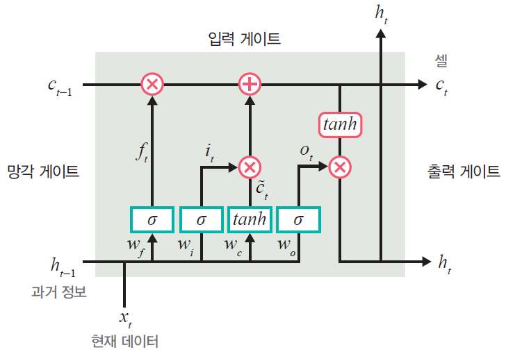
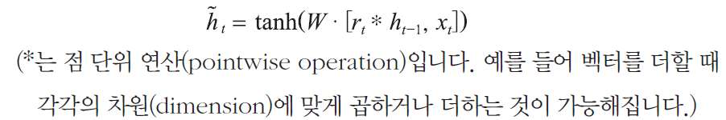

# 순환신경망 RNN

## RNN (Recurrent Neural Network)

- 시간적으로 연속성이 있는 데이터를 처리하려고 고안된 인공 신경망
- 은닉층 노드들이 연결되어 이전 단계 정보를 은닉층 노드에 저장할 수 있도록 구성한 신경망
- Recurrent(반복되는)는 이전 은닉층이 현재 은닉층의 입력이 되면서 반복되는 순환 구조를 갖는다는 의미
- RNN이 기존 네트워크와 다른 점은 기억(memory)을 갖는다는 것
- 기억은 현재까지 입력 데이터를 요약한 정보
- 새로운 입력이 네트워크로 들어올 때마다 기억은 조금씩 수정되며, 결국 최종적으로 남겨진 기억은 모든 입력 전체를 요약한 정보

### 일대일

- 순환이 없기 때문에 RNN이라고 말하기 어려우며, 순방향 네트워크가 대표적 사례

### 일대다

- 입력이 하나이고 출력이 다수인 구조
- 이미지를 입력해서 이미지에 대한 설명을 문장으로 출력하는 이미지 캡션(image captioning)

### 다대일

- 입력이 다수이고 출력이 하나인 구조로, 문장을 입력해서 긍정/부정을 출력하는 감성분석기

### 다대다

- 입력과 출력이 다수인 구조로, 언어를 번역하는 자동 번역기 등

### 동기화 다대다

- 문장에서 다음에 나올 단어를 예측하는 언어 모델, 즉 프레임 수준의 비디오 분류

- 다대일

- 다층 다대일

- 다대다

## LSTM

- RNN은 결정적 단점이 있음
- 망각 게이트 (forget gate)는 과거 정보를 어느 정도 기억할지 결정
- 과거 정보와 현재 데이터를 입력받아 시그모이드를 취한 후 그 값을 과거 정보에 곱해줌
- 시그모이드의 출력이 0이면 과거 정보는 버리고, 1이면 과거 정보는 온전히 보존

### 입력 게이트 (input gate)

- 현재 정보를 기억하기 위해 만들어졌음
- 과거 정보와 현재 데이터를 입력받아 시그모이드와 하이퍼블릭 탄젠트 함수를 기반으로 현재 정보에 대한 보존량을 결정
- 즉, 현재 메모리에 새로운 정보를 반영할지 결정하는 역할을 함
- 계산한 값이 1이면 입력 x_t가 들어올 수 있도록 허용(open)
- 계산한 값이 0이면 차단

### 셀

- 각 단계에 대한 은닉 노드를 메모리 셀이라고 함
- 총합(sum)을 사용하여 셀 값을 반영하며, 이것으로 기울기 소멸 문제가 해결
- 망각 게이트와 입력 게이트의 이전 단계 셀 정보를 계산하여 현재 단계의 셀 상태(cell state) 를 업데이트

### 출력 게이트(output gate)

- 과거 정보와 현재 데이터를 사용하여 뉴런의 출력을 결정
- 이전 은닉 상태(hidden state)와 t번째 입력을 고려해서 다음 은닉 상태를 계산
- LSTM에서는 이 은닉 상태가 그 시점에서의 출력이 됨
- 출력 게이트는 갱신된 메모리의 출력 값을 제어하는 역할을 함
- 계산한 값이 1이면 의미 있는 결과로 최종 출력
- 계산한 값이 0이면 해당 연산 출력을 하지 않음

## GRU (Gated Recurrent Unit)

- 게이트 메커니즘이 적용된 RNN 프레임워크의 한 종류이면서 LSTM보다 구조가 간단함
- GRU는 LSTM에서 사용하는 망각 게이트와 입력 게이트를 하나로 합친 것이며, 별도의 업데이트 게이트로 구성
- 하나의 게이트 컨트롤러 (gate controller)가 망각 게이트와 입력 게이트를 모두 제어함
- 게이트 컨트롤러가 1을 출력하면 망각 게이트는 열리고 입력 게이트는 닫히며, 반대로 0을 출력하면 망각 게이트는 닫히고 입력 게이트는 열림
- 즉 이전 기억이 저장될 때마다 단계별 입력은 삭제
- GRU는 출력 게이트가 없어 전체 상태 벡터가 매 단계마다 출력되며, 이전 상태의 어느 부분이 출력될지 제어하는 새로운 게이트 컨트롤러가 별도로 존재

### 망각 게이트 (reset gate)

- 과거 정보를 적당히 초기화(reset) 시키려는 목적으로 시그모이드 함수를 출력으로 이용하여 (0, 1) 값을 이전 은닉층에 곱함

  

### 업데이트 게이트 (update gate)

- 과거와 현재 정보의 최신화 비율을 결정하는 역할을 함
- 시그모이드로 출력된 결과는 현시점의 정보량을 결정하고 1에서 뺀 값은 직전 시점의 은닉층 정보와 곱함

### 후보군(candidate)

- 현시점의 정보에 대한 후보군을 계산
- 과거 은닉층의 정보를 그대로 이용하지 않고 망각 게이트의 결과를 이용하여 후보군을 계산

### 은닉층 계산

- 마지막으로 업데이트 게이트 결과와 후보군 결과를 결합하여 현 시점의 은닉층을 계산
- 시그모이드 함수의 결과는 현시점에서 결과에 대한 정보량을 결정하고 1-시그모이드 함수의 결과는 과거의 정보량을 결정

## 양방향 RNN

- RNN은 이전 시점의 데이터들을 참고해서 정답을 예측하지만 실제 문제에서는 과거 시점이 아닌 미래 시점의 데이터에 힌트가 있는 경우도 많음
- 이전 시점의 데이터뿐만 아니라 이후 시점의 데이터도 함께 활용하여 출력 값을 예측하고자 하는 것이 양방향 RNN

### 양방향 RNN 구조

- 양방향 RNN은 하나의 출력 값을 예측하는 데 메모리 셀 두 개를 사용
- 첫번째 배보리 셀은 이전 시점의 은닉 상태를 전달받아 현재의 은닉 상태를 계산
- 다음 기림에서는 초록섹 메모리 셀에 해당
- 두 번째 메모리 셀은 다음 시점의 은닉 상태를 전달받아 현재의 은닉 상태를 계산
- 다음 그림의 주황색 메모리 셀에 해당
- 이 값 두 개를 모두 출력층에서 출력 값을 예측하는 데 사용

