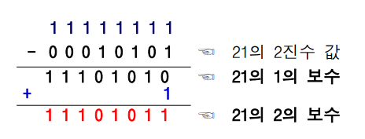

# 자료구조
- 단순 구조  
: 정수, 실수, 문자, 문자열, 등의 기본 자료형  
- 선형 구조  
: 자료들 간의 앞뒤 관계가 1:1의 선형 관계  
  리스트, 연결 리스트, 스택, 큐, 덱 등  
- 비선형 구조  
: 자료들 간의 앞뒤 관계가 1:다 또는 다:다 관계  
트리 그래프 등  
- 파일 구조  
레코드의 집합인 파일에 대한 구조  
순차파일, 색인파일, 직접파일 등  

자료구조명|특징
-|-
스택(stack)|나중에 들어온 값을 먼저 나갈 수 있도록 해주는 자료구조(last in first out)
큐(queue)|먼저 들어온 값을 먼저 나갈 수 있도록 해주는 자료구조
튜플(tuple)|리스트와 같지만 데이터의 변경을 허용하지 않는 자료구조
세트(set)|데이터의 중복을 허용하지 않고 수학의 집합 연산을 지원하는 자료구조
딕셔너리(dictionary)|전화번호부와 같이 키(key)와 값(value) 형태의 데이터를 저장하는 자료구조, 여기서 키값은 다른 데이터와 중복을 허용하지 않음
collections 모듈|위에 열거된 여러 자료구조들을 효율적으로 사용할 수 있도록 지원하는 파이썬 내장(built-in)모듈 

존(Zone)형식의 표현  
- 10진수 한 자리를 표현하기 위해서 1바이트(8비트)를 사용하는 형식  
- 존 영역
  - 상위 4비트
  - 1111로 표현
- 수치 영역
  - 하위 4비트
  - 표현하고자 하는 10진수 한 자리 값에 대한 2진수 값을 표시  
- 존 형식의 구조

여러 자리의 10진수를 표현하는 방법  
- 10진수의 자릿수 만큼 존 형식을 연결하여 사용
- 마지막 자리의 존 영역에 부호를 표시  
  - 양수(+) : 1100
  - 음수(-) : 1101
  

팩(Pack) 형식의 표현
- 10진수 한 자리를 표현하기 위해서 존 영역 없이 4비트를 사용하는 형식
- 최하위 4비트에 부호를 표시
  - 양수(+) : 1100
  

n비트의 부호 절댓값 형식  
- 최상위 1비트 : 부호 표시
  - 양수(+) : 0
  - 음수(-) : 1
- 나머지 n-1비트 : 이진수 표시
- 1바이트를 사용하는 부호 절댓값 형식의 예
  
  

1의 보수형식  
- 음수의 표현에서 부호 비트를 사용하는 대신 1의 보수를 사용하는 방법
- n비트의 2진수를 1의 보수로 만드는 방법
  - n비트의 모두 1로 만든 이진수에서 변환하고자 하는 이진수를 뺀다.
  - 예) 10진수 21을 1의 보수로 만들기(1바이트 사용)

- 1바이트를 사용하는 1의 보수 형식의 예
  

  2의 보수 형식
  - 음수의 표현에서 부호 비트를 사용하는 대신 2의 보수를 사용하는 방법
  - n비트의 2진수를 2의 보수로 만드는 방법
    - 1의 보수에 1을 더해준다
    - 예) 10을 21의 2의 보수로 만들기(1바이트 사용)
  
  - 1바이트를 사용하는 2진 보수 형식의 예
   
   2진수 정수의 세 가지 표현 방법에서 양수의 표현은 같고 **음수의 표현만 다르다.**

고정 소수점 표현  
- 소수점이 항상 최상위 비트의 왼쪽 밖에 고정되어 있는 것으로 취급하는 방법  
- 고정 소수점의 표현의 00010101은 0.00010101의 실수 값을 의미  

부동 소수점 형식의 표현  
- 고정 소수점 형식에 비해서 표현 가능한 값의 범위가 넓다
- 실수를 구분하여 표현
  
- 4바이트를 사용하는 부동 소수점 형식
    

  
문자 자료의 표현  
문자에 대한 이진수 코드를 정의하여 사용  
문자에 대한 2진수 코드표
- BCD코드
- EBCDIC코드
- ASCII코드

6비트를 사용하여 문자 표현  
상위 2비트 : 존 비트  
하위 4비트 : 2진수 비트  
존 비트와 2진수 비트를 조합하여 10진수 0~9와 영어 대문자, 특수 문자를 표현

8비트를 사용하여 문자 표현  
상위 4비트 : 존 비트  
하위 4비트 : 2진수 비트  
존 비트와 2진수 비트를 조합하여 10진수 0~9와 영어 대문자/소문자와 특수문자를 표현  

EBCDIC코드의 구성  

EBCDIC코드  

ASCII코드  
7비트를 사용하여 문자 표현  
상위 3비트 : 존 비트
하위 4비트 : 2진수 비트  
존 비트와 2진수 비트를 조합하여 10진수 0~9와 영어 대문자/소문자, 특수문자를 표현  

ASCII코드의 구성 

ASCII코드

유니코드  
16비트를 사용하여 문자 표현  
16비트의 코드값을 4자리의 16진수로 표시  

유니코드의 구성

유니코드  

논리자료  
논리값을 표현하기 위한 자료 형식  
논리값
- 참(True)과 거짓(False), 1과 0  

1바이트를 사용하여 논리자료를 표현하는 방법
- 방법 1)
  - 참 : 최하위 비트를 1로 표시 00000001
  - 거짓 : 전체 비트를 0으로 표시 00000000
- 방법 2)
  - 참 : 전체 비트를 1로 표시 11111111
  - 거짓 : 전체 비트를 0으로 표시 00000000
- 방법 3)
  - 참 : 하나 이상의 비트를 1로 표시 00000001 or  00000100 ...
  - 거짓 : 전체 비트를 0으로 표시 00000000

소프트웨어 생명주기  
성공적인 소프트웨어 개발이란?  
얼마나 정확하고 효율적으로 소프트웨어를 개발하고 사용 및 관리가 이루어 지는가  
개발할 소프트웨어에 대한 정확한 이해  
사용할 자료와 자료 간의 연산관계를 분석하여 최적의 자료구조 정의  

소프트웨어 생명주기  
소프트웨어를 체계적으로 개발하고 관리하기 위해서 개발과정을 단계별로 나누어 구분한 것  
일반적으로 6단계로 구분  
일반적인 소프트웨어 생명주기  

# 알고리즘  
알고리즘의 표현 방법  
- 자연어를 이용한 서술적 표현 방법
- 순서도(flow chart)를 이용한 도식화 표현 방법  
- 프로그래밍 언어를 이용한 구체화 방법  
- 가상코드(Pseudo-code)를 이용한 추상화 방법

순서도를 이용한 알고리즘의 표현
- 순서도에서 사용하는 기호  
 
- 장점 : 알고리즘의 흐름 파악이 용이함
- 단점 : 복잡한 알고리즘의 표현이 어려움

가상 코드를 이용한 알고리즘의 표현
- 가상코드 즉 알고리즘 기술언어(ADL, Algorithm Description Language)를 사용하여 프로그래밍 언어의 일반적인 형태와 유사하게 알고리즘을 표현
- 특정 프로그래밍 언어가 아니므로 직접 실행은 불가능
- 일반적인 프로그래밍 언어의 형태이므로 원하는 특정 프로그래밍 언어로의 변환 용이
- 가상코드의 형식
  - 기본 요소
    - 기호
      - 변수, 자료형 이름, 레코드 필드 명, 문장의 레이블 등을 나타냄
      - 문자나 숫자의 조합. 첫 문자는 반드시 영문자 사용
    - 자료형
      - 정수형과 실수형의 수치 자료형, 문자형, 논리형, 포인터, 문자열 등의 모든 자료형 사용
    - 연산자
      - 산술연산자, 관계연산자, 논리연산자
    - 지정문
      - 사용형식 : 변수 ← 값;
      - 지정 연산자(←)의 오른쪽에 있는 값(또는 식의 계산 결과 값이나 변수의 값)을 지정 연산자(←)의 왼쪽에 있는 변수에 저장

# 리스트
리스트 : 자료를 나열한 목록  
선형 리스트  
- 순서 리스트  
- 자료들 간에 순서를 갖는 리스트  

선형 리스트의 저장
- 원소들의 논리적 순서와 같은 순서로 메모리에 저장
- 순차 자료구조
  - 원소들의 논리적 순서 = 원소들이 저장된 물리적 순서

선형 리스트에서 원소 삽입
- 선형 리스트 중간에 원소가 삽입되면, 그 이후의 원소들은 한자리씩 자리를 뒤로 이동하여 물리적 순서를 논리적 순서와 일치시킨다.

선형 리스트에서 원소 삭제
- 선형리스트 중간에 원소가 삭제되면, 그 이후의 원소들은 한자리씩 자리를 앞으로 이동하여 물리적 순서를 논리적 순서와 일치시킨다.

순차 자료구조의 문제점
- 삽입연산이나 삭제연산 후에 연속적인 물리 주소를 유지하기 위해서 원소들을 이동시키는 추가적인 작업과 시간이 소요
  - 원소들의 이동 작업으로 인한 오버헤드는 원소의 개수가 많고 삽입/삭제 연산이 많이 발생하는 경우에 성능상의 문제 발생
- 순차 자료구조는 배열을 이용하여 구현하기 때문에 배열이 갖고 있는 메모리 사용의 비효율성 문제를 그대로 가짐
- 순차 자료구조에서의 연산 시간에 대한 문제와 저장 공간에 대한 문제를 개선한 자료 표현 방법 필요  

연결 자료구조(linked data structure)
- 자료의 논리적인 순서와 물리적인 순서가 일치하지 않는 자료구조
  - 각 원소에 저장되어 있는 다음 원소의 주소에 의해 순서가 연결되는 방식
    - 물리적인 순서를 맞추기 위한 오버헤드가 발생하지 않음
  - 여러 개의 작은 공간을 연결하여 하나의 전체 자료구조를 표현
    - 크기 변경이 유연하고 더 효율적으로 메모리를 사용
- 연결 리스트
  - 리스트를 연결 자료구조로 표현한 구조
  - 연결하는 방식에 따라 단순 연결 리스트와 원형 연결 리스트, 이중 연결 리스트, 이중 원형 연결 리스트로 나뉜다.
  
연결 리스트의 노드
- 연결 자료구조에서 하나의 원소를 표현하기 위한 단위 구조
- <원소, 주소>의 구조  
  
  - 데이터 필드
    - 원소의 값을 저장
    - 저장할 원소의 형태에 따라 하나 이상의 필드로 구성
  - 링크 필드
    - 다음 노드의 주소를 저장
    - 포인터 변수를 사용하여 주소값을 저장

선형 리스트와 연결 리스트의 비교  
- 리스트 이름 week : 연결 리스트이 시작을 가리키는 포인터 변수
  - 포인터 변수 week는 연결 리스트의 첫번째 노드를 가리키는 동시에 연결된 리스트 전체를 의미
- 연결 리스트의 마지막 노드의 링크필드 : 노드의 끝을 표시하기 위해서 null 저장
- 공백 연결 리스트 : 포인터변수 week에 null을 저장(널 포인터)

# 스택
스택  
- 접시를 쌓듯이 차곡차곡 쌓아 올린 형태의 자료구조
- 스택에 저장된 원소는 top으로 정한 곳에서만 접근 가능
  - top의 위치에서만 원소를 삽입하므로 먼저 삽입한 원소는 밑에 쌓이고, 나중에 삽입한 원소는 위에 쌓이는 구조
  - 마지막에 삽입(last-in)한 원소는 맨 위에 쌓여 있다가 가장 먼저 삭제(first out)됨 : 후입선출 구조(LIFO)  

스택의 연산
- 스택에서의 삽입 연산 : push
- 스택에서의 삭제 연산 : pop  

시스템 스택  
프로그램에서의 호출과 복귀에 따른 수행 순서를 관리  
- 가장 마지막에 호출된 함수가 가장 먼저 실행을 완료하고 복귀하는 후입선출 구조의 스택을 이용하며 수행순서 관리
- 함수 호출이 발생하면 호출한 함수 수행에 필요한 지역변수, 매개변수 및 수행 후 복귀할 주소 등의 정보를 스택 프레임에 저장하여 시스템 스택에 삽입
- 함수의 실행이 끝나면 시스템 스택의 top 원소(스택 프레임)를 삭제(pop)하면서 프레임에 저장되어있던 복귀주소를 확인하고 복귀
- 함수 호출과 복귀에 따라 이 과정을 반복하여 전체 프로그램 수행이 종료되면 시스템 스택은 공백 스택이 된다.

# 큐
큐(queue)  
- 스택과 마찬가지로 삽입과 삭제의 위치가 제한되어있는 유한 순서 리스트
- 큐의 뒤에서는 삽입만 하고 앞에서는 삭제만 할 수 있는 구조
  - 삽입한 순서대로 원소가 나열되어 가장 먼저 삽입(first-in)한 원소는 맨 앞에 있다가 가장 먼저 삭제(first-out)된다. : 선입선출 구조(FIFO)

연결 큐
- 단순 연결 리스트를 이용한 큐
  - 큐의 원소 : 단순 연결 리스트의 노드
  - 큐의 원소의 순서 : 노드의 링크 포인터로 연결
  - 변수 front : 첫 번째 노드를 가리키는 포인터 변수
  - 변수 rear : 마지막 노드를 가리키는 포인터 변수
- 상태 표현
  - 초기 상태와 공백 상태 : front = rear = None
- 연결 큐의 구조
  

운영체제의 작업 큐  
- 프린트 버퍼 큐
  - CPU에서 프린터로 보낸 데이터 순서대로(선입선출) 프린터에서 출력하기 이해서 선입선출 구조의 큐 사용
- 스케쥴링 큐
  - CPU 사용을 요청한 프로세서들의 순서를 스케줄링 하기 위해서 큐를 사용