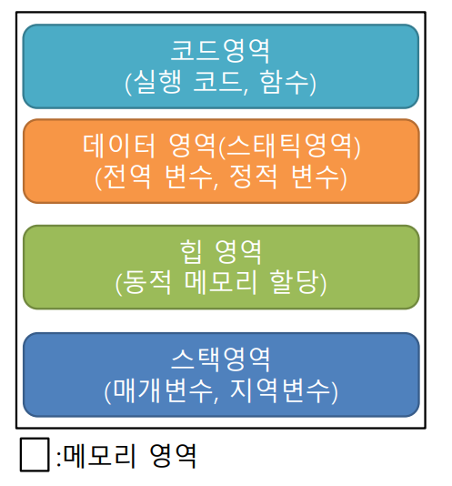

# 메모리 영역
메모리 관리 원칙  
1. 메모리 관리의 주체는 운영체제이다.  
   - 반드시 운영체제를 통해서만 메모리를 할당
2. 운영체제는 메모리가 있는 한은 할당요청을 거절하지 않는다.
3. 한번 할당된 메모리 공간은 절대로 다른 목적을 위해서 재할당되지 않는다.
   - 할당된 공간은 안정적
4. 응용 프로그램이 할당된 메모리를 해제하면 운영체제는 이 공간을 빈 영역으로 인식한다.  

- 코드 영역 : 프로그램 실행코드, 함수들이 저장되는 영역, OR 텍스트 영역  
- 데이터 영역 : 전역 변수, 정적 변수들이 저장되는 영역  
- 힙 영역 : 프로그램이 실행되는 동안 동적으로 메모리를 할당할 수 있는 영역
- 스택 영역 : 매개변수, 지역변수, 중괄호(블록), 내부에 정의된 변수들이 저장되는 영역

> 정적할당
- 정적 메모리 공간 할당
- 필요에 따라 메모리 공간 계산 후 할당 방식
- 메모리 공간 필요가 분명할 시 사용
- 선언한 메모리 공간 변화 불가
- 일반적인 변수 선언 형태

> 동적할당
- 동적 메모리 공간 할당
- 정적 할당과는 다른 메모리 방식의 메모리 공간 할당
- 프로그램 동작 중 메모리 공간을 가변 할당 가능
- 필요 정도에 따라 메모리 할당 후 제거하는 방식
- 메모리 공간 필요 정도가 불분명할 시 사용
- 임시적인 메모리가 필요할 시 사용
- 동적 할당된 메모리는 이름이 없는 변수와 동일

# 동적할당과 정적할당
동적할당  
- 힙 영역에 할당
- 런타임 중에 이루어진다
- 장점 : 경제적이다.
- 단점 : 더 이상 사용하지 않을 떄 명시적으로 메모리를 해제해 주어야 한다.
  
정적할당
- 컴파일로 고정되는 데이터 영역에 할당
- 컴파일타임에 이루어진다.
- 장점 : 실행도중 해제되지 않고 자동 회수된다.
- 단점 : 메모리 크기를 조절할 수 없다.