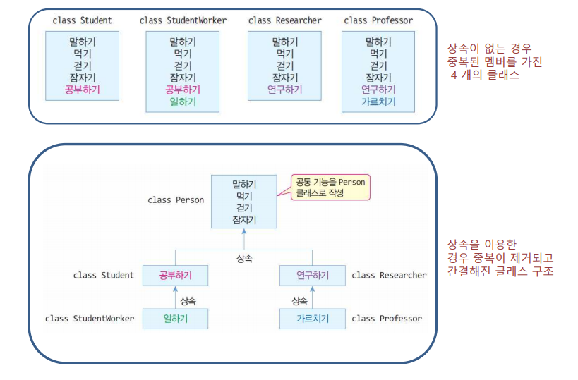

# 클래스
```python
class 클래스명 :  
    def __init__(self): #생성자  
        self.인스턴스변수1 = 0  
    def setdata(self, 입력매개변수1,...)  :  #초기화(생성자로 대체가능)
        self.인스턴스변수1 = 입력매개변수1  
        ...  
    def 인스턴스메소드(self, ...) :  # 내부의 메소드 생성 가능
        ...  
        return 반환값  
    ...
```

> 객체
  
자신의 속성을 갖고 있고 다른 것과 식별이 가능한 것  
배열과 비슷하다.  
타언어에서 연관배열, 맵, 딕셔너리 등의 데이터 타입과 같다고 볼 수 있다.  
데이터를 가지고 있다. - 데이터는 객체의 상태를 기술하는 정보를 가지고 있다.  
행위의 집합을 가지고 있다. - 이 행위들은 메세지를 받았을 때 객체가 어떻게 해야하는지 알고 있는 것이다.  
객체를 구분하는 아이덴티티를 갖고 있다. - 어떠한 객체를 다른 객체와 구분하는 것을 가능하게 한다.  
사전적 정의로 실제 존재하는 것  
객체지향이론에서는 사물과 같은 유형적인것 뿐만 아니라 개념이나 논리같은 무형적인 것도 객체로 간주한다.  
프로그래밍에서의 객체는 **클래스에 정의된 내용대로 메모리에 생성된 것.**  

비유  
붕어빵기계 : 클래스  
붕어빵 : 객체  
붕어빵 속 앙금 : 필드  


> 클래스 

객체를 정의해 놓은 것  
객체의 설계도, 틀  
객체를 생성하는데 사용  
객체는 클래스에 정의된 재로 생성  

```
class Test:

t1 = Test()  
t2 = Test()
```  
생성자를 이용하여 메모리에 객체를 만들라는 명령  
메모리에 만들어진 객체를 인스턴스(instance)라고도 한다.  
객체를 참조하는 변수 t1, t2  
Test라는 객체가 2개가 만들어지고 각각의 객체를 참고하는 t1과 t2변수가 선언  


대상의 속성 = 필드  
Test 클래스 인스턴스화  
```
t1 = Test()
t2 = Test()
```
객체별로 name과 number라는 속성을 가진다.  
```
t1.name = '소방차'
t1.number = 1234
t2.name = '구급차'
t2.number = '1004'
```
객체 != 인스턴스  
객체는 인스턴스를 포함하는 의미  

인스턴스화  
클래스로부터 인스턴스를 생성하는 것
```
class Animal :

cat = Animal( )
```
클래스에 의해서 만들어진 객체를 인스턴스라고 한다.  
cat은 객체이고, cat이라는 객체는 Animal의 인스턴스(instance)이다.  
인스턴스 = 특정 객체(cat)가 어떤 클래스(Animal)의 객체인지를 관계 위주로 설명할 때 사용  
즉, cat은 인스턴스보다는 객체  
cat은 Animal의 객체 보다는 cat은 Animal의 인스턴스  


# 생성자
모든 클래스는 인스턴스화될 때 생성자를 사용.  
생성자(초기자)를 프로그래머가 만들지 않으면 Object클래스 안에 있는 생성자가(\_\_new__)가 자동으로 동작  
생성자(초기자)를 하나라도 프로그래머가 만들었다면 \_\_new__가 동작 안함  
객체가 될 때 필드를 초기화하는 역할을 수행  
```python
class 클래스명 : 
    def __new__(cls) 
    def __init__(self): #생성자  
        self.인스턴스변수1 = 0  
    def setdata(self, 입력매개변수1,...)  :  #초기화(생성자로 대체가능)
        self.인스턴스변수1 = 입력매개변수1  
        ...  
    def 인스턴스메소드(self, ...) :  # 내부의 메소드 생성 가능
        ...  
        return 반환값  
    ...
```

# 메소드
입력값 : 매개변수, 인자  
결과값 : 리턴값  
매개변수 :  전달된 인자를 받아들이는 변수를 의미  
인자 : 어떤 함수를 호출 시에 전달되는 값을 의미  

메소드란 클래스가 가지고 있는 기능  
클래스 안에 선언  

def 매개변수 이름(매개변수들) :  
&nbsp;&nbsp;&nbsp;&nbsp;&nbsp;&nbsp; 실행문  


1. 매개변수도 없고 리턴하는 것도 없는 형태의 메소드
```python
def method1(self) :
    print('method1이 실행됩니다.')
```
2. 정수를 받아들인 후 리턴하지 않는 메소드
```python
def method2(self, x) :
    print(x + '를 이용하는 method2 입니다.')
```
3. 아무것도 받아들이지 않고 정수를 반환하는 메소드
```python
def method3(self) :
    print('method3이 실행됩니다.')
    return 10
# 리턴하는 값 앞에 return이라는 키워드를 사용한다.
```
4. 정수 2개를 매개변수로 받고 아무것도 반환하지 않는 메소드
```python
def method4(self, x, y) :
    print(x + ',' + y +'를 이용하는 method4 입니다.')
```
5. 정수를 한 개 받아들인 후 정수를 반환하는 메소드  
```python
def method5(self, y):
    print(y + '를 이용하는 method5 입니다.')
    return 5
```

이미 구성한 로직을 재활용이 가능  
동일 로직 반복사용에 활용됨  
구성한 로직을 바탕으로 호출로 기능 사용가능  

# 멤버
### 인스턴스 멤버란?  
클래스를 통해 만들어지는 인스턴스 필드와 메소드 - **인스턴스 필드, 인스턴스 메소드**  

인스턴스 멤버는 인스턴스에 소속된 멤버  
클래스 내부에는 존재하지 않고 객체 생성 시 내부에 존재, 개별 객체 영역에 존재  
인스턴스 멤버는 객체를 생성하지 않고는 사용불가  

인스턴스 멤버 선언  
필드 또는 메소드 선언할 때 **self 필수** 

### 정적(static) 멤버란?  
클래스에 고정된 필드와 메소드 - **정적 필드, 정적 메소드, 클래스 메소드**  

정적 멤버는 클래스에 소속된 멤버  
객체 내부에 존재하지 않고 메소드 영역에 존재  
정적 멤버는 객체를 생성하지 않고 클래스로 바로 접근해 사용  

클래스, 정적 메소드 선언 시 메소드 상위단에 @staticmethod @classmethod 개별 작성  
클래스 메소드는 입력 매개변수 cls 필수  

정적 멤버 선언  
필드 또는 메소드 선언할 때 **self 제외**

클래스 변수
- 인스턴스 변수와는 달리 클래스에 소속
- 인스턴스를 통한 접근과 클래스를 통한 접근 두 가지 전부 가능
- 인스턴스를 생성할 필요가 없는 값을 클래스에 저장할 때 사용
- 값의 변경사항을 모든 인스턴스가 공유해야 하는 경우 사용

클래스, 정적 메소드  
- 인스턴스 메소드는 클래스 멤버에 접근할 수 있다.
- 클래스 메소드는 인스턴스 멤버에 접근할 수 없다.
- 인스턴스 변수는 인스턴스가 만들어지면서 생성
- 클래스 메소드는 인스턴스가 생성되기 전에 생성
- 클래스 메소드가 인스턴스 멤버에 접근하는 것은 존재하지 않는 인스턴스 변수에 접근하는 것과 같다.  

인스턴스 멤버 선언 vs 정적 멤버의 선언 기준  
- 필드
  - 객체마다 가지고 있어야 할 데이터 -> 인스턴스 필드
  - 공용적인 데이터 -> 정적 필드
- 메소드
  - 인스턴스 필드로 작업해야 할 메소드 -> 인스턴스 메소드
  - 인스턴스 필드로 작업하지 않는 메소드 -> 정적 메소드


# 캡슐(은닉)
공개 속성과 비공개 속성
- 클래스 바깥에서 접근할 수 있는 속성을 공개 속성(public attribute)
- 클래스 안에서만 접근할 수 있는 속성을 비공개 속성(private attribute)

속성명 앞에 \_\_사용  
- 클래스 속성(클래스 멤버)  
- 인스턴스 속성(인스턴스 멤버)  
ex)
```python
class A:
    __클래스 변수
    __init__(self):
    self.__인스턴스 변수
    __인스턴스 메소드(self):
    __클래스 메소드():
```

# 상속
자식(하위, 파생) 클래스가 부모(상위) 클래스의 멤버를 물려받는 것  
자식이 부모를 선택해 물려받음  
상속대상 : 부모의 필드와 메소드  

상속의 효과  
- 부모 클래스를 재사용해 자식 클래스를 빨리 개발 가능
- 반복된 코드, 중복을 줄임
- 유지, 보수 편리성 제공
- 객체 다형성 구현 가능
  


```python
class 자식클래스 (부모클래스) :
    생성자
    메소드
```

부모 클래스의 내용(속성과 메소드)을 자식 클래스가 가지게 되는 것.  
자식클래스를 선언할 때 소괄호로 부모클래스를 포함  
Python은 다중 상속이 있음.
```python
class A :
    부모 클래스 속성

class B(A) :
    자식 클래스 속성

class C(A) : 

class D(B,C):
```

부모 없는 자식 없음
- 자식 생성할 때는 부모 객체부터 생성 후 자식 객체 생성
- 부모 생성자 호출 완료 후 자식 생성자 호출 완료


# 다형
메소드 오버라이딩  
- 서브(자식) 클래스에서 슈퍼(부모) 클래스의 메소드 중복 작성
- 슈퍼 클래스의 메소드 무력화, 항상 서브 클래스에 오버라이딩 한 메소드가 실행되도록 보장됨
- 메소드 무시하기로 번역되기도 함

오버라이딩 조건
- 슈퍼 클래스 메소드의 원형(메소드 이름, 인자 타입 및 개수)과 동일하게 작성