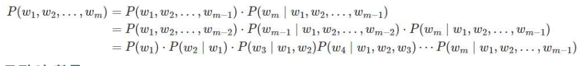
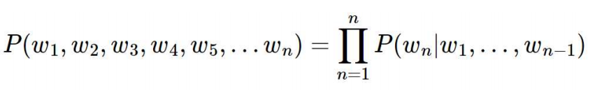
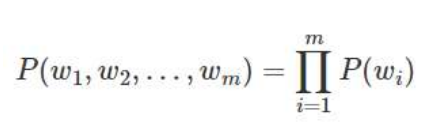
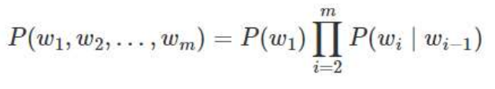

# 언어모델

## 언어 모델이란? (LM, Language Model)

- 단어 시퀀스에 확률을 할당하는 모델, 이전 단어들을 이용하여 다음 단어를 예측함
- BERT는 양쪽 단어들로부터 가운데 단어 예측

통계를 이용한 방법과 인공신경망을 이용한 방법

최근에는 인공신경망 방법이 더 성능 좋음

## 통계적 언어 모델(Statistical Language Model, SLM)

- 확률 기반의 언어모델
- m개의 단어 w1, w2, ..., wm 열(word sequence)이 주어졌을 때 문장으로써 성립될 확률 P(w1, w2, ..., wm)을 출력함으로써 이 단어 열이 실제로 현실에서 사용될 수 있는 문장(sentence)인지를 판별하는 모델
- 조건부 확률
- 문장에 대한 확률을 카운트 기반의 접근으로 계산

### 조건부 확률

- 주어진 사건이 일어났다는 가정 하에 다른 한 사건이 일어날 확률
- 기존의 단어를 바탕으로 만들어질 다음 단어의 확률

### 문장의 확률

## 조건부 확률

- 유니그램 모형(Unigram Model)
- 바이그램 모형(Bigram Model)
- N그램 모형(N-gram Model)

### 유니그램 모델

- 모든 단어의 활용이 완전히 서로 독립이라면 단어 열의 확률은 다음과 같이 각 단어의 확률의 곱이 되는 기반의 모델

### 바이그램 모델 or 마코프 모형 (Markov Model)

- 단어의 활용이 바로 전 단어에만 의존한다면 단어 열의 확률

## 통계적 언어 모델 한계 

- SLM의 한계는 훈련 코퍼스에 확률을 계산하고 싶은 문장이나 단어가 없을 수 있다는 점
- 확률을 계산하고 싶은 문장이 길어질수록 갖고 있는 코퍼스에서 그 문장이 존재하지 않을 가능성이 높다.
- 단어의 확률을 구하고자 가준 단어의 앞 단어를 전부 포함해서 카운트하는 것이 아니라, 앞 단어 중 임의의 개수만 포함해서 카운트하여 근사화 함. 이렇게 하면 갖고 있는 코퍼스에서 해당 단어의 시퀀스를 카운트할 확률이 높아짐

##  N-gram 언어 모델 (N-gram Language Model)

- 임의의 개수를 정하기 위한 기준을 위해 사용하는 것
- n개의 연속적인 단어 나열
- n개의 단어 뭉치 단위로 끊어서 이를 하나의 토큰으로 간주
- n-gram을 통한 언어 모델에서는 다음에 나올 단어의 예측은 오직 n-1개의 단어에만 의존

Ex) An adorable little boy is spreading smiles

- 유니그램 : an, adorable, little,  boy, is,  spreading, smiles
- 바이그램 : an adorable, adorable little, little boy, boy is, is spreading, spreading smiles
- 4-그램(n-그램) : an adorable little boy, adorable little boy is, little boy is spreading, boy is spreading smiles

### N-gram Language Model의 한계

- 희소 문제(Sparsity Problem)
- n을 선택하는 것은 trade-off 문제

#### 희소 문제

- 충분한 데이터를 관측하지 못하여 언어를 정확히 모델링하지 못하는 한계