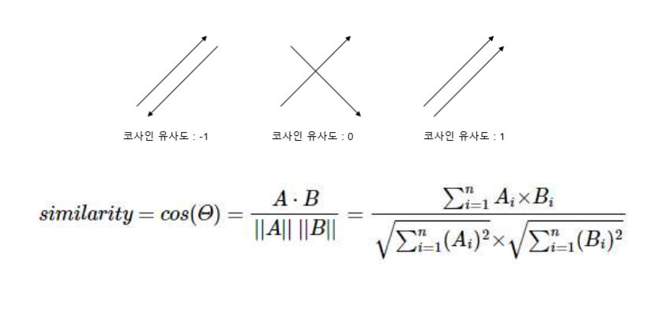

# 벡터의 유사도

## 문장이나 문서의 유사도

- 문서의 유사도는 주로 문서들 간에 동일한 단어 또는 비슷한 단어가 얼마나 공통적으로 많이 사용되었는지에 의존

### 벡터의 유사도

- 코사인 유사도
- 자카드 유사도
- 유클리디안 유사도
- 멘하탄 유사도

#### 코사인 유사도(Cosine Similarity)

- 두 벡터 간의 코사인 각도를 이용하여 구할 수 있는 두 벡터의 유사도

