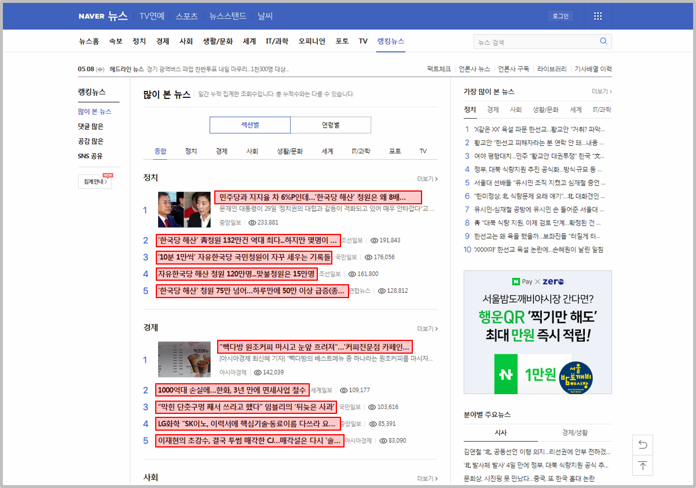
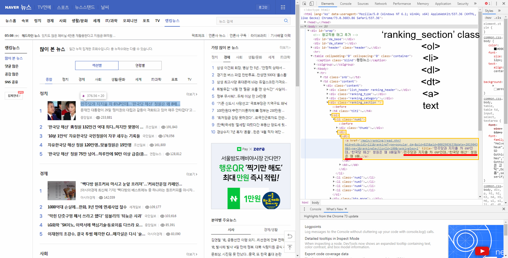

# 4. 네이버 뉴스 제목 가져오기
파이썬과 BeautifulSoup을 이용하면 이 웹 크롤러를 간단하게 만들 수 있는데, 이번 예제에서는 네이버 뉴스의 ‘많이 본 뉴스’를 가져와 보겠다.


주소: https://news.naver.com/main/ranking/popularDay.nhn?rankingType=popular_day&date=20190430

위의 주소에서 알 수 있듯이 맨 뒤에 날짜를 바꿔주면 해당하는 날짜의 많이 본 뉴스를 볼 수 있다.

## 원하는 데이터 추출하기
네이버 많이 본 뉴스 페이지에서 헤드라인만 추출해서 출력해 보겠다.

개발자 도구(Ctrl+Shift+I 또는 F12)를 통해 소스를 보면 헤드라인이 나온 부분을 찾을 수 있다.

위의 그림과 같이 ‘ranking_section’ 클래스 아래 ‘ol’, ‘li’, ‘dl’, ‘dt’, ‘a’ 태그 안의 텍스트임을 알 수 있다.

## 예제
```python
import requests
from bs4 import BeautifulSoup

url = 'https://news.naver.com/main/ranking/popularDay.nhn?rankingType=popular_day&date=20190430'

r = requests.get(url)
html = r.content
soup = BeautifulSout(html, 'html.parser')
titles_html = soup.select('.rankiking_section > oi > li > dl > dt > a')

for i in range(len(titles_html)):
    print(i+1, titles_html[i].text)
```
30개의 헤드라인이 순서대로 출력된다.

결과
```
1 민주당과 지지율 차 6%P인데…'한국당 해산' 청원은 왜 8배…
2 '한국당 해산' 靑청원 132만건 역대 최다...하지만 몇명이 …
3 ‘10분 1만씩’ 자유한국당 국민청원이 자꾸 세우는 기록들
4 자유한국당 해산 청원 120만명...맞불청원은 15만명
5 '한국당 해산' 청원 75만 넘어…하루만에 50만 이상 급증(종…
6 "빽다방 원조커피 마시고 눈앞 흐려져"…'커피전문점 카페인…
7 1000억대 손실에…한화, 3년 만에 면세사업 철수
8 “막힌 단춧구멍 째서 쓰라고 했다” 임블리의 ‘뒤늦은 사과’
9 LG화학 "SK이노, 이력서에 핵심기술·동료이름 다쓰라 요…
10 이재현의 초강수, 결국 투썸 매각한 CJ…매각설은 다시 '솔…
11 필로폰 검출돼도 "안했다" 버텼던 박유천, '이것'에 무너졌…
12 전문가 “박유천, 로버트 할리로 잘못된 학습효과...다리털 …
13 10대 의붓딸 살해범, 젖먹이 아들 앞에서 범행…엄마도 공범…
14 딸 죽인 남편에게 "고생했다"…젖먹이 앞에서 의붓딸 살해(…
15 박유천 손·다리 상처.. 필로폰 부작용 '메스버그 현상?'
16 "혹시 나도 걸렸나?" A형 간염 증상과 절대 해서는 안 될 것…
17 '제2의 인생' 사는 한성주, 과거 소환할 이유 있나
18 익산 미륵사지 석탑, 20년 보수 끝내고 역사적 준공(종합)
19 1만원 내고 5000만원 혜택…해외이주자 귀국뒤 '얌체진료'
20 [전문] '임블리' 임지현 상무, 인스타그램 재사과…"문의 10…
21 조셉 윤 "웜비어 몸값에 서명했다…北에 지불해야 할 것"
22 IS 우두머리 5년 만에 공개…"스리랑카 테러, 최후전투 복…
23 아키히토, 태평양 전쟁 피해국 돌며 "사죄"… 한국은 숙제로…
24 '전쟁 사죄' 아키히토 일왕 퇴위...마지막 발언 주목
25 패션쇼서 '꽈당'…신발 끈에 넘어진 모델 사망
26 [팩트체크] 넷플릭스 3년, 한국  '장악' 4대 공식…19금-미…
27 경쟁이 삼성전자 전후방 사업 반토막냈다
28 반도체의 배신…삼성전자, 10분기만에 최악 성적표 받았다(…
29 갤럭시S10도 '역부족'…삼성폰 1분기 영업익 작년 대비 '뚝'
30 삼성 ‘갤럭시 폴드’, 특허괴물 유니록에 소송 당해
```
