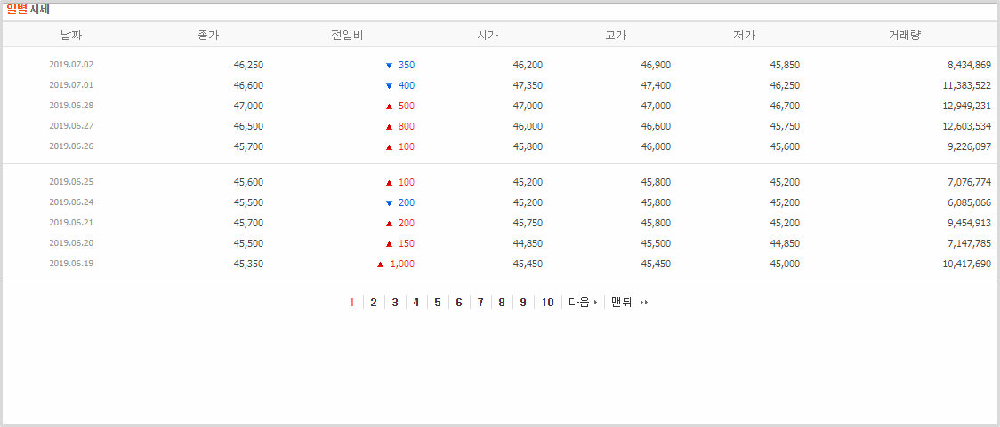
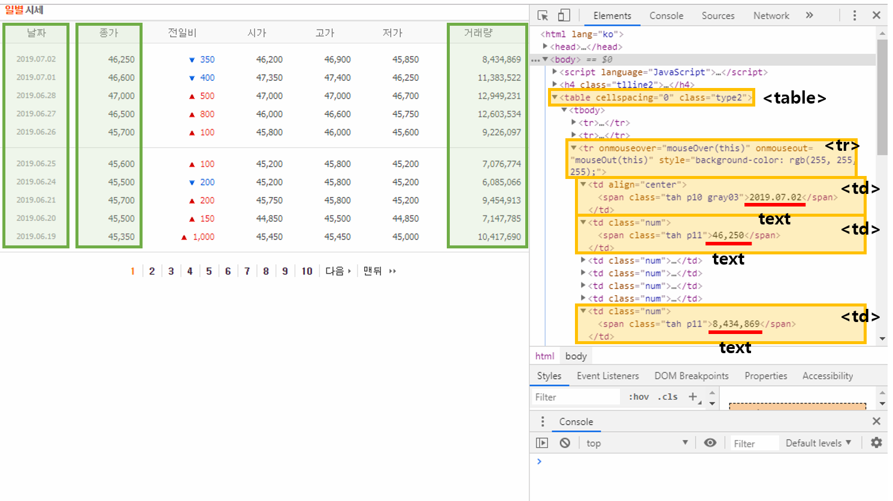

# 5. 삼성전자 주식 월별시세 가져오기
네이버 증권에서 제공하는 삼성전자 종목(005930)의 일별시세를 가져와 보겠다.

주소: https://finance.naver.com/item/sise_day.nhn?code=005930¶  
위의 주소와 같이 뒷부분에 code=005930와 같이 종목코드를 입력해주면 해당 종목의 일별시세를 볼 수 있다.

## 원하는 데이터 추출하기
종목의 일별시세 페이지에서 날짜, 종가, 거래량만 추출해서 출력해 보겠다.

위의 그림과 같이 개발자 도구(Ctrl+Shift+I 또는 F12)를 통해 소스를 보면 날짜, 종가, 거래량이 나온 부분을 찾을 수 있다.

‘table’, ‘tr’, ‘td’ 태그 안의 텍스트임을 알 수 있다.

## 예제
```python
import requests
from bs4 import BeautifulSoup

def print_stock_price(code, page_num):
    result = [[], [], []]

    for n in range(page_num):
        url = 'https://finance.naver.com/item/sise_day.nhn?code='+code+'&page='+str(n+1)
        r = requests.get(url)
        html = r.content
        soup = BeautifulSoup(html, 'html.parser')
        tr = soup.select('table > tr')

        for i in range(1, len(tr)-1):
            if tr[i].select('td')[0].text.strip():
                result[0].append(tr[i].select('td')[0].text.strip())
                result[1].append(tr[i].select('td')[1].text.strip())
                result[2].append(tr[i].select('td')[6].text.strip())

    for i in range(len(result[0])):
        print(result[0][i], result[1][i], result[2][i])


stock_code = '005930'
pages = 50

print_stock_price(stock_code, pages)
```

### 설명
```python
def print_stock_price(code, page_num):
    result = [[], [], []]
```
종목의 코드와 페이지수를 입력하는 함수를 만든다. result에는 날짜, 종가, 거래량이 추가된다.

```python
for n in range(page_num):
    url = 'https://finance.naver.com/item/sise_day.nhn?code=' + code + '&page' + str(n+1)
    html = r.content
    soup = BeautifulSoup(html, 'html.parser')
    tr = soup.select('table > tr')
```
주소 뒷부분에 &page=2와 같은 형식으로 연결해주면 해당 페이지의 일별시세를 볼 수 있다.

table 안의 tr 태그를 리스트형태로 가져온다.

```python
for i in range(1, len(tr)-1):
    if tr[i].select('td')[0].text.strip():
        result[0].append(tr[i].select('td')[0].text.strip())
        result[1].append(tr[i].select('td')[1].text.strip())
        result[2].append(tr[i].select('td')[6].text.strip())
```
첫번째 tr 태그는 th 태그가, 마지막 tr 태그는 페이지 넘버가 있어서 제외한다.

text가 없는 row가 있다.

text가 있는 row에 대해서 첫번째(날짜), 두번째(종가), 일곱번째(거래량) td 태그의 text를 가져온다.

```python
stock_code = '005930'
pages = 50

print_stock_price(stock_code, pages)
```
해당 종목의 코드와 50페이지를 입력한다.

### 결과
```
2019.07.02 46,250 8,434,869
2019.07.01 46,600 11,383,522
2019.06.28 47,000 12,949,231
2019.06.27 46,500 12,603,534
2019.06.26 45,700 9,226,097
2019.06.25 45,600 7,076,774
2019.06.24 45,500 6,085,066
2019.06.21 45,700 9,454,913
2019.06.20 45,500 7,147,785
2019.06.19 45,350 10,417,690

...

2017.06.28 2,385,000 191,450
2017.06.27 2,415,000 192,335
2017.06.26 2,414,000 171,056
2017.06.23 2,381,000 190,302
2017.06.22 2,398,000 229,116
2017.06.21 2,374,000 199,473
2017.06.20 2,407,000 300,900
2017.06.19 2,328,000 226,078
2017.06.16 2,279,000 348,069
2017.06.15 2,284,000 193,140
```
2017년 6월 15일부터 2019년 7월 2일까지 일별시세와 거래량을 출력한다.