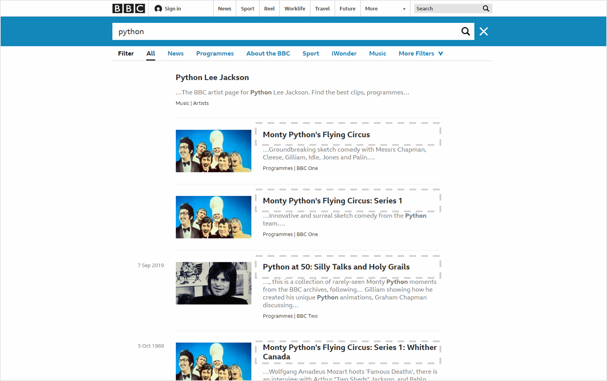

# 6. BBC 뉴스 검색 결과 가져오기

주소: https://www.bbc.co.uk/search?q=python

위의 주소와 같이 뒷부분에 검색어를 연결해주면 해당 검색어에 대한 뉴스 검색 결과 페이지를 볼 수 있다.


## 원하는 데이터 추출하기
앞의 예제와 같이 개발자 도구(Ctrl+Shift+I 또는 F12)를 통해 소스를 보면 뉴스 제목이 나온 부분을 찾을 수 있다.

순서대로 ‘.search-results’ 클래스 > li 태그 > article 태그 > div 태그 > h1 태그 > a 태그 안의 텍스트임을 알 수 있다.

## 예제
```python
import requests
from bs4 import BeautifulSoup


def print_news_result(sw):
    url = 'https://www.bbc.co.uk/search?q=' + sw
    r = requests.get(url)
    html = r.content
    soup = BeautifulSoup(html, 'html.parser')
    titles_html = soup.select('.search-results > li > article > div > h1 > a')

    for i in range(len(titles_html)):
        title = titles_html[i].text
        link = titles_html[i].get('href')
        print(str(i + 1) + '. ' + title + ' (' + link + ')')


print_news_result('python')
```
검색어 ‘python’에 대한 bbc 뉴스 검색 결과의 제목과 링크가 출력된다.

### 설명
```python
def print_news_result(sw):
   url = 'https://www.bbc.co.uk/search?q=' + sw
   r = requests.get(url)
   html = r.content
   soup = BeautifulSoup(html, 'html.parser')
   titles_html = soup.select('.search-results > li > article > div > h1 > a')
```

함수에 검색어를 입력하면 url 주소에 검색어를 연결해주고, 해당 url 페이지에서 뉴스 제목이 있는 부분의 html를 리스트의 형태로 가져오도록 한다.

```python
for i in range(len(titles_html)):
    title = titles_html[i].text
    link = titles_html[i].get('href')
    print(str(i + 1) + '. ' + title + ' (' + link + ')')
```
뉴스의 개수에 따라 뉴스의 제목과 링크 주소를 출력하도록 한다.

### 결과
```
1. Monty Python's Flying Circus (https://www.bbc.co.uk/programmes/p00fp03l)
2. Monty Python's Flying Circus: Series 1 (https://www.bbc.co.uk/programmes/p00fz14r)
3. Python at 50: Silly Talks and Holy Grails (https://www.bbc.co.uk/programmes/m0008bzf)
4. Monty Python's Flying Circus: Series 1: Whither Canada (https://www.bbc.co.uk/programmes/p00gz89w)
5. Monty Python: Almost The Truth - The BBC Lawyer's Cut (https://www.bbc.co.uk/programmes/b00n7sf3)
6. Six-foot python abandoned in Burnley Tesco car park (https://www.bbc.co.uk/news/uk-england-lancashire-49908576)
7. Python Lee Jackson (https://www.bbc.co.uk/music/artists/3c86a819-d7b3-415d-86b8-7c7a880c288e)
8. Comedy Club Extra: Monty Python at 18,262 Days (https://www.bbc.co.uk/programmes/m00093mg)
9. Emma Britton: Bristol Bus Boycott, Monty Python & toilets (https://www.bbc.co.uk/programmes/p074ljch)
10. Monty Python (https://www.bbc.co.uk/music/artists/4a5c8526-f8ec-43f1-97af-49722ad88394)
```
검색어 ‘python’이 포함된 뉴스의 제목과 링크를 순서대로 출력한다.